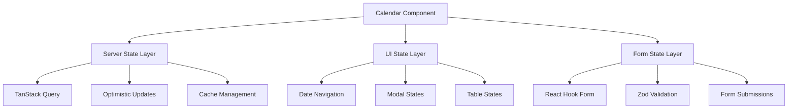

# Calendar SubApp - State Management Documentation

<!-- AI-METADATA:
category: architecture
complexity: intermediate
updated: 2025-07-13
claude-ready: true
priority: medium
token-optimized: true
audience: developers
ai-context-weight: medium
-->

<!-- AI-CONTEXT-BOUNDARY: start -->

## 🔍 Overview

The Calendar SubApp implements a **hybrid state management approach** combining TanStack Query for server state, React local state for UI interactions, and React Hook Form for form state management.

## 🗄️ State Architecture

### State Layer Separation



### State Responsibilities

| State Layer | Responsibility | Technology |
|-------------|---------------|------------|
| **Server State** | Event data, API calls, caching | TanStack Query |
| **UI State** | Modals, navigation, interactions | React useState |
| **Form State** | Form data, validation, submission | React Hook Form |
| **Table State** | Sorting, filtering, pagination | TanStack Table |

## 🔄 Server State Management

### TanStack Query Integration

#### Query Configuration

```typescript
// Calendar events query with optimized caching
export function useCalendarEvents(dateStart: Date, dateEnd: Date) {
  return api.app.calendar.getAll.useQuery(
    { dateStart, dateEnd },
    {
      staleTime: 10 * 1000,          // Data fresh for 10 seconds
      cacheTime: 5 * 60 * 1000,      // Cache for 5 minutes
      refetchOnWindowFocus: false,    // Don't refetch on window focus
      refetchInterval: false,         // No automatic polling
      select: (data) => data.sort((a, b) => 
        a.dateStart.getTime() - b.dateStart.getTime()
      ),
      onError: (error) => {
        toast.error('Failed to load events');
        console.error('Calendar query error:', error);
      }
    }
  );
}

// Query key factory for consistent cache management
export const calendarKeys = {
  all: ['calendar'] as const,
  events: () => [...calendarKeys.all, 'events'] as const,
  eventsByDate: (dateStart: Date, dateEnd: Date) => 
    [...calendarKeys.events(), { dateStart, dateEnd }] as const,
};
```

#### Optimistic Updates

```typescript
// Create event with optimistic update
export function useCreateEvent() {
  const utils = api.useUtils();
  
  return api.app.calendar.create.useMutation({
    onMutate: async (newEvent) => {
      // Cancel outgoing refetches
      await utils.app.calendar.getAll.cancel();
      
      // Snapshot previous value
      const previousEvents = utils.app.calendar.getAll.getData({
        dateStart: startOfDay(newEvent.dateStart),
        dateEnd: endOfDay(newEvent.dateStart)
      });
      
      // Optimistically update cache
      utils.app.calendar.getAll.setData(
        {
          dateStart: startOfDay(newEvent.dateStart),
          dateEnd: endOfDay(newEvent.dateStart)
        },
        (old) => {
          if (!old) return [{ ...newEvent, id: 'temp-' + Date.now() }];
          return [...old, { ...newEvent, id: 'temp-' + Date.now() }];
        }
      );
      
      return { previousEvents, newEvent };
    },
    
    onError: (err, newEvent, context) => {
      // Rollback optimistic update
      if (context?.previousEvents) {
        utils.app.calendar.getAll.setData(
          {
            dateStart: startOfDay(newEvent.dateStart),
            dateEnd: endOfDay(newEvent.dateStart)
          },
          context.previousEvents
        );
      }
      
      toast.error('Failed to create event');
    },
    
    onSuccess: (createdEvent, newEvent) => {
      toast.success('Event created successfully');
    },
    
    onSettled: (createdEvent, error, newEvent) => {
      // Always refetch to ensure consistency
      utils.app.calendar.getAll.invalidate({
        dateStart: startOfDay(newEvent.dateStart),
        dateEnd: endOfDay(newEvent.dateStart)
      });
    }
  });
}
```

#### Selective Cache Invalidation

```typescript
// Smart cache invalidation based on affected dates
export function useCalendarCacheInvalidation() {
  const utils = api.useUtils();
  
  const invalidateAffectedQueries = useCallback(
    (affectedDates: Date[]) => {
      // Group dates by day to minimize invalidations
      const uniqueDays = Array.from(
        new Set(affectedDates.map(date => format(date, 'yyyy-MM-dd')))
      ).map(dateString => parseISO(dateString));
      
      // Invalidate queries for each affected day
      uniqueDays.forEach(date => {
        utils.app.calendar.getAll.invalidate({
          dateStart: startOfDay(date),
          dateEnd: endOfDay(date)
        });
      });
      
      // Also invalidate any week/month queries that might include these dates
      utils.app.calendar.getAll.invalidate(
        (query) => {
          const { dateStart, dateEnd } = query;
          return uniqueDays.some(date => 
            date >= dateStart && date <= dateEnd
          );
        }
      );
    },
    [utils]
  );
  
  return { invalidateAffectedQueries };
}

// Edit event with smart invalidation
export function useEditEvent() {
  const utils = api.useUtils();
  const { invalidateAffectedQueries } = useCalendarCacheInvalidation();
  
  return api.app.calendar.edit.useMutation({
    onSuccess: (result, variables) => {
      // Determine affected dates based on edit scope
      const affectedDates = getAffectedDates(variables);
      invalidateAffectedQueries(affectedDates);
      
      toast.success(`Event updated (${result.type})`);
    },
    onError: () => {
      toast.error('Failed to update event');
    }
  });
}

function getAffectedDates(editVariables: EditEventVariables): Date[] {
  const dates = [editVariables.originalDate];
  
  if (editVariables.updates.newDate) {
    dates.push(editVariables.updates.newDate);
  }
  
  if (editVariables.scope === 'thisAndFuture' || editVariables.scope === 'all') {
    // For series modifications, we might need to invalidate a broader range
    // This is a simplified approach - in practice, you might calculate the exact range
    const today = new Date();
    const futureRange = addMonths(today, 6); // Invalidate next 6 months
    dates.push(futureRange);
  }
  
  return dates;
}
```

### Background Synchronization

```typescript
// Background sync for critical events
export function useBackgroundSync() {
  const utils = api.useUtils();
  
  useEffect(() => {
    const interval = setInterval(() => {
      // Silently refetch critical events
      utils.app.calendar.getAll.invalidate(
        {
          dateStart: startOfDay(new Date()),
          dateEnd: endOfDay(new Date())
        },
        { refetchType: 'none' } // Don't show loading state
      );
    }, 60 * 1000); // Every minute
    
    return () => clearInterval(interval);
  }, [utils]);
}
```

## 🎨 UI State Management

### Date Navigation State

```typescript
// Date navigation with keyboard shortcuts
export function useDateNavigation() {
  const [selectedDate, setSelectedDate] = useState<Date>(new Date());
  
  // Keyboard navigation
  useEffect(() => {
    const handleKeyDown = (e: KeyboardEvent) => {
      // Skip if user is typing in form fields
      if (e.target instanceof HTMLInputElement || e.target instanceof HTMLTextAreaElement) {
        return;
      }
      
      switch (e.key) {
        case 'ArrowLeft':
          e.preventDefault();
          setSelectedDate(date => subDays(date, 1));
          break;
        case 'ArrowRight':
          e.preventDefault();
          setSelectedDate(date => addDays(date, 1));
          break;
        case 't':
          e.preventDefault();
          setSelectedDate(new Date());
          break;
      }
    };
    
    window.addEventListener('keydown', handleKeyDown);
    return () => window.removeEventListener('keydown', handleKeyDown);
  }, []);
  
  // Navigation functions
  const navigateToDate = useCallback((date: Date) => {
    setSelectedDate(date);
  }, []);
  
  const navigateToPreviousDay = useCallback(() => {
    setSelectedDate(date => subDays(date, 1));
  }, []);
  
  const navigateToNextDay = useCallback(() => {
    setSelectedDate(date => addDays(date, 1));
  }, []);
  
  const navigateToToday = useCallback(() => {
    setSelectedDate(new Date());
  }, []);
  
  return {
    selectedDate,
    navigateToDate,
    navigateToPreviousDay,
    navigateToNextDay,
    navigateToToday
  };
}
```

### Modal State Management

```typescript
// Centralized modal state management
interface ModalState {
  createEvent: boolean;
  editEvent: CalendarEvent | null;
  cancelEvent: CalendarEvent | null;
}

export function useModalState() {
  const [modalState, setModalState] = useState<ModalState>({
    createEvent: false,
    editEvent: null,
    cancelEvent: null
  });
  
  const openCreateModal = useCallback(() => {
    setModalState(prev => ({ ...prev, createEvent: true }));
  }, []);
  
  const closeCreateModal = useCallback(() => {
    setModalState(prev => ({ ...prev, createEvent: false }));
  }, []);
  
  const openEditModal = useCallback((event: CalendarEvent) => {
    setModalState(prev => ({ ...prev, editEvent: event }));
  }, []);
  
  const closeEditModal = useCallback(() => {
    setModalState(prev => ({ ...prev, editEvent: null }));
  }, []);
  
  const openCancelModal = useCallback((event: CalendarEvent) => {
    setModalState(prev => ({ ...prev, cancelEvent: event }));
  }, []);
  
  const closeCancelModal = useCallback(() => {
    setModalState(prev => ({ ...prev, cancelEvent: null }));
  }, []);
  
  const closeAllModals = useCallback(() => {
    setModalState({
      createEvent: false,
      editEvent: null,
      cancelEvent: null
    });
  }, []);
  
  return {
    modalState,
    openCreateModal,
    closeCreateModal,
    openEditModal,
    closeEditModal,
    openCancelModal,
    closeCancelModal,
    closeAllModals
  };
}
```

### Table State Management

```typescript
// TanStack Table state management
export function useCalendarTableState(events: CalendarEvent[]) {
  const [sorting, setSorting] = useState<SortingState>([
    { id: 'dateStart', desc: false }
  ]);
  const [columnFilters, setColumnFilters] = useState<ColumnFiltersState>([]);
  const [columnVisibility, setColumnVisibility] = useState<VisibilityState>({});
  const [rowSelection, setRowSelection] = useState<RowSelectionState>({});
  
  // Memoized table instance
  const table = useReactTable({
    data: events,
    columns: calendarColumns,
    getCoreRowModel: getCoreRowModel(),
    getSortedRowModel: getSortedRowModel(),
    getFilteredRowModel: getFilteredRowModel(),
    getPaginationRowModel: getPaginationRowModel(),
    onSortingChange: setSorting,
    onColumnFiltersChange: setColumnFilters,
    onColumnVisibilityChange: setColumnVisibility,
    onRowSelectionChange: setRowSelection,
    state: {
      sorting,
      columnFilters,
      columnVisibility,
      rowSelection,
    },
    initialState: {
      pagination: {
        pageSize: 20,
      },
    },
  });
  
  // Bulk actions for selected rows
  const selectedEvents = useMemo(() => {
    return table.getSelectedRowModel().rows.map(row => row.original);
  }, [table, rowSelection]);
  
  const clearSelection = useCallback(() => {
    setRowSelection({});
  }, []);
  
  return {
    table,
    selectedEvents,
    clearSelection,
    hasSelection: Object.keys(rowSelection).length > 0
  };
}
```

## 📝 Form State Management

### Event Creation Form

```typescript
// Create event form with validation
export function useCreateEventForm(
  onSuccess?: (event: CalendarEvent) => void
) {
  const createMutation = useCreateEvent();
  
  const form = useForm<CreateEventInput>({
    resolver: zodResolver(CreateEventSchema),
    defaultValues: {
      title: '',
      description: '',
      dateStart: roundToNextHour(new Date()),
      type: 'NORMAL',
      rule: undefined,
      dateUntil: undefined
    }
  });
  
  const onSubmit = async (data: CreateEventInput) => {
    try {
      const result = await createMutation.mutateAsync(data);
      form.reset();
      onSuccess?.(result);
    } catch (error) {
      // Error handling is done in mutation
    }
  };
  
  return {
    form,
    onSubmit: form.handleSubmit(onSubmit),
    isSubmitting: createMutation.isPending,
    error: createMutation.error
  };
}

// Helper function to round to next hour
function roundToNextHour(date: Date): Date {
  const rounded = new Date(date);
  rounded.setHours(date.getHours() + 1, 0, 0, 0);
  return rounded;
}
```

### Event Edit Form

```typescript
// Edit event form with scope selection
export function useEditEventForm(
  event: CalendarEvent,
  onSuccess?: () => void
) {
  const editMutation = useEditEvent();
  
  const form = useForm<EditEventInput>({
    resolver: zodResolver(EditEventSchema),
    defaultValues: {
      id: event.id,
      originalDate: event.originalDate || event.dateStart,
      scope: 'single',
      updates: {
        title: event.title,
        description: event.description,
        newDate: event.dateStart,
        type: event.type
      }
    }
  });
  
  // Watch for changes to determine what fields have been modified
  const watchedValues = form.watch('updates');
  const hasChanges = useMemo(() => {
    return (
      watchedValues.title !== event.title ||
      watchedValues.description !== event.description ||
      watchedValues.newDate?.getTime() !== event.dateStart.getTime() ||
      watchedValues.type !== event.type
    );
  }, [watchedValues, event]);
  
  const onSubmit = async (data: EditEventInput) => {
    // Only include changed fields in updates
    const updates: Partial<EventUpdates> = {};
    
    if (data.updates.title !== event.title) {
      updates.title = data.updates.title;
    }
    if (data.updates.description !== event.description) {
      updates.description = data.updates.description;
    }
    if (data.updates.newDate?.getTime() !== event.dateStart.getTime()) {
      updates.newDate = data.updates.newDate;
    }
    if (data.updates.type !== event.type) {
      updates.type = data.updates.type;
    }
    
    try {
      await editMutation.mutateAsync({
        ...data,
        updates
      });
      onSuccess?.();
    } catch (error) {
      // Error handling is done in mutation
    }
  };
  
  return {
    form,
    onSubmit: form.handleSubmit(onSubmit),
    isSubmitting: editMutation.isPending,
    hasChanges,
    error: editMutation.error
  };
}
```

### Recurrence Pattern Form

```typescript
// Recurrence pattern form state
export interface RecurrencePattern {
  frequency: 'DAILY' | 'WEEKLY' | 'MONTHLY' | 'YEARLY';
  interval: number;
  byweekday?: string[];
  endType: 'never' | 'until' | 'count';
  until?: Date;
  count?: number;
}

export function useRecurrenceForm() {
  const [pattern, setPattern] = useState<RecurrencePattern>({
    frequency: 'WEEKLY',
    interval: 1,
    endType: 'never'
  });
  
  // Generate RRule string from pattern
  const ruleString = useMemo(() => {
    if (!pattern) return undefined;
    
    const parts = [`FREQ=${pattern.frequency}`];
    
    if (pattern.interval > 1) {
      parts.push(`INTERVAL=${pattern.interval}`);
    }
    
    if (pattern.byweekday?.length) {
      parts.push(`BYDAY=${pattern.byweekday.join(',')}`);
    }
    
    if (pattern.endType === 'until' && pattern.until) {
      parts.push(`UNTIL=${formatDateForRRule(pattern.until)}`);
    } else if (pattern.endType === 'count' && pattern.count) {
      parts.push(`COUNT=${pattern.count}`);
    }
    
    return parts.join(';');
  }, [pattern]);
  
  // Human-readable description
  const description = useMemo(() => {
    return generateRuleDescription(ruleString);
  }, [ruleString]);
  
  return {
    pattern,
    setPattern,
    ruleString,
    description
  };
}

function formatDateForRRule(date: Date): string {
  return date.toISOString().replace(/[-:]/g, '').split('.')[0] + 'Z';
}

function generateRuleDescription(rule?: string): string {
  if (!rule) return 'Does not repeat';
  
  try {
    const rrule = new RRule(RRule.fromString(rule));
    return rrule.toText();
  } catch {
    return 'Invalid recurrence pattern';
  }
}
```

## 🔄 State Synchronization

### Cross-Component State Sharing

```typescript
// Custom hook for sharing calendar state across components
export function useCalendarContext() {
  const context = useContext(CalendarContext);
  
  if (!context) {
    throw new Error('useCalendarContext must be used within CalendarProvider');
  }
  
  return context;
}

// Calendar context provider
interface CalendarContextValue {
  selectedDate: Date;
  setSelectedDate: (date: Date) => void;
  modalState: ModalState;
  modalActions: ModalActions;
  tableState: TableState;
}

export function CalendarProvider({ children }: { children: React.ReactNode }) {
  const dateNavigation = useDateNavigation();
  const modalState = useModalState();
  const { selectedDate } = dateNavigation;
  
  // Fetch events for selected date
  const { data: events = [] } = useCalendarEvents(
    startOfDay(selectedDate),
    endOfDay(selectedDate)
  );
  
  const tableState = useCalendarTableState(events);
  
  const value: CalendarContextValue = {
    selectedDate: dateNavigation.selectedDate,
    setSelectedDate: dateNavigation.navigateToDate,
    modalState: modalState.modalState,
    modalActions: modalState,
    tableState
  };
  
  return (
    <CalendarContext.Provider value={value}>
      {children}
    </CalendarContext.Provider>
  );
}
```

### State Persistence

```typescript
// Persist user preferences in localStorage
export function useCalendarPreferences() {
  const [preferences, setPreferences] = useLocalStorage<CalendarPreferences>('calendar-preferences', {
    defaultView: 'table',
    dateFormat: 'MM/DD/YYYY',
    timeFormat: '12h',
    firstDayOfWeek: 0, // Sunday
    showWeekends: true
  });
  
  const updatePreference = useCallback(
    <K extends keyof CalendarPreferences>(
      key: K,
      value: CalendarPreferences[K]
    ) => {
      setPreferences(prev => ({ ...prev, [key]: value }));
    },
    [setPreferences]
  );
  
  return {
    preferences,
    updatePreference
  };
}

interface CalendarPreferences {
  defaultView: 'table' | 'calendar' | 'list';
  dateFormat: string;
  timeFormat: '12h' | '24h';
  firstDayOfWeek: number;
  showWeekends: boolean;
}
```

## 📊 State Performance Optimizations

### Memoization Strategies

```typescript
// Memoized event processing
export function useProcessedEvents(events: CalendarEvent[]) {
  return useMemo(() => {
    // Sort events by date
    const sortedEvents = events.sort((a, b) => 
      a.dateStart.getTime() - b.dateStart.getTime()
    );
    
    // Group events by type
    const eventsByType = groupBy(sortedEvents, 'type');
    
    // Calculate statistics
    const stats = {
      total: sortedEvents.length,
      critical: eventsByType.CRITICAL?.length || 0,
      normal: eventsByType.NORMAL?.length || 0,
      recurring: sortedEvents.filter(e => e.isRecurrence).length,
      exceptions: sortedEvents.filter(e => e.isException).length
    };
    
    return {
      events: sortedEvents,
      eventsByType,
      stats
    };
  }, [events]);
}

// Debounced search state
export function useDebouncedSearch(delay = 300) {
  const [searchTerm, setSearchTerm] = useState('');
  const [debouncedSearchTerm, setDebouncedSearchTerm] = useState('');
  
  useEffect(() => {
    const timer = setTimeout(() => {
      setDebouncedSearchTerm(searchTerm);
    }, delay);
    
    return () => clearTimeout(timer);
  }, [searchTerm, delay]);
  
  return {
    searchTerm,
    setSearchTerm,
    debouncedSearchTerm
  };
}
```

### Virtual Scrolling State

```typescript
// Future: Virtual scrolling for large event lists
export function useVirtualizedEvents(events: CalendarEvent[]) {
  const [containerHeight, setContainerHeight] = useState(600);
  const itemHeight = 60;
  const visibleCount = Math.ceil(containerHeight / itemHeight);
  const [scrollTop, setScrollTop] = useState(0);
  
  const startIndex = Math.floor(scrollTop / itemHeight);
  const endIndex = Math.min(startIndex + visibleCount + 2, events.length);
  
  const visibleEvents = useMemo(() => {
    return events.slice(startIndex, endIndex);
  }, [events, startIndex, endIndex]);
  
  return {
    visibleEvents,
    totalHeight: events.length * itemHeight,
    offsetY: startIndex * itemHeight,
    onScroll: (e: React.UIEvent<HTMLDivElement>) => {
      setScrollTop(e.currentTarget.scrollTop);
    }
  };
}
```

<!-- AI-CONTEXT-BOUNDARY: end -->

---

**State Management**: Hybrid approach with TanStack Query, React state, and React Hook Form  
**Caching Strategy**: Optimistic updates with selective invalidation  
**Last Updated**: 2025-07-13