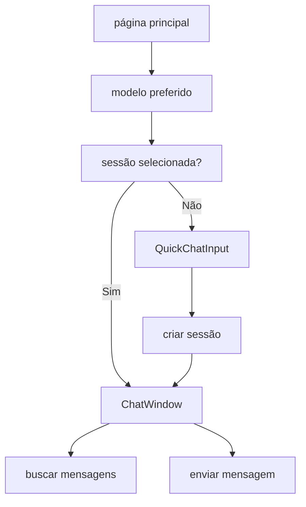

# Chat Development Guide

## 📖 Visão Geral

Este guia fornece informações detalhadas para desenvolvedores que trabalham no **Chat SubApp** do Kodix, incluindo padrões, estruturas, fluxos de trabalho e melhores práticas específicas.

## 🏗️ Arquitetura do Chat

### **Estrutura de Diretórios**

```
apps/kdx/src/app/[locale]/(authed)/apps/chat/
├── page.tsx                     # 🏠 Página principal
├── [sessionId]/                 # 📂 Rota dinâmica para sessões
│   └── page.tsx                 # 💬 Página de sessão específica
├── _components/                 # 🧩 Componentes do Chat
│   ├── app-sidebar.tsx          # 📋 Sidebar com pastas e sessões
│   ├── chat-window.tsx          # 💭 Janela principal de conversa
│   ├── model-selector.tsx       # 🎯 Seletor de modelos de IA
│   ├── model-info-badge.tsx     # 🏷️ Badge informativo do modelo
│   ├── quick-chat-input.tsx     # ⚡ Input para início rápido
│   ├── message.tsx              # 💬 Componente de mensagem
│   └── input-box.tsx            # 📝 Input de mensagens
└── _hooks/                      # 🎣 Hooks customizados
    ├── useChatPreferredModel.ts # 🧠 Hook para modelo preferido
    └── useAutoCreateSession.tsx # 🔄 Hook para criação automática
```

### **Fluxo de Dados Principal**



## 🎯 Componentes Principais

### **1. Page.tsx - Orquestrador Principal**

**Responsabilidades:**

- Gerencia estado global de `selectedSessionId` e `selectedModelId`
- Carrega modelo preferido usando hierarquia inteligente
- Coordena comunicação entre componentes

**Padrões Específicos:**

```typescript
// ✅ Hierarquia de modelo
useEffect(() => {
  if (selectedSessionId && sessionQuery.data?.aiModelId) {
    // 1ª Prioridade: Modelo da sessão
    setSelectedModelId(sessionQuery.data.aiModelId);
  } else if (!selectedSessionId && isReady && preferredModelId) {
    // 2ª Prioridade: Modelo preferido do team
    setSelectedModelId(preferredModelId);
  }
}, [selectedSessionId, sessionQuery.data, preferredModelId]);
```

### **2. ChatWindow - Interface de Conversa**

**Responsabilidades:**

- Renderiza mensagens com streaming visual
- Gerencia envio de mensagens via tRPC
- Atualiza cache de forma otimizada

**Padrões de Implementação:**

```typescript
// ✅ Streaming visual para novas mensagens
const aiMessage: ChatMessage = {
  role: "ai",
  content: result.aiMessage.content,
  id: result.aiMessage.id,
  isNewMessage: true, // ← Ativa streaming
};

// ✅ Invalidação específica de cache
queryClient.invalidateQueries(
  trpc.app.chat.buscarMensagensTest.pathFilter({
    chatSessionId: sessionId,
  }),
);
```

### **3. AppSidebar - Organização Complexa**

**Funcionalidades:**

- Lista pastas e sessões com queries otimizadas
- Sistema de edição inline de sessões
- Criação/edição de pastas
- Menu de contexto com ações

**Padrões de Performance:**

```typescript
// ✅ Query otimizada com filtros
const sessionsQuery = api.app.chat.listarSessions.useQuery({
  // Filtros específicos por pasta
});

// ✅ Mutation com invalidação granular
onSuccess: () => {
  queryClient.invalidateQueries(trpc.app.chat.buscarChatFolders.pathFilter());
};
```

## 🎣 Hooks Customizados

### **useChatPreferredModel**

**Propósito:** Implementa hierarquia de prioridade para seleção de modelos

**Hierarquia:**

1. **Chat Team Config** (`lastSelectedModelId`)
2. **AI Studio Default** (modelo marcado como padrão)
3. **Primeiro Disponível** (fallback)

**Uso:**

```typescript
const {
  modelId: preferredModelId,
  isReady,
  isLoading,
  source, // "chat_config" | "ai_studio_default" | "first_available"
} = useChatPreferredModel();
```

### **useAutoCreateSession**

**Propósito:** Criação automática de sessões ao enviar primeira mensagem

**Fluxo:**

```typescript
const { createSessionAndSendMessage } = useAutoCreateSession({
  onSessionCreated: (sessionId) => {
    // Navegar para nova sessão
    router.push(`/apps/chat/${sessionId}`);
  },
});
```

## 🔄 Integração com AI Studio

### **Service Layer Pattern**

O Chat **NÃO** acessa diretamente repositórios do AI Studio. Toda comunicação acontece via Service Layer:

```typescript
// ❌ ERRADO - Acesso direto
const model = await aiStudioRepository.AiModelRepository.findById(modelId);

// ✅ CORRETO - Via Service Layer
const model = await AiStudioService.getModelById({
  modelId,
  teamId,
  requestingApp: chatAppId,
});
```

### **Principais Service Methods**

| Service Method         | Descrição                             | Documentação                                                |
| ---------------------- | ------------------------------------- | ----------------------------------------------------------- |
| `getModelById()`       | Busca modelo específico com validação | [API Reference](./Chat_API_Reference.md#getpreferredmodel)  |
| `getDefaultModel()`    | Busca modelo marcado como padrão      | [AI Studio Integration](../ai-studio/)                      |
| `getAvailableModels()` | Lista modelos ativos do team          | [API Reference](./Chat_API_Reference.md#getavailablemodels) |
| `getProviderToken()`   | Busca token criptografado             | [AI Studio Security](../ai-studio/technical-details.md)     |

> 📋 **Referência Completa**: Para detalhes de todos os endpoints tRPC do Chat, consulte [Chat API Reference](./Chat_API_Reference.md)

## 🎨 Streaming Visual

### **Implementação Técnica**

O Chat usa streaming **visual** (não real-time) via `useTypingEffect`:

```typescript
// ✅ Hook customizado para efeito de digitação
const { displayedText, isComplete, skip } = useTypingEffect({
  text: content,
  speed: 20, // 20ms por caractere
  trigger: isAI && isNewMessage,
});

// ✅ Controle de quando aplicar streaming
<Message
  content={content}
  isNewMessage={msg.isNewMessage} // ← Só novas mensagens da IA
  onTypingComplete={() => {
    // Remove flag após conclusão
    setMessages(prev =>
      prev.map((m, i) =>
        i === idx ? { ...m, isNewMessage: false } : m
      )
    );
  }}
/>
```

## ⚙️ Team Configuration

### **Sistema AppTeamConfig**

O Chat utiliza o sistema oficial de configurações por team:

```typescript
// ✅ Schema de configuração
export const chatConfigSchema = z.object({
  lastSelectedModelId: z.string().optional(),
  aiSettings: z
    .object({
      maxTokens: z.number().default(2000),
      temperature: z.number().default(0.7),
      enableStreaming: z.boolean().default(true),
    })
    .default({}),
  uiSettings: z
    .object({
      showModelInHeader: z.boolean().default(true),
      autoSelectModel: z.boolean().default(true),
    })
    .default({}),
});
```

### **Uso no Hook**

```typescript
const { saveLastSelectedModel } = useChatConfig();

// ✅ Salvar automaticamente ao selecionar modelo
const handleModelSelect = (modelId: string) => {
  setSelectedModelId(modelId);
  saveLastSelectedModel(modelId); // ← Persiste no team config
};
```

## 🔒 Segurança e Validação

### **Isolamento por Team**

Todas as operações são isoladas por `teamId`:

```typescript
// ✅ Middleware automático adiciona teamId
const sessions = await chatRepository.findSessionsByTeam(
  ctx.auth.user.activeTeamId,
);

// ✅ Validação de ownership em operações
const session = await chatRepository.findSessionById(sessionId);
if (session.teamId !== ctx.auth.user.activeTeamId) {
  throw new TRPCError({ code: "FORBIDDEN" });
}
```

### **Validação de Modelos**

```typescript
// ✅ Verificar se modelo está disponível para o team
const availableModels = await AiStudioService.getAvailableModels({
  teamId: ctx.auth.user.activeTeamId,
  requestingApp: chatAppId,
});

const isModelAvailable = availableModels.some((m) => m.id === modelId);
if (!isModelAvailable) {
  throw new TRPCError({
    code: "BAD_REQUEST",
    message: "Modelo não disponível para este team",
  });
}
```

## 🧪 Padrões de Teste

### **Estrutura de Testes**

```
tests/chat/
├── components/
│   ├── chat-window.test.tsx
│   ├── model-selector.test.tsx
│   └── app-sidebar.test.tsx
├── hooks/
│   ├── useChatPreferredModel.test.ts
│   └── useAutoCreateSession.test.tsx
└── integration/
    ├── chat-flow.test.tsx
    └── streaming.test.tsx
```

### **Mocks Essenciais**

```typescript
// ✅ Mock do tRPC
const mockTRPC = {
  app: {
    chat: {
      buscarMensagensTest: {
        useQuery: jest.fn(() => ({
          data: { mensagens: mockMessages },
          isLoading: false,
        })),
      },
    },
  },
};

// ✅ Mock do AI Studio Service
jest.mock("~/lib/ai-studio-service", () => ({
  AiStudioService: {
    getModelById: jest.fn(),
    getDefaultModel: jest.fn(),
    getAvailableModels: jest.fn(),
  },
}));
```

## 📊 Performance e Otimização

### **Queries Otimizadas**

```typescript
// ✅ Cache estratégico por 5 minutos
const { data: preferredModel } = useQuery({
  ...trpc.app.chat.getPreferredModel.queryOptions(),
  staleTime: 5 * 60 * 1000,
  refetchOnWindowFocus: false,
});

// ✅ Lazy loading de mensagens
const messagesQuery = api.app.chat.buscarMensagensTest.useQuery(
  { chatSessionId: sessionId, limite: 50, pagina: 1 },
  { enabled: !!sessionId }, // ← Só executa quando necessário
);
```

### **Invalidação Inteligente**

```typescript
// ✅ Invalidação específica após mutations
onSuccess: () => {
  queryClient.invalidateQueries(
    trpc.app.chat.buscarMensagensTest.pathFilter({
      chatSessionId: sessionId,
    }),
  );
  // Não invalida outras sessões
};
```

## 🚀 Próximos Passos

### **Melhorias Planejadas**

1. **Streaming Real**: Migrar para Server-Sent Events
2. **Cache Avançado**: Implementar cache persistente local
3. **Performance**: Lazy loading de componentes pesados
4. **Testing**: Aumentar cobertura para 95%+

### **Padrões a Implementar**

1. **Error Boundaries**: Para recuperação de erros específicos
2. **Suspense**: Para loading states mais elegantes
3. **Virtual Scrolling**: Para listas grandes de mensagens
4. **Web Workers**: Para processamento pesado offline

---

## 📚 Recursos Relacionados

- **[Chat Streaming Implementation](./Chat_Streaming_Implementation.md)** - Detalhes técnicos do streaming
- **[Chat Team Configuration System](./Chat_Team_Config_System.md)** - Sistema de configurações
- **[Chat API Reference](./Chat_API_Reference.md)** - Referência completa das APIs
- **[SubApp Architecture](../../architecture/subapp-architecture.md)** - Padrões gerais de SubApps

---

**📝 Última atualização**: Janeiro 2025 | **🛠️ Stack**: React + tRPC + AI Studio | **👥 Team**: Frontend Kodix
