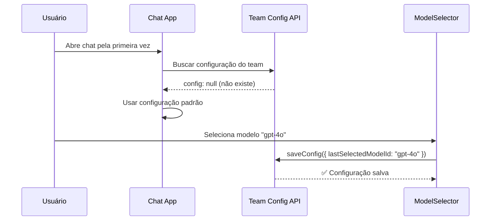
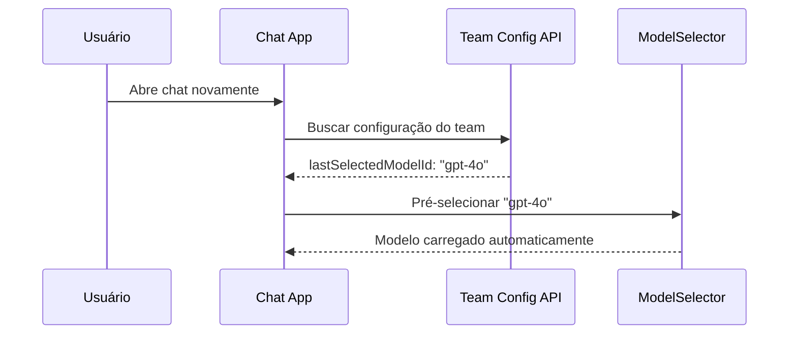
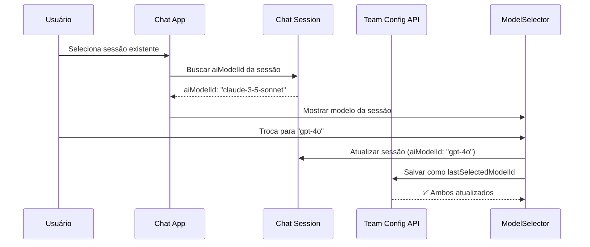

# Chat Team Configuration System - Kodix

## 📖 Overview

O **Chat Team Configuration System** é um sistema avançado de configurações personalizáveis por equipe no Chat App do Kodix. Permite que cada team tenha suas próprias configurações, incluindo o salvamento automático do último modelo de IA selecionado.

**📚 DOCUMENTAÇÃO GERAL:** Este documento detalha a implementação específica do Chat. Para visão geral completa do sistema de configurações (team + usuário), consulte:

**👉 [Sistema de Configurações de SubApps](../../architecture/subapp-configurations-system.md)**

## 🎯 **Configurações Disponíveis no Chat**

### **✅ Configurações de Team** (`appTeamConfig`) - **IMPLEMENTADO**

- Último modelo selecionado por toda a equipe
- Configurações de IA padrão (tokens, temperatura)
- Preferências de interface da equipe
- Comportamentos automáticos

### **⏳ Configurações de Usuário** (`userAppTeamConfig`) - **SCHEMA DEFINIDO**

- Preferências pessoais de modelo
- Configurações de notificação individuais
- Tema pessoal (claro/escuro/auto)
- Tamanho de fonte e modo compacto

**💡 Nota:** As configurações de usuário já têm schema definido, mas ainda não possuem interface implementada.

## 🏗️ **Arquitetura do Sistema**

### **Componentes Principais**

```
┌─────────────────┐    ┌─────────────────┐    ┌─────────────────┐
│   Model         │    │   Chat          │    │   Team          │
│   Selector      │    │   Window        │    │   Config        │
└─────────────────┘    └─────────────────┘    └─────────────────┘
       │                       │                       │
       └───────────────────────┼───────────────────────┘
                               │
                   ┌───────────▼───────────┐
                   │  AppTeamConfig API    │
                   │  (chatAppId)          │
                   └─────────────────────────┘
```

### **Base: Sistema AppTeamConfig**

O Chat utiliza o sistema **AppTeamConfig** existente no Kodix, seguindo o padrão documentado em:

**👉 [Sistema de Configurações de SubApps](../../architecture/subapp-configurations-system.md)**

## ⚙️ **Schema de Configuração**

### **Estrutura Completa**

```typescript
export const chatConfigSchema = z.object({
  // 🎯 Modelo padrão selecionado pelo team
  lastSelectedModelId: z.string().optional(),

  // 🤖 Configurações de IA padrão
  aiSettings: z
    .object({
      maxTokens: z.number().min(100).max(8000).default(2000),
      temperature: z.number().min(0).max(2).default(0.7),
      enableStreaming: z.boolean().default(true),
    })
    .default({}),

  // 🎨 Configurações de interface
  uiSettings: z
    .object({
      showModelInHeader: z.boolean().default(true),
      autoSelectModel: z.boolean().default(true),
      defaultChatTitle: z.string().default("Nova Conversa"),
    })
    .default({}),

  // 🔧 Configurações de comportamento
  behaviorSettings: z
    .object({
      rememberLastModel: z.boolean().default(true),
      autoSaveConversations: z.boolean().default(true),
      enableTypingIndicator: z.boolean().default(true),
    })
    .default({}),
});
```

### **Localização do Schema**

```typescript
// packages/shared/src/db.ts
export const appIdToAppTeamConfigSchema = {
  [kodixCareAppId]: kodixCareConfigSchema,
  [chatAppId]: chatConfigSchema, // ← Adicionado aqui
};
```

## 🎯 **Funcionalidade Principal: Último Modelo Selecionado**

### **Como Funciona**

1. **Usuário seleciona modelo** no ModelSelector
2. **Sistema salva automaticamente** `lastSelectedModelId` na configuração do team
3. **Próxima sessão** carrega o modelo automaticamente
4. **Isolamento por team** garante que cada equipe tenha sua própria configuração

### **Implementação no Frontend**

```typescript
// hooks/useChatConfig.ts
export function useChatConfig() {
  const trpc = useTRPC();

  // Buscar configuração atual do team
  const { data: config, isLoading } = trpc.app.getConfig.useQuery({
    appId: chatAppId,
  });

  // Salvar último modelo selecionado
  const saveLastSelectedModel = (modelId: string) => {
    if (!config?.behaviorSettings?.rememberLastModel) return;

    saveConfig({ lastSelectedModelId: modelId });
  };

  // Obter modelo padrão do team
  const getDefaultModelId = () => config?.lastSelectedModelId;

  return {
    config,
    saveLastSelectedModel,
    getDefaultModelId,
    shouldAutoSelectModel: () => config?.uiSettings?.autoSelectModel !== false,
  };
}
```

### **Integração na Página Principal**

```typescript
// apps/chat/page.tsx
export default function ChatPage() {
  const { saveLastSelectedModel, getDefaultModelId } = useChatConfig();

  const handleModelSelect = (modelId: string) => {
    setSelectedModelId(modelId);

    // 💾 Salvar como último modelo selecionado do team
    saveLastSelectedModel(modelId);

    // 🔄 Atualizar sessão atual se existir
    if (selectedSessionId) {
      updateSessionMutation.mutate({
        id: selectedSessionId,
        aiModelId: modelId,
      });
    }

    console.log(
      "💾 [TEAM CONFIG] Salvando último modelo selecionado:",
      modelId,
    );
  };

  // 🎯 Carregar modelo padrão ao iniciar (quando implementado)
  // useEffect(() => {
  //   if (!selectedSessionId && !selectedModelId && shouldAutoSelectModel()) {
  //     const defaultModel = getDefaultModelId();
  //     if (defaultModel) setSelectedModelId(defaultModel);
  //   }
  // }, []);
}
```

## 🗄️ **Estrutura de Banco de Dados**

### **Tabela Utilizada**

```sql
-- Usa a tabela existente do sistema AppTeamConfig
CREATE TABLE appTeamConfigs (
  id VARCHAR(21) PRIMARY KEY,
  config JSON NOT NULL,              -- Configuração do chat aqui
  appId VARCHAR(21) NOT NULL,        -- chatAppId = "az1x2c3bv4n5"
  teamId VARCHAR(21) NOT NULL,       -- ID do team
  UNIQUE KEY unique_appId_teamId (appId, teamId)
);
```

### **Exemplo de Configuração Salva**

```json
{
  "lastSelectedModelId": "gpt-4o-2024-11-20",
  "aiSettings": {
    "maxTokens": 2000,
    "temperature": 0.7,
    "enableStreaming": true
  },
  "uiSettings": {
    "showModelInHeader": true,
    "autoSelectModel": true,
    "defaultChatTitle": "Nova Conversa"
  },
  "behaviorSettings": {
    "rememberLastModel": true,
    "autoSaveConversations": true,
    "enableTypingIndicator": true
  }
}
```

## 🔄 **Fluxos de Trabalho**

### **1. Primeira Seleção de Modelo**



### **2. Carregamento em Sessão Posterior**



### **3. Troca de Modelo em Sessão Existente**



## 🛠️ **APIs tRPC Utilizadas**

### **Endpoints Existentes**

```typescript
// Buscar configuração do team
trpc.app.getConfig.useQuery({ appId: chatAppId });

// Salvar configuração do team
trpc.app.saveConfig.mutate({
  appId: chatAppId,
  config: { lastSelectedModelId: "modelo-id" },
});
```

### **Validators Atualizados**

```typescript
// packages/validators/src/trpc/app/index.ts

// Tipos atualizados para incluir chat
export type AppIdsWithConfig = typeof kodixCareAppId | typeof chatAppId;

// Input schemas atualizados
export const ZSaveConfigInput = z.union([
  z.object({
    appId: z.literal(kodixCareAppId),
    config: kodixCareConfigSchema.partial(),
  }),
  z.object({
    appId: z.literal(chatAppId),
    config: chatConfigSchema.partial(), // ← Novo
  }),
]);
```

## 🎨 **Interface do Usuário**

### **Model Selector com Persistência**

O componente `ModelSelector` já existente agora possui comportamento inteligente:

```typescript
<ModelSelector
  selectedModelId={displayModelId}        // Modelo atual (da sessão ou padrão do team)
  onModelSelect={handleModelSelect}       // Salva automaticamente na config do team
  disabled={updateSessionMutation.isPending}
/>
```

### **Indicadores Visuais**

- 🎯 **Modelo padrão do team**: Indicado visualmente quando carregado automaticamente
- 💾 **Salvamento automático**: Toast de confirmação (opcional)
- 🔄 **Sincronização**: Indica quando modelo da sessão difere do padrão do team

## ⚙️ **Configurações Disponíveis**

### **1. Configurações de IA**

| Configuração      | Tipo    | Padrão | Descrição                            |
| ----------------- | ------- | ------ | ------------------------------------ |
| `maxTokens`       | number  | 2000   | Limite máximo de tokens por resposta |
| `temperature`     | number  | 0.7    | Criatividade do modelo (0.0-2.0)     |
| `enableStreaming` | boolean | true   | Habilita respostas em tempo real     |

### **2. Configurações de Interface**

| Configuração        | Tipo    | Padrão          | Descrição                               |
| ------------------- | ------- | --------------- | --------------------------------------- |
| `showModelInHeader` | boolean | true            | Mostra modelo selecionado no cabeçalho  |
| `autoSelectModel`   | boolean | true            | Seleciona automaticamente último modelo |
| `defaultChatTitle`  | string  | "Nova Conversa" | Título padrão para novas conversas      |

### **3. Configurações de Comportamento**

| Configuração            | Tipo    | Padrão | Descrição                                       |
| ----------------------- | ------- | ------ | ----------------------------------------------- |
| `rememberLastModel`     | boolean | true   | **Principal**: Lembra último modelo selecionado |
| `autoSaveConversations` | boolean | true   | Salva conversas automaticamente                 |
| `enableTypingIndicator` | boolean | true   | Mostra indicador de digitação                   |

## 🔒 **Segurança e Isolamento**

### **Isolamento por Team**

- ✅ **Configurações isoladas**: Cada `teamId` tem sua própria configuração
- ✅ **Validação de acesso**: Middleware `appInstalledMiddleware` verifica permissões
- ✅ **Sanitização**: Schemas Zod validam e sanitizam todas as entradas

### **Validação de Dados**

```typescript
// Todas as configurações passam por validação Zod
const validatedConfig = chatConfigSchema.parse(userInput);

// Merge seguro com defaults
const finalConfig = {
  ...defaultConfig,
  ...validatedConfig,
};
```

## 📊 **Performance e Cache**

### **Estratégias de Cache**

```typescript
// Cache da configuração por 5 minutos
const { data: config } = trpc.app.getConfig.useQuery(
  { appId: chatAppId },
  {
    staleTime: 5 * 60 * 1000, // 5 minutos
    refetchOnWindowFocus: false, // Não refetch ao focar janela
  },
);
```

### **Invalidação Inteligente**

```typescript
// Invalidação específica após salvamento
queryClient.invalidateQueries({
  queryKey: trpc.app.getConfig.getQueryKey({ appId: chatAppId }),
});
```

## 🧪 **Testing**

### **Testes de Configuração**

```typescript
describe("Chat Team Config", () => {
  it("should save last selected model for team", async () => {
    const { saveLastSelectedModel } = renderHook(() => useChatConfig());

    await act(() => {
      saveLastSelectedModel("gpt-4o");
    });

    expect(mockSaveConfig).toHaveBeenCalledWith({
      appId: chatAppId,
      config: { lastSelectedModelId: "gpt-4o" },
    });
  });

  it("should load default model on app start", async () => {
    mockUseQuery.mockReturnValue({
      data: { lastSelectedModelId: "claude-3-5-sonnet" },
    });

    const { getDefaultModelId } = renderHook(() => useChatConfig());

    expect(getDefaultModelId()).toBe("claude-3-5-sonnet");
  });
});
```

## 🚀 **Status de Implementação**

### **✅ Concluído**

- [x] Schema de configuração definido (`chatConfigSchema`)
- [x] Validators tRPC atualizados
- [x] Hook `useChatConfig` criado
- [x] Integração na página principal preparada
- [x] Documentação completa

### **🔄 Em Desenvolvimento**

- [ ] Correção de erros de linter no hook
- [ ] Ativação das funções comentadas na página principal
- [ ] Testes de integração

### **📋 Próximos Passos**

- [ ] Interface de configurações avançadas para admins
- [ ] Configurações por usuário (sobrescrevem configurações do team)
- [ ] Analytics de uso de modelos por team
- [ ] Templates de prompt salvos por team

## 🔗 **Recursos Relacionados**

- **[Sistema de Configurações de SubApps](../../architecture/subapp-configurations-system.md)** - Documentação completa do sistema
- **[Chat README](./README.md)** - Documentação geral do Chat
- **[AI Studio](../ai-studio/README.md)** - Gestão de modelos de IA
- **[Model Selector Component](../../components/model-selector.md)** - Componente de seleção

## 📝 **Logs e Debugging**

### **Console Logs Implementados**

```typescript
// Na seleção de modelo
console.log("Modelo selecionado:", modelId);
console.log("💾 [TEAM CONFIG] Salvando último modelo selecionado:", modelId);

// No hook de configuração
console.log("✅ Chat config saved successfully");
console.error("❌ Error saving chat config:", error);
```

### **Como Debuggar**

1. **Abrir Console do Browser** durante uso do chat
2. **Selecionar um modelo** e verificar logs de salvamento
3. **Recarregar página** e verificar se modelo é carregado automaticamente
4. **Verificar rede** nas DevTools para chamadas tRPC

---

_Este sistema é parte fundamental da personalização por team no Kodix Chat. Para dúvidas ou melhorias, consulte a [documentação completa do sistema de configurações](../../architecture/subapp-configurations-system.md)._
