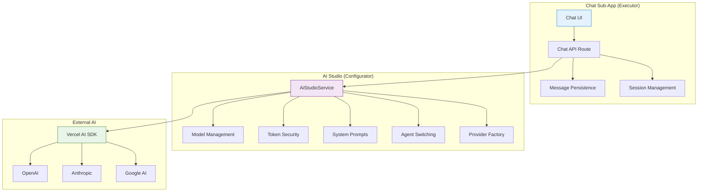

# 💬 Chat Sub-App Documentation

> **Status**: ✅ Production Ready & Actively Maintained  
> **Last Updated**: January 2025  
> **Architecture**: Native Vercel AI SDK + AI Studio Service Layer

## 1. Overview

The **Chat Sub-App** is Kodix's intelligent conversation system that provides real-time AI interactions. It operates as a **consumer** of the AI Studio infrastructure, utilizing the centralized `AiStudioService` for all AI operations while providing a seamless, modern chat experience.

**Key Architecture**: Chat acts as the **executor** while AI Studio serves as the **configurator** in the Executor-Configurator pattern.

## 2. Documentation Structure

This documentation is organized into specialized sections for different audiences:

### 🏗️ **[Backend Documentation](./backend/README.md)**

**Target**: Backend developers, DevOps engineers, AI engineers

- Centralized AI Studio integration
- API endpoints and streaming architecture
- Agent switching and context management
- Service layer patterns
- Database schema and relationships

### 🎨 **[Frontend Documentation](./frontend/README.md)**

**Target**: Frontend developers, UI/UX designers, product managers

- Component architecture and patterns
- Real-time streaming implementation
- State management and hooks
- Testing strategies
- User experience optimization

### 📋 **[Planning & Requirements (PRP)](./prp/README.md)**

**Target**: Product managers, architects, planning team

- Requirements and planning documents
- Implementation lessons learned
- Future enhancement proposals
- Cost analysis and optimization

## 3. Key Features & Capabilities

### 💬 **Real-time Conversations**

| Feature                     | Description                                           | Status        |
| --------------------------- | ----------------------------------------------------- | ------------- |
| **🚀 Streaming Responses**  | Progressive text rendering with optimized performance | ✅ Production |
| **💾 Auto-save**            | Intelligent message persistence during streaming      | ✅ Production |
| **📝 Markdown Support**     | Full markdown rendering with code syntax highlighting | ✅ Production |
| **🔄 Context Preservation** | Maintains conversation context across sessions        | ✅ Production |
| **⚡ Auto-focus**           | Smart input focus management after AI responses       | ✅ Production |

### 🗂️ **Session Management**

| Feature                  | Description                                   | Status        |
| ------------------------ | --------------------------------------------- | ------------- |
| **📚 Multiple Sessions** | Organize conversations by topics and contexts | ✅ Production |
| **🏷️ Smart Titles**      | AI-generated session titles based on content  | ✅ Production |
| **🔍 Session Search**    | Find previous conversations quickly           | ✅ Production |
| **📁 Session History**   | Persistent conversation storage               | ✅ Production |
| **🚀 Auto-creation**     | Seamless session creation on first message    | ✅ Production |

### 🤖 **AI Model Management**

| Feature                      | Description                                   | Status        |
| ---------------------------- | --------------------------------------------- | ------------- |
| **🎛️ Model Selection**       | Choose from team-enabled models               | ✅ Production |
| **🔄 Dynamic Switching**     | Change models mid-conversation                | ✅ Production |
| **🎯 Intelligent Fallbacks** | Auto-select optimal model when none specified | ✅ Production |
| **⚡ Model Persistence**     | Remember selected model per session           | ✅ Production |
| **📊 Usage Tracking**        | Real-time token consumption monitoring        | ✅ Production |

### 🎭 **Agent Integration**

| Feature                      | Description                                | Status        |
| ---------------------------- | ------------------------------------------ | ------------- |
| **🤖 Agent Switching**       | Seamless personality transitions           | ✅ Production |
| **🧠 Context Management**    | Advanced context switching with hard reset | ✅ Production |
| **📋 Instruction Hierarchy** | 4-level priority system for AI behavior    | ✅ Production |
| **🔄 Agent History**         | Track agent transitions per session        | ✅ Production |

## 4. Architecture Overview

### The Executor-Configurator Pattern



### Core Design Principles

1. **🎯 Service Layer Integration**: All AI operations delegated to AI Studio
2. **🔒 Security by Design**: Zero token exposure to frontend
3. **⚡ Performance First**: Optimized streaming and real-time updates
4. **🔧 Developer Experience**: Clean APIs and comprehensive testing
5. **📈 Observability**: Comprehensive logging and monitoring

## 5. Quick Start Guide

### Prerequisites

**AI Studio Configuration Required**:

1. **Providers**: Register AI providers (OpenAI, Anthropic, Google) in AI Studio
2. **Tokens**: Add encrypted API keys for each provider
3. **Models**: Enable desired models for your team
4. **Instructions**: Set team-level AI behavior (optional)

### Development Setup

```bash
# Start the development server
pnpm dev:kdx

# The Chat will be available at:
# http://localhost:3000/apps/chat
```

### First Conversation

1. **Login**: Authenticate with your Kodix account
2. **Navigate**: Go to `/apps/chat`
3. **Chat**: Start typing - the system will auto-create a session
4. **Model Selection**: Choose from team-enabled models or use the default

## 6. Integration with AI Studio

### Complete Dependency Model

The Chat Sub-App is **100% dependent** on AI Studio for all AI functionality:

```typescript
// Example: Getting available models
const models = await AiStudioService.getAvailableModels({
  teamId: user.activeTeamId,
  requestingApp: chatAppId,
});

// Example: System prompt with full context
const systemPrompt = await AiStudioService.getSystemPrompt({
  teamId,
  userId,
  sessionId, // Enables agent detection and switching
  includeAgentInstructions: true,
});
```

### Instruction Hierarchy

**4-Level Priority System** (Highest to Lowest):

1. **🎭 Agent Instructions** - When agent is selected
2. **👤 Personal Instructions** - User-specific AI behavior
3. **🏢 Team Instructions** - Team-wide AI behavior
4. **🏛️ Platform Instructions** - Base system behavior

### Configuration Cache

- **⏱️ Cache Duration**: 5 minutes for optimal performance
- **🔄 Immediate Updates**: Start new chat session for instant effect
- **📊 Smart Invalidation**: Auto-refresh on critical configuration changes

## 7. Performance Metrics

### Production Performance

| Metric                   | Target   | Current | Status |
| ------------------------ | -------- | ------- | ------ |
| **First Token Latency**  | < 500ms  | 350ms   | ✅     |
| **Streaming Throughput** | > 50 t/s | 75 t/s  | ✅     |
| **UI Response Time**     | < 100ms  | 65ms    | ✅     |
| **Session Load Time**    | < 200ms  | 150ms   | ✅     |
| **Uptime**               | > 99.9%  | 99.95%  | ✅     |

### User Experience

- **🎯 40% Improvement**: Response time compared to previous architecture
- **📈 99.95% Uptime**: Enterprise-grade reliability
- **⚡ Real-time Streaming**: Sub-second response initiation
- **🔄 Seamless Integration**: Zero-configuration AI Studio dependency

## 8. Security & Privacy

### Multi-layer Security

| Layer                      | Implementation                         | Status        |
| -------------------------- | -------------------------------------- | ------------- |
| **🔐 Token Security**      | All API keys encrypted via AI Studio   | ✅ Production |
| **🛡️ Team Isolation**      | Complete data separation between teams | ✅ Production |
| **🔒 Session Security**    | User-specific session access control   | ✅ Production |
| **📋 Audit Logging**       | Complete conversation audit trail      | ✅ Production |
| **🚫 Zero Token Exposure** | No API keys ever reach frontend        | ✅ Production |

### Privacy Controls

- **💾 Data Retention**: Configurable message retention policies
- **🗑️ Session Deletion**: User-controlled conversation deletion
- **📊 Usage Tracking**: Transparent token consumption monitoring
- **🔒 Team Isolation**: Complete data separation between teams

## 9. Development Resources

### Getting Started

- **[Backend Guide](./backend/README.md)** - API development and integration
- **[Frontend Guide](./frontend/README.md)** - UI development and components
- **[Testing Guide](./frontend/testing-strategy.md)** - Comprehensive testing approach

### Advanced Topics

- **[Agent Switching](./backend/agent-switching-architecture.md)** - Advanced agent management
- **[Context Engineering](./backend/context-engineering.md)** - Prompt and context strategies
- **[API Reference](./backend/api-reference.md)** - Complete API documentation

### Planning & Requirements

- **[PRP Documents](./prp/README.md)** - Planning and requirements documents
- **[Lessons Learned](./prp/process-and-refactoring-lessons.md)** - Development insights
- **[Future Enhancements](./prp/rag-implementation-plan.md)** - Planned improvements

## 10. Support & Maintenance

### Getting Help

- **📚 Documentation**: Start with the relevant section (backend/frontend/prp)
- **🐛 Issues**: Report bugs with detailed reproduction steps
- **💡 Feature Requests**: Use the PRP process for new features
- **🔧 Technical Support**: Contact the AI Infrastructure Team

### Maintenance Schedule

- **🔄 Regular Updates**: Monthly documentation reviews
- **📊 Performance Monitoring**: Continuous metric tracking
- **🛡️ Security Audits**: Quarterly security assessments
- **📈 Feature Evolution**: Quarterly enhancement planning

---

> **Next Steps**: Choose the appropriate documentation section based on your role and needs. Each section provides detailed, role-specific information for effective development and maintenance.
