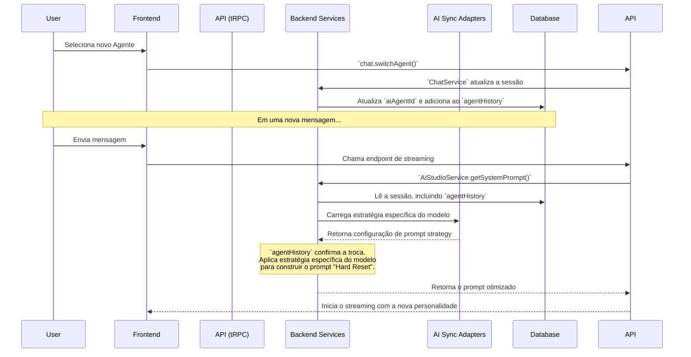

# Guia da Arquitetura de Troca de Agentes

> Este guia descreve a arquitetura e a estratégia de prompt engineering usadas para permitir a troca de agentes de IA em tempo real no Chat do Kodix.

---

## 1. O Desafio: A Inércia Contextual dos Modelos de IA

Modelos de linguagem avançados (como GPT-4o e Claude 3.5) são projetados para manter a consistência de uma conversa. Essa característica, embora útil, cria um problema chamado **inércia contextual**: ao receber novas instruções (como uma mudança de personalidade de agente), o modelo tende a ignorá-las para não quebrar o padrão da conversa existente.

Para superar isso, a arquitetura do Kodix implementa uma estratégia de **"Hard Reset"** no prompt do sistema, **adaptada especificamente para cada modelo de IA**.

---

## 2. A Arquitetura da Solução

O sistema de troca de agentes funciona através de uma orquestração cuidadosa entre o banco de dados, os serviços de backend, a API e **configurações específicas por modelo**.



### Pilares da Implementação:

1.  **Persistência no Banco de Dados**: A tabela `chatSession` possui três campos cruciais:

    - `aiAgentId`: Define qual agente a IA deve "ser".
    - `activeAgentId`: Reflete a seleção do usuário na UI.
    - `agentHistory`: Um log de todas as trocas. **Este campo é a chave para detectar a mudança.**

2.  **Sistema de Configuração por Modelo** (`ai-sync-adapters`):

    - **Arquivos JSON de Estratégias**: Cada provedor (OpenAI, Google, Anthropic) possui um arquivo de configuração que define estratégias específicas por modelo:
      - `openai-prompt-strategies.json` - 32+ modelos GPT e o-series
      - `google-prompt-strategies.json` - 22+ modelos Gemini
      - `anthropic-prompt-strategies.json` - 8+ modelos Claude
    - **Estrutura de Estratégia**:
      ```json
      {
        "modelId": "gpt-4o-2024-11-20",
        "strategy": {
          "type": "gpt-advanced",
          "agentSwitchTemplate": "hierarchical",
          "assertiveness": "medium",
          "contextualMemory": "high",
          "specialHandling": ["priority-system", "role-override"]
        }
      }
      ```

3.  **Orquestração de Backend**:

    - **`ChatService`**: Executa a lógica de negócio, atualizando a sessão no banco de dados quando o usuário solicita uma troca.
    - **`AiStudioService`**: É o cérebro evolutivo. Ao gerar o prompt para a IA, ele:
      1. Verifica o `agentHistory` para detectar trocas
      2. **Carrega a estratégia específica do modelo atual**
      3. Aplica a estratégia para gerar o prompt "Hard Reset" otimizado
      4. Preserva as instruções de contexto (usuário, time e plataforma)

4.  **Estratégias de Prompt Específicas por Modelo**:

    - **Claude (Anthropic)**:
      - Usa tags XML (`<system_reset>`, `<new_identity>`)
      - Alta assertividade com "identity-override"
      - Baixa memória contextual (prefere reset completo)
    - **GPT (OpenAI)**:
      - Estrutura hierárquica com "priority-system"
      - Assertividade média com "role-override"
      - Alta memória contextual (preserva mais contexto)
    - **Gemini (Google)**:
      - Comandos diretos com "direct-command"
      - Estrutura de "role-assignment"
      - Balanceamento entre contexto e reset

---

## 3. Tipos de Estratégias por Provedor

### **OpenAI (GPT Series)**

- `gpt-advanced`: GPT-4o, GPT-4.1, o1-pro (hierarchical, alta memória)
- `gpt-standard`: GPT-4o-mini, GPT-3.5 (simple, média memória)
- `gpt-lite`: GPT-4.1-nano (minimal, baixa memória)
- `reasoning-model`: o1, o3, o4-mini (reasoning-focused, step-by-step)

### **Google (Gemini Series)**

- `google-advanced`: Gemini 2.5-pro, 2.0-pro (direct-command, role-assignment)
- `google-standard`: Gemini 2.5-flash, 2.0-flash (direct-simple)
- `google-lite`: Gemini flash-lite, 8b (minimal, efficient-processing)
- `google-legacy`: Gemini 1.0-pro (legacy-compatibility)

### **Anthropic (Claude Series)**

- `claude-advanced`: Claude 4, 3.5-sonnet (xml-tags, identity-override)
- `claude-standard`: Claude 3.5-haiku, 3-haiku (simple, gentle-reset)

---

## 4. Princípios-Chave da Arquitetura

- **Estratégias Específicas por Modelo**: Cada modelo de IA tem características únicas. O sistema aplica a estratégia de prompt mais eficaz para cada um.
- **Configuração Baseada em JSON**: Estratégias são mantidas em arquivos JSON sincronizados com pricing, facilitando manutenção e atualizações.
- **Detecção por Histórico, não por Estado**: A decisão de aplicar o "Hard Reset" é baseada na presença de uma nova entrada no `agentHistory`, não em uma comparação simples de IDs.
- **Backend-Driven com Adaptação**: Toda a lógica de engenharia de prompt é centralizada no `AiStudioService`, mas adaptada dinamicamente baseada no modelo específico.
- **Manutenibilidade**: Sistema de configuração unificado permite atualizações rápidas quando novos modelos são lançados.

---

## 5. Manutenção e Atualizações

O sistema de estratégias é mantido através do processo unificado documentado em `@/ai-sync-adapters/README.md`:

1. **Pricing + Strategies**: Ambos são atualizados simultaneamente
2. **Sincronização**: `modelId` deve ser idêntico em ambos os arquivos
3. **Validação**: Sistema verifica consistência entre pricing e strategies
4. **Deployment**: Atualizações são aplicadas via AI Studio UI

Este design evolutivo garante que, independentemente do modelo de IA utilizado, a intenção do usuário de trocar de assistente seja sempre respeitada de forma clara, imediata e otimizada para as características específicas de cada modelo.
