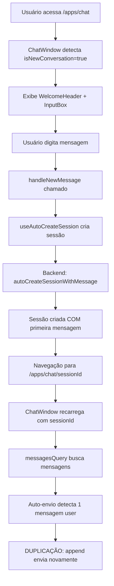
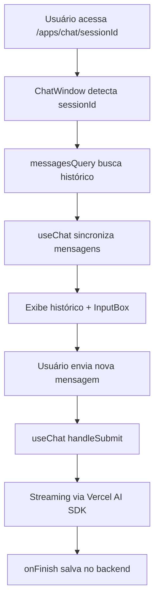
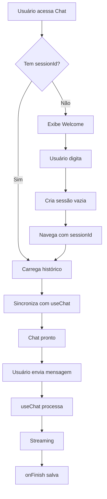

# Fluxo de Sessões e Mensagens no Chat

## 📋 Visão Geral

Este documento detalha o comportamento atual do sistema de sessões e mensagens no Chat SubApp, identifica os problemas existentes e propõe uma arquitetura robusta seguindo os padrões do Vercel AI SDK.

## 🔍 Estado Atual

### Fluxos Existentes

#### 1. **Novo Chat (Sem Sessão)**



#### 2. **Chat Existente (Com Sessão)**



### Problemas Identificados

#### 1. **Duplicação de Primeira Mensagem**

- **Causa**: Auto-envio não distingue sessões recém-criadas
- **Efeito**: Primeira mensagem aparece duplicada
- **Local**: `chat-window.tsx` linha ~165

#### 2. **Sincronização Complexa**

- **Causa**: Múltiplas fontes de verdade (banco vs useChat)
- **Efeito**: Mensagens somem após streaming
- **Local**: `useEffect` de sincronização

#### 3. **Múltiplos Caminhos de Criação**

- **Causa**: Dois fluxos diferentes (novo vs existente)
- **Efeito**: Lógica duplicada e complexa
- **Local**: `handleNewMessage` vs `handleSubmit`

#### 4. **Auto-Envio Problemático**

- **Causa**: Lógica genérica demais
- **Efeito**: Dispara em momentos inadequados
- **Local**: Auto-send logic no `useEffect`

## 🏗️ Arquitetura Atual

### Componentes Envolvidos

```
┌─────────────────┐     ┌──────────────────┐     ┌─────────────────┐
│   page.tsx      │────▶│  ChatWindow.tsx  │────▶│  useChat hook   │
└─────────────────┘     └──────────────────┘     └─────────────────┘
                               │                           │
                               ▼                           ▼
                        ┌──────────────────┐     ┌─────────────────┐
                        │ useAutoCreate    │     │ /api/chat/stream│
                        │    Session       │     └─────────────────┘
                        └──────────────────┘

```

### Estados e Transições

1. **Estado: Nova Conversa**

   - `sessionId = undefined`
   - `isNewConversation = true`
   - Renderiza welcome screen

2. **Estado: Criando Sessão**

   - `isCreating = true`
   - Navegação pendente
   - Input desabilitado

3. **Estado: Sessão Ativa**

   - `sessionId = string`
   - `messages = array`
   - Chat funcional

4. **Estado: Streaming**
   - `isLoading = true`
   - Mensagem sendo gerada
   - Stop button visível

## 🚨 Problemas de Sincronização

### 1. **Fontes de Verdade Conflitantes**

```typescript
// Fonte 1: Banco de dados (via tRPC)
const messagesQuery = useQuery(trpc.app.chat.buscarMensagensTest);

// Fonte 2: useChat hook (Vercel AI SDK)
const { messages } = useChat();

// Problema: Qual é a fonte de verdade?
```

### 2. **Timing de Sincronização**

```typescript
// Sincronização atual - muito agressiva
useEffect(() => {
  if (messagesFromDB) {
    setMessages(messagesFromDB); // Sobrescreve streaming!
  }
}, [messagesFromDB]);
```

### 3. **Ciclo de Vida Confuso**

1. Criar sessão → Salva mensagem no banco
2. Navegar → Recarrega do banco
3. Auto-envio → Duplica mensagem
4. Streaming → Conflito com banco

## 🎯 Arquitetura Proposta

### Princípios

1. **Single Source of Truth**: useChat é a fonte durante a sessão
2. **Lazy Sync**: Sincronizar apenas no carregamento inicial
3. **No Auto-Send**: Remover lógica de auto-envio
4. **Unified Flow**: Um único fluxo para novo/existente

### Novo Fluxo Proposto



### Mudanças Necessárias

#### 1. **Remover Auto-Envio**

```typescript
// REMOVER este bloco completamente
if (hasOnlyUserMessage && userMessage && !autoSentRef.current.has(messageKey)) {
  // Auto-send logic
}
```

#### 2. **Criar Sessão Vazia**

```typescript
// Em useAutoCreateSession
const createSession = async () => {
  const session = await createEmptySession();
  navigate(`/apps/chat/${session.id}`);
  // NÃO salvar primeira mensagem aqui
};
```

#### 3. **Sincronização Inteligente**

```typescript
// Sincronizar APENAS no mount inicial
useEffect(() => {
  if (!hasSyncedRef.current && messagesFromDB) {
    setMessages(messagesFromDB);
    hasSyncedRef.current = true;
  }
}, [messagesFromDB]);
```

#### 4. **Fluxo Unificado**

```typescript
// Sempre usar useChat para enviar
const sendMessage = (content: string) => {
  if (!sessionId) {
    // Criar sessão primeiro
    await createSession();
  }
  // Depois enviar via useChat
  append({ role: "user", content });
};
```

## 📐 Padrões Vercel AI SDK

### Conformidade Necessária

1. **useChat como Controlador Principal**

   - Gerencia estado de mensagens
   - Controla streaming
   - Handles errors

2. **Backend como Persistência**

   - Salva via onFinish
   - Não interfere no streaming
   - Apenas armazena

3. **Sincronização Mínima**
   - Apenas no carregamento inicial
   - Nunca durante streaming
   - Respeitar useChat

### Exemplo de Implementação Correta

```typescript
export function ChatWindow({ sessionId }: Props) {
  const { messages, append, isLoading } = useChat({
    api: "/api/chat/stream",
    body: { chatSessionId: sessionId },
    // Carregar histórico inicial
    initialMessages: sessionId ? await loadMessages(sessionId) : [],
    onFinish: (message) => {
      // Auto-save já acontece no backend
      console.log("Message completed");
    },
  });

  // Sem sincronização manual!
  // Sem auto-envio!
  // Simples e direto
}
```

## 🔧 Plano de Implementação

### Fase 1: Remover Complexidade

1. [ ] Remover auto-envio completamente
2. [ ] Simplificar sincronização
3. [ ] Unificar fluxos de criação

### Fase 2: Implementar Novo Fluxo

1. [ ] Criar sessões vazias
2. [ ] Usar initialMessages do useChat
3. [ ] Remover múltiplas fontes de verdade

### Fase 3: Otimizar

1. [ ] Cache inteligente
2. [ ] Prefetch de sessões
3. [ ] Otimizar queries

## 📊 Métricas de Sucesso

1. **Zero Duplicação**: Nenhuma mensagem duplicada
2. **Streaming Estável**: Sem mensagens sumindo
3. **Código Simples**: Redução de 50% na complexidade
4. **Performance**: Menos re-renders

## 🚀 Próximos Passos

1. **Aprovar arquitetura proposta**
2. **Implementar em branches separadas**
3. **Testar extensivamente**
4. **Deploy gradual**

---

**Status**: Documento em revisão
**Última atualização**: Dezembro 2024
**Autor**: Sistema de Documentação

# Fluxo de Sessões e Mensagens - Estado Atual

> **📋 Status:** Pós-FASE 1 ✅ | Auto-envio removido | Sincronização simplificada  
> **🗓️ Última atualização:** Dezembro 2024  
> **⚠️ Mudanças recentes:** FASE 1 concluída - Auto-envio desabilitado

## 🔄 Mudanças da FASE 1 Implementadas

### ❌ Auto-envio Removido

O sistema de auto-envio automático foi **completamente desabilitado** para eliminar duplicação de mensagens:

```typescript
// ❌ REMOVIDO - Auto-envio desabilitado
// const autoSentRef = useRef<Set<string>>(new Set());

// ❌ REMOVIDO - Lógica de auto-envio comentada
/*
const hasOnlyUserMessage = formattedMessages.length === 1 && formattedMessages[0]?.role === "user";
if (hasOnlyUserMessage && userMessage && !autoSentRef.current.has(messageKey)) {
  // ... lógica de auto-envio removida
}
*/
```

### 🔄 Sincronização Simplificada

Nova abordagem de sincronização **apenas no carregamento inicial**:

```typescript
// ✅ NOVO - Sincronização controlada
const hasSyncedRef = useRef(false);

useEffect(() => {
  if (!sessionId || messagesQuery.isLoading || hasSyncedRef.current) {
    return; // Sincronizar apenas uma vez
  }

  if (formattedMessages.length > 0) {
    setMessages(formattedMessages);
    hasSyncedRef.current = true; // Marcar como sincronizado
  }
}, [messagesQuery.data, sessionId, setMessages, isLoading, messages.length]);

// ✅ NOVO - Reset da flag quando sessão muda
useEffect(() => {
  hasSyncedRef.current = false;
}, [sessionId]);
```

---

## 📊 Estado Atual do Sistema
