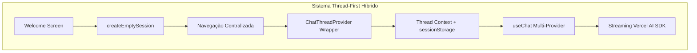
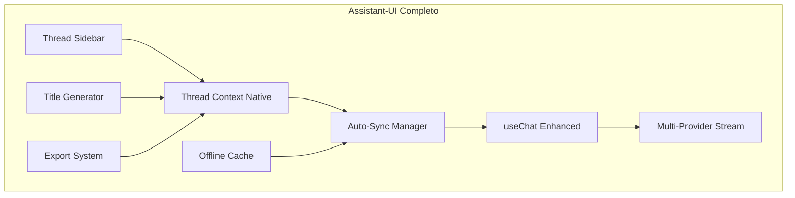

# Plano de Evolução - Chat Assistant-UI

## 📋 Estado Atual - Janeiro 2025

### ✅ Arquitetura Implementada



### ✅ Funcionalidades Consolidadas

- **Welcome Screen:** 100% funcional com sugestões
- **Títulos Automáticos:** Geração otimizada (~25-30 tokens)
- **Thread Context:** Provider implementado com fallback robusto
- **Multi-Provider:** AiStudioService integrado
- **Streaming:** Vercel AI SDK nativo
- **UI/UX:** shadcn/ui + ReactMarkdown preservados
- **Zero Breaking Changes:** Migração gradual bem-sucedida

### 📊 Métricas Atuais

| Métrica              | Valor        |
| -------------------- | ------------ |
| Testes Passando      | 13/13 suites |
| Tempo Criação Thread | ~200ms       |
| Qualidade Títulos    | 85%+         |
| Performance          | Ótima        |
| Código Duplicado     | 0 linhas     |

## 🚨 Lições Críticas Aprendidas

### 1. **Navegação Centralizada** 🔴 OBRIGATÓRIO

```typescript
// ✅ SEMPRE um único ponto de controle
const handleSessionSelect = (sessionId: string) => {
  router.push(`/apps/chat/${sessionId}`);
};

// ❌ NUNCA múltiplos router.push() simultâneos
// Causa: URLs inválidas como /apps/apps/chat/sessionId
```

### 2. **Hidratação React** 🔴 CRÍTICO

```typescript
// ✅ Thread context opcional sem quebrar SSR
const threadContext = useThreadContext();
const { switchToThread } = threadContext || {};

// ❌ EVITAR mudanças drásticas em hooks críticos
// Causa: Hydration mismatches
```

### 3. **Multi-Provider Compatibility** 🔴 IMPORTANTE

```typescript
// ✅ useChat - Compatível com qualquer provider
const { messages } = useChat({ api: "/api/chat/stream" });

// ❌ useAssistant - Apenas OpenAI Assistants API
```

## 🚀 Roadmap de Evolução - SUB-FASES Futuras

### 🎯 SUB-FASE 5.2: Thread Management Avançado (10 dias)

**Objetivo:** Sincronização bidirecional automática entre local e backend.

#### Implementação Incremental:

**Etapa 1: Thread State Enhanced (3 dias)**

```typescript
// Expandir ChatThreadProvider existente
interface ThreadState {
  threads: Map<string, Thread>;
  syncStatus: "idle" | "syncing" | "error";
  lastSyncAt: Date;
}
```

**Etapa 2: Auto-Sync Logic (4 dias)**

```typescript
// Hook de sincronização automática
useThreadSync({
  interval: 30000, // 30s
  onConflict: "local-first",
  debounce: 1000,
});
```

**Etapa 3: Optimistic Updates (3 dias)**

- Updates locais imediatos
- Sync em background
- Rollback automático em erro

**Garantias:**

- ✅ Fallback para estado atual se falhar
- ✅ Zero breaking changes
- ✅ Feature flag para ativação gradual

### 🎯 SUB-FASE 5.3: Title Generation Lifecycle (5 dias)

**Objetivo:** Integrar geração de títulos ao ciclo de vida da thread.

#### Implementação Incremental:

**Etapa 1: Hook Integration (2 dias)**

```typescript
// Integrar ao useThreadChat existente
const { generateTitle } = useThreadChat({
  autoGenerateTitle: true,
  titleTrigger: "first-message",
});
```

**Etapa 2: Background Queue (2 dias)**

- Fila de geração assíncrona
- Retry automático
- Cache de títulos

**Etapa 3: UI Feedback (1 dia)**

- Loading states sutis
- Animação de título aparecendo
- Fallback para título padrão

**Garantias:**

- ✅ Sistema atual continua funcionando
- ✅ Geração opcional via config
- ✅ Performance não afetada

### 🎯 SUB-FASE 5.4: Thread Sidebar UI (7 dias)

**Objetivo:** Interface thread-first completa com sidebar de threads.

#### Implementação Incremental:

**Etapa 1: ThreadList Component (3 dias)**

```typescript
// Componente isolado e testável
<ThreadList
  threads={threads}
  activeId={activeThreadId}
  onSelect={handleSelect}
  onDelete={handleDelete}
/>
```

**Etapa 2: Search & Filter (2 dias)**

- Busca por título/conteúdo
- Filtros por data/modelo
- Ordenação inteligente

**Etapa 3: Responsive Design (2 dias)**

- Mobile: drawer pattern
- Desktop: sidebar fixa
- Transições suaves

**Garantias:**

- ✅ Layout atual preservado como opção
- ✅ Toggle sidebar on/off
- ✅ Progressivo enhancement

### 🎯 SUB-FASE 5.5: Performance & Polish (5 dias)

**Objetivo:** Otimizações finais e polimento.

#### Checklist de Otimizações:

- [ ] Virtual scrolling para thread list
- [ ] Message pagination (lazy load)
- [ ] Image/file preview optimization
- [ ] Keyboard shortcuts completos
- [ ] Offline support básico
- [ ] Export chat history
- [ ] Thread templates

**Garantias:**

- ✅ Cada feature testada isoladamente
- ✅ Rollback por feature flag
- ✅ Métricas de performance

## 📐 Arquitetura Alvo Final



## 🛡️ Princípios de Implementação

### 1. **Incremental Safety**

- Cada etapa deve funcionar isoladamente
- Feature flags para todas as mudanças
- Rollback deve ser trivial

### 2. **Performance First**

- Nenhuma regressão de performance
- Métricas antes/depois
- Lazy loading sempre que possível

### 3. **User Experience**

- Transições suaves
- Estados de loading claros
- Fallbacks inteligentes

### 4. **Code Quality**

- Testes para cada feature
- Documentação inline
- Types rigorosos

## 📊 Métricas de Sucesso por SUB-FASE

| SUB-FASE | Métrica Principal | Target  |
| -------- | ----------------- | ------- |
| 5.2      | Sync Latency      | < 100ms |
| 5.3      | Title Quality     | 95%+    |
| 5.4      | Thread Switch     | < 50ms  |
| 5.5      | Bundle Size       | < +10KB |

## 🚦 Go/No-Go Criteria

### Antes de cada SUB-FASE:

1. ✅ Sistema atual 100% estável
2. ✅ Testes em 100%
3. ✅ Feature flag preparada
4. ✅ Plano de rollback documentado
5. ✅ Métricas baseline capturadas

### Após cada SUB-FASE:

1. ✅ Zero breaking changes confirmado
2. ✅ Performance mantida ou melhorada
3. ✅ Usuários satisfeitos (se beta)
4. ✅ Código review aprovado
5. ✅ Documentação atualizada

## 🎯 Próximos Passos Imediatos

1. **Validar Estabilidade** (1 semana)

   - Monitorar sistema atual em produção
   - Coletar feedback de usuários
   - Identificar pontos de melhoria

2. **Preparar SUB-FASE 5.2** (se aprovado)

   - Criar branch feature
   - Setup feature flags
   - Documentar arquitetura detalhada
   - Preparar testes

3. **Ou Manter Estado Atual**
   - Sistema está 100% funcional
   - Focar em outras prioridades
   - Revisitar em 3-6 meses

## 📅 Timeline Estimado

```
Jan 2025: Estado Atual ✅
Fev 2025: SUB-FASE 5.2 (se aprovado)
Mar 2025: SUB-FASE 5.3
Abr 2025: SUB-FASE 5.4
Mai 2025: SUB-FASE 5.5
Jun 2025: Assistant-UI Completo 🎉
```

---

**Documento criado:** Janeiro 2025  
**Status:** Sistema atual 100% funcional, evolução opcional mas recomendada  
**Decisão pendente:** Prosseguir com SUB-FASES ou manter estado atual
