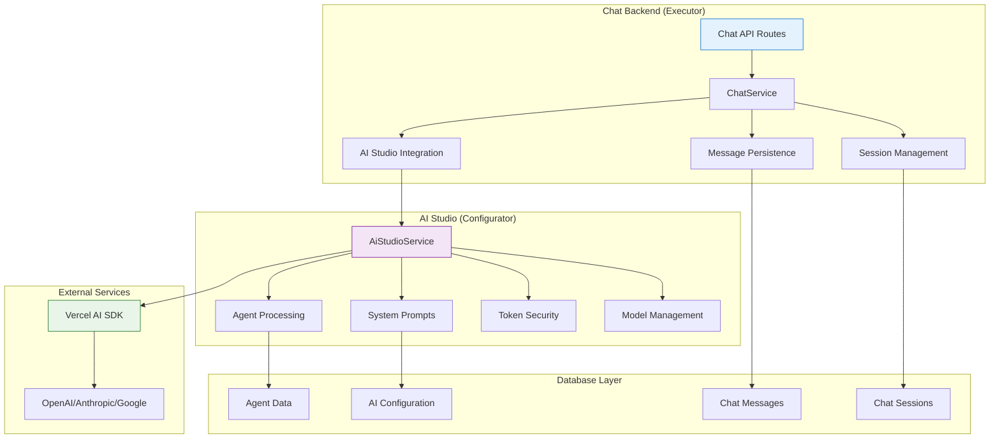
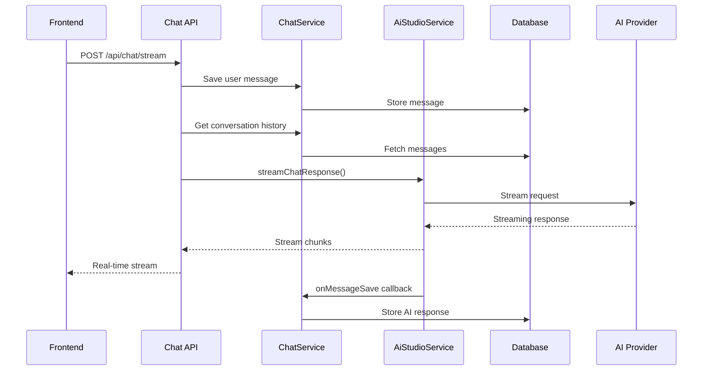

# Chat Backend Architecture

> **Status**: ✅ Production Ready & Actively Maintained  
> **Last Updated**: January 2025  
> **Architecture Pattern**: Executor-Configurator with AI Studio Integration

## 1. Overview

The Chat backend implements a **service-oriented architecture** that leverages the AI Studio infrastructure for all AI operations. It serves as the **executor** in the Executor-Configurator pattern, handling message persistence, session management, and acting as a thin proxy to the AI Studio service layer.

**Core Principle**: Delegate all AI complexity to AI Studio while maintaining chat-specific business logic and data management.

## 2. Documentation Index

### 🏗️ **Core Architecture**

- **[🚀 Streaming Architecture](./streaming-architecture.md)** - AI Studio integration and real-time streaming
- **[🔄 Agent Switching Architecture](./agent-switching-architecture.md)** - Advanced agent management and context switching
- **[🧠 Context Engineering](./context-engineering.md)** - Prompt strategies and context management

### 📚 **API Documentation**

- **[📋 API Reference](./api-reference.md)** - Complete tRPC endpoints and streaming API documentation

## 3. Architecture Overview

### 3.1 The Executor-Configurator Pattern



### 3.2 Key Components

| Component               | Responsibility                          | Location                              |
| ----------------------- | --------------------------------------- | ------------------------------------- |
| **Chat API Routes**     | HTTP endpoints for frontend integration | `apps/kdx/src/app/api/chat/`          |
| **ChatService**         | Business logic and orchestration        | `packages/api/src/internal/services/` |
| **Session Management**  | Chat session lifecycle                  | `packages/db/src/repositories/`       |
| **Message Persistence** | Message storage and retrieval           | `packages/db/src/repositories/`       |
| **AI Studio Bridge**    | Integration with AI Studio service      | Via `AiStudioService` calls           |

## 4. Service Layer Architecture

### 4.1 ChatService - The Core Orchestrator

```typescript
// packages/api/src/internal/services/chat.service.ts
export class ChatService {
  // Session Management
  static async findSessionById(sessionId: string) {
    return chatRepository.ChatSessionRepository.findById(sessionId);
  }

  static async createSession(params: CreateSessionParams) {
    return chatRepository.ChatSessionRepository.create(params);
  }

  static async updateSession(sessionId: string, updates: Partial<ChatSession>) {
    return chatRepository.ChatSessionRepository.update(sessionId, updates);
  }

  // Message Management
  static async createMessage(params: CreateMessageParams) {
    return chatRepository.ChatMessageRepository.create(params);
  }

  static async findMessagesBySession(params: FindMessagesParams) {
    return chatRepository.ChatMessageRepository.findBySession(params);
  }

  // Agent Management
  static async switchAgent(params: SwitchAgentParams) {
    // Validates and updates agent switching
    // Maintains agent history
    // Updates session state
  }

  // System Integration
  static async hasSystemInstructions(sessionId: string) {
    // Check if system instructions are configured
    return boolean;
  }
}
```

### 4.2 Key Service Responsibilities

#### Session Lifecycle Management

```typescript
// Session Creation Flow
const session = await ChatService.createSession({
  title: "Generated Title",
  aiModelId: selectedModelId,
  teamId: user.activeTeamId,
  userId: user.id,
});

// System Prompt Integration
const systemPrompt = await AiStudioService.getSystemPrompt({
  teamId,
  userId,
  sessionId: session.id,
});

if (systemPrompt?.trim()) {
  await ChatService.createSystemMessage({
    chatSessionId: session.id,
    content: systemPrompt,
    metadata: {
      type: "system_prompt",
      source: "platform_and_team_instructions",
    },
  });
}
```

#### Message Flow Management

```typescript
// Message Processing Flow
export async function handleStreamingRequest(request: NextRequest) {
  // 1. Authentication & Authorization
  const { userId, teamId } = await auth();

  // 2. Message Persistence (User Message)
  await ChatService.createMessage({
    chatSessionId: session.id,
    senderRole: "user",
    content: userMessage,
    status: "ok",
  });

  // 3. **CENTRALIZED AI STREAMING** via AI Studio
  return AiStudioService.streamChatResponse({
    messages: conversationHistory,
    sessionId: session.id,
    userId,
    teamId,
    modelId: session.aiModelId,
    onMessageSave: async (messageData) => {
      // 4. Auto-save AI Response
      await ChatService.createMessage({
        chatSessionId: session.id,
        senderRole: "ai",
        content: messageData.content,
        status: "ok",
        metadata: messageData.metadata,
      });
    },
  });
}
```

## 5. API Layer Architecture

### 5.1 Main API Endpoints

| Endpoint                     | Method | Purpose                | Implementation        |
| ---------------------------- | ------ | ---------------------- | --------------------- |
| **`/api/chat/stream`**       | POST   | Real-time AI streaming | Next.js Route Handler |
| **`/api/chat/sessions`**     | GET    | Session listing        | tRPC Procedure        |
| **`/api/chat/sessions`**     | POST   | Session creation       | tRPC Procedure        |
| **`/api/chat/messages`**     | GET    | Message history        | tRPC Procedure        |
| **`/api/chat/agent-switch`** | POST   | Agent switching        | tRPC Procedure        |

### 5.2 Streaming Architecture



### 5.3 Error Handling Strategy

```typescript
// Comprehensive Error Handling
export async function POST(request: NextRequest) {
  try {
    // Main processing logic
    return await processStreamingRequest(request);
  } catch (error) {
    console.error("🔴 [CHAT_API] Stream error:", error);

    // Categorized error responses
    if (error instanceof AuthenticationError) {
      return Response.json({ error: "Unauthorized" }, { status: 401 });
    }

    if (error instanceof ValidationError) {
      return Response.json({ error: error.message }, { status: 400 });
    }

    if (error instanceof AIServiceError) {
      return Response.json(
        { error: "AI service unavailable" },
        { status: 503 },
      );
    }

    // Generic error fallback
    return Response.json({ error: "Internal server error" }, { status: 500 });
  }
}
```

## 6. Database Integration

### 6.1 Schema Overview

```typescript
// Chat Sessions Table
interface ChatSession {
  id: string;
  title: string;
  aiModelId: string | null;
  aiAgentId: string | null;
  activeAgentId: string | null;
  agentHistory: AgentHistoryEntry[] | null;
  teamId: string;
  userId: string;
  createdAt: Date;
  updatedAt: Date | null;
}

// Chat Messages Table
interface ChatMessage {
  id: string;
  chatSessionId: string;
  senderRole: "user" | "ai" | "system";
  content: string;
  status: "ok" | "error" | "pending";
  metadata: Record<string, unknown> | null;
  createdAt: Date;
  updatedAt: Date | null;
}

// Agent History Structure
interface AgentHistoryEntry {
  agentId: string;
  agentName: string;
  switchedAt: string;
  messageCount: number;
  reason: "user_switch" | "auto_suggestion" | "system_default";
}
```

### 6.2 Repository Pattern

```typescript
// Clean separation of database operations
export class ChatSessionRepository {
  static async create(params: CreateSessionParams) {
    return db.insert(chatSession).values(params).returning();
  }

  static async findById(sessionId: string) {
    return db.select().from(chatSession).where(eq(chatSession.id, sessionId));
  }

  static async findByTeam(teamId: string) {
    return db.select().from(chatSession).where(eq(chatSession.teamId, teamId));
  }

  static async update(sessionId: string, updates: Partial<ChatSession>) {
    return db
      .update(chatSession)
      .set(updates)
      .where(eq(chatSession.id, sessionId))
      .returning();
  }
}
```

## 7. Integration Patterns

### 7.1 AI Studio Integration

```typescript
// Complete AI Studio dependency
export class ChatBackendService {
  static async processAIRequest(params: ProcessAIRequestParams) {
    // 1. Validate session and permissions
    const session = await ChatService.findSessionById(params.sessionId);

    // 2. Delegate all AI operations to AI Studio
    const response = await AiStudioService.streamChatResponse({
      messages: params.messages,
      sessionId: params.sessionId,
      userId: params.userId,
      teamId: params.teamId,
      modelId: session.aiModelId,
      onMessageSave: async (messageData) => {
        // 3. Handle persistence callback
        await ChatService.createMessage({
          chatSessionId: params.sessionId,
          senderRole: "ai",
          content: messageData.content,
          metadata: messageData.metadata,
        });
      },
    });

    return response;
  }
}
```

### 7.2 Security Integration

```typescript
// Multi-layer security validation
export async function validateChatRequest(request: NextRequest) {
  // 1. Authentication
  const authSession = await auth();
  if (!authSession?.user) {
    throw new AuthenticationError("User not authenticated");
  }

  // 2. Authorization
  const { chatSessionId } = await request.json();
  const session = await ChatService.findSessionById(chatSessionId);

  if (!session || session.teamId !== authSession.user.activeTeamId) {
    throw new AuthorizationError("Access denied to chat session");
  }

  // 3. Team isolation
  if (session.teamId !== authSession.user.activeTeamId) {
    throw new AuthorizationError("Team isolation violation");
  }

  return { user: authSession.user, session };
}
```

## 8. Performance Optimization

### 8.1 Caching Strategy

```typescript
// Smart caching for frequently accessed data
export class ChatCacheService {
  private static cache = new Map<string, any>();

  static async getCachedSession(sessionId: string) {
    const cacheKey = `session:${sessionId}`;

    if (this.cache.has(cacheKey)) {
      return this.cache.get(cacheKey);
    }

    const session = await ChatService.findSessionById(sessionId);
    this.cache.set(cacheKey, session);

    // Auto-expire cache after 5 minutes
    setTimeout(() => this.cache.delete(cacheKey), 5 * 60 * 1000);

    return session;
  }
}
```

### 8.2 Database Optimization

```typescript
// Optimized query patterns
export class ChatMessageRepository {
  static async findRecentMessages(sessionId: string, limit: number = 20) {
    return db
      .select()
      .from(chatMessage)
      .where(eq(chatMessage.chatSessionId, sessionId))
      .orderBy(desc(chatMessage.createdAt))
      .limit(limit);
  }

  static async findMessagesBySession(params: FindMessagesParams) {
    return db
      .select()
      .from(chatMessage)
      .where(eq(chatMessage.chatSessionId, params.chatSessionId))
      .orderBy(
        params.ordem === "asc"
          ? asc(chatMessage.createdAt)
          : desc(chatMessage.createdAt),
      )
      .limit(params.limite)
      .offset(params.offset);
  }
}
```

## 9. Monitoring & Observability

### 9.1 Logging Strategy

```typescript
// Structured logging for debugging and monitoring
export class ChatLogger {
  static logStreamingRequest(sessionId: string, userId: string, metadata: any) {
    console.log("🔵 [CHAT_STREAMING]", {
      action: "streaming_request",
      sessionId,
      userId,
      timestamp: new Date().toISOString(),
      metadata,
    });
  }

  static logAIResponse(sessionId: string, responseMetadata: any) {
    console.log("🟢 [CHAT_AI_RESPONSE]", {
      action: "ai_response_complete",
      sessionId,
      model: responseMetadata.model,
      tokensUsed: responseMetadata.usage?.totalTokens,
      finishReason: responseMetadata.finishReason,
      timestamp: new Date().toISOString(),
    });
  }

  static logError(sessionId: string, error: Error, context: any) {
    console.error("🔴 [CHAT_ERROR]", {
      action: "error_occurred",
      sessionId,
      error: error.message,
      stack: error.stack,
      context,
      timestamp: new Date().toISOString(),
    });
  }
}
```

### 9.2 Performance Metrics

```typescript
// Performance tracking
export class ChatMetrics {
  static trackStreamingLatency(sessionId: string, startTime: number) {
    const latency = Date.now() - startTime;

    console.log("📊 [CHAT_METRICS]", {
      metric: "streaming_latency",
      sessionId,
      latency,
      timestamp: new Date().toISOString(),
    });

    // Alert if latency exceeds threshold
    if (latency > 1000) {
      console.warn("⚠️ [CHAT_PERFORMANCE]", {
        alert: "high_latency",
        sessionId,
        latency,
      });
    }
  }
}
```

## 10. Development Guidelines

### 10.1 Best Practices

1. **🎯 Service Layer First**: All business logic should go through service classes
2. **🔒 Security by Default**: Every endpoint must validate authentication and authorization
3. **📊 Comprehensive Logging**: Log all significant operations with structured data
4. **⚡ Performance Awareness**: Monitor and optimize database queries and API calls
5. **🧪 Test Coverage**: Maintain >85% test coverage for all backend logic

### 10.2 Code Organization

```
packages/api/src/
├── internal/services/
│   ├── chat.service.ts          # Main orchestration service
│   ├── ai-studio.service.ts     # AI Studio integration
│   └── errors/                  # Custom error classes
├── trpc/routers/app/chat/       # tRPC route handlers
├── repositories/                # Database access layer
└── utils/                       # Shared utilities

apps/kdx/src/app/api/chat/       # Next.js API routes
├── stream/route.ts              # Main streaming endpoint
├── sessions/route.ts            # Session management
└── messages/route.ts            # Message operations
```

### 10.3 Testing Strategy

```typescript
// Service layer testing example
describe("ChatService", () => {
  describe("switchAgent", () => {
    it("should update session with new agent", async () => {
      // Setup
      const mockSession = { id: "session-1", teamId: "team-1" };
      const mockAgent = { id: "agent-2", name: "New Agent" };

      // Execute
      const result = await ChatService.switchAgent({
        sessionId: "session-1",
        agentId: "agent-2",
        reason: "user_switch",
        teamId: "team-1",
      });

      // Verify
      expect(result.success).toBe(true);
      expect(result.agent.id).toBe("agent-2");
    });
  });
});
```

## 11. Next Steps

### For Backend Developers

1. **📚 Start with**: [API Reference](./api-reference.md) for endpoint details
2. **🔄 Then explore**: [Streaming Architecture](./streaming-architecture.md) for AI integration
3. **🧠 Advanced topics**: [Agent Switching](./agent-switching-architecture.md) and [Context Engineering](./context-engineering.md)

### For DevOps Engineers

1. **🔧 Focus on**: Performance monitoring and logging strategies
2. **📊 Monitor**: Database query performance and AI service latency
3. **🔒 Security**: Review authentication and authorization patterns

### For AI Engineers

1. **🎯 Deep dive**: [Context Engineering](./context-engineering.md) for prompt strategies
2. **🔄 Understand**: [Agent Switching](./agent-switching-architecture.md) for advanced AI behavior
3. **🚀 Optimize**: AI Studio integration patterns and performance

---

> **Architecture Philosophy**: Keep the Chat backend simple and focused on its core responsibilities—message persistence, session management, and seamless AI Studio integration. Let AI Studio handle the complexity of AI operations while maintaining clean separation of concerns.
