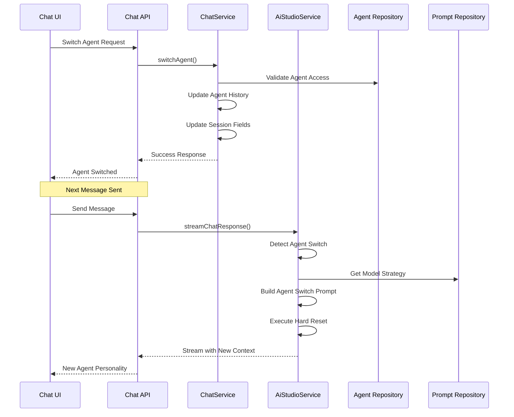

# Chat Backend Agent Integration

> **Status**: ✅ Production Ready & Actively Maintained  
> **Last Updated**: January 2025  
> **Integration Point**: Chat ↔ AI Studio Services

## 1. Overview

This document describes how the Chat backend integrates with AI Studio's agent switching and context engineering systems. The Chat subapp acts as the orchestration layer for agent management while delegating AI processing to AI Studio services.

**Key Integration Points:**
- Chat session state management for agent switching
- Message context preparation for AI Studio
- tRPC endpoints for agent operations
- Frontend integration patterns

## 2. Agent Switching Integration Flow

### 2.1 Complete Integration Sequence



### 2.2 Chat Backend Responsibilities

**Session State Management:**
- Maintain `aiAgentId` and `activeAgentId` synchronization
- Track agent history with timestamps and reasons
- Validate agent access permissions for team

**Message Processing:**
- Prepare conversation history for AI Studio
- Handle message creation and storage
- Manage streaming response integration

**Agent Lifecycle:**
- Coordinate agent switches with AI Studio
- Maintain session integrity during transitions
- Provide fallback mechanisms for failed switches

## 3. Session State Management

### 3.1 Agent State Fields

The Chat backend maintains agent state through three key fields in the `chat_session` table:

| Field               | Purpose            | Usage                                      |
| ------------------- | ------------------ | ------------------------------------------ |
| **`aiAgentId`**     | **Active Agent**   | Used by AI Studio for prompt building      |
| **`activeAgentId`** | **UI State**       | Used by frontend for display and detection |
| **`agentHistory`**  | **Switch History** | Chronological record of agent transitions  |

### 3.2 Agent History Structure

```typescript
// Agent History Structure managed by Chat backend
interface AgentHistoryEntry {
  agentId: string;
  agentName: string;
  switchedAt: string; // ISO timestamp
  messageCount: number;
  reason: "user_switch" | "auto_suggestion" | "system_default";
}
```

### 3.3 State Synchronization

```typescript
// ChatService implementation for agent switching
static async switchAgent(params: {
  sessionId: string;
  agentId: string;
  reason: "user_switch" | "auto_suggestion" | "system_default";
  teamId: string;
}) {
  // 1. Validate session and agent access
  const session = await this.findSessionById(sessionId);
  const agent = await aiStudioRepository.AiAgentRepository.findById(agentId);

  // 2. Update both agent fields for consistency
  await chatRepository.ChatSessionRepository.update(sessionId, {
    aiAgentId: agentId,      // ✅ Used by AI Studio
    activeAgentId: agentId,  // ✅ Used by frontend
    agentHistory: [...currentHistory, newEntry]
  });

  // 3. Return success for immediate UI feedback
  return { success: true, agent: { id: agent.id, name: agent.name } };
}
```

## 4. Message Context Integration

### 4.1 Chat History Preparation

The Chat backend prepares conversation context for AI Studio consumption:

```typescript
// Message history formatting for AI Studio
const messages = await ChatService.findMessagesBySession({
  chatSessionId: session.id,
  limite: 20, // Token budget consideration
  offset: 0,
  ordem: "asc",
});

const formattedMessages = messages.map((msg) => ({
  role: msg.senderRole === "user" ? "user" : "assistant",
  content: msg.content,
}));
```

### 4.2 Context Handoff to AI Studio

```typescript
// Chat API streaming endpoint integration
export async function POST(request: NextRequest) {
  // 1. Extract chat session and user message
  const { chatSessionId, messages } = await request.json();
  
  // 2. Get session and prepare context
  const session = await ChatService.findSessionById(chatSessionId);
  const messageHistory = await ChatService.findMessagesBySession({
    chatSessionId: session.id,
    limite: 20,
    offset: 0,
    ordem: "asc",
  });

  // 3. Get system prompt with agent context from AI Studio
  const systemPrompt = await AiStudioService.getSystemPrompt({
    teamId,
    userId,
    sessionId: session.id, // Enables agent switch detection
  });

  // 4. Stream response with full context
  return AiStudioService.streamChatResponse({
    messages: [
      { role: "system", content: systemPrompt },
      ...formattedMessages
    ],
    sessionId: session.id,
    userId,
    teamId,
    modelId: session.aiModelId,
    onMessageSave: async (messageData) => {
      await ChatService.createMessage({
        chatSessionId: session.id,
        senderRole: "ai",
        content: messageData.content,
        status: "ok",
      });
    },
  });
}
```

## 5. tRPC Agent Management Endpoints

### 5.1 Chat Router Agent Endpoints

```typescript
// tRPC endpoints in chat router for agent management
export const chatRouter = t.router({
  // Switch agent in session
  switchAgent: protectedProcedure
    .input(
      z.object({
        sessionId: z.string(),
        agentId: z.string(),
        reason: z.enum(["user_switch", "auto_suggestion", "system_default"]),
      }),
    )
    .mutation(async ({ input, ctx }) => {
      return ChatService.switchAgent({
        sessionId: input.sessionId,
        agentId: input.agentId,
        reason: input.reason,
        teamId: ctx.auth.user.activeTeamId,
      });
    }),

  // Get available agents for team
  getAvailableAgents: protectedProcedure
    .input(z.object({ sessionId: z.string() }))
    .query(async ({ input, ctx }) => {
      return ChatService.getAvailableAgents(
        input.sessionId,
        ctx.auth.user.activeTeamId,
      );
    }),

  // Get agent history for session
  getAgentHistory: protectedProcedure
    .input(z.object({ sessionId: z.string() }))
    .query(async ({ input, ctx }) => {
      return ChatService.getAgentHistory(
        input.sessionId,
        ctx.auth.user.activeTeamId,
      );
    }),
});
```

### 5.2 Integration with AI Studio Services

```typescript
// ChatService delegates AI operations to AiStudioService
static async getAvailableAgents(sessionId: string, teamId: string) {
  // 1. Validate session access
  const session = await this.findSessionById(sessionId);
  if (!session || session.teamId !== teamId) {
    throw new Error("Session not found or access denied");
  }

  // 2. Delegate to AI Studio for agent discovery
  const agents = await aiStudioRepository.AiAgentRepository.findByTeam({
    teamId: teamId,
    limite: 50,
    offset: 0,
  });

  // 3. Add Chat-specific state information
  return agents.map((agent) => ({
    id: agent.id,
    name: agent.name,
    isActive: agent.id === session.activeAgentId, // Chat session state
    hasInstructions: !!agent.instructions,
  }));
}
```

## 6. Frontend Integration Patterns

### 6.1 Agent Switcher Component

```typescript
// Chat UI component for agent switching
const AgentSwitcher = ({ sessionId, currentAgentId, onAgentSwitch }) => {
  const { data: availableAgents } = trpc.chat.getAvailableAgents.useQuery({ 
    sessionId 
  });
  const switchAgent = trpc.chat.switchAgent.useMutation();

  const handleAgentChange = async (agentId: string) => {
    try {
      await switchAgent.mutateAsync({
        sessionId,
        agentId,
        reason: 'user_switch'
      });

      onAgentSwitch?.(agentId);
      toast.success(`Switched to ${agent.name}`);
    } catch (error) {
      toast.error('Failed to switch agent');
    }
  };

  return (
    <Select value={currentAgentId} onValueChange={handleAgentChange}>
      <SelectContent>
        {availableAgents?.map(agent => (
          <SelectItem key={agent.id} value={agent.id}>
            <div className="flex items-center space-x-2">
              <AgentAvatar agent={agent} />
              <span>{agent.name}</span>
            </div>
          </SelectItem>
        ))}
      </SelectContent>
    </Select>
  );
};
```

### 6.2 Agent History Display

```typescript
// Chat UI component for displaying agent switch history
const AgentHistory = ({ session }) => {
  const agentHistory = session.agentHistory || [];

  if (agentHistory.length === 0) {
    return (
      <div className="text-muted-foreground text-sm">
        No agent switches in this conversation
      </div>
    );
  }

  return (
    <div className="space-y-2">
      <h4 className="font-medium">Agent History</h4>
      <div className="space-y-1">
        {agentHistory.map((entry, index) => (
          <div key={index} className="flex items-center justify-between text-sm">
            <span className="font-medium">{entry.agentName}</span>
            <span className="text-muted-foreground">
              {formatDistanceToNow(new Date(entry.switchedAt), { addSuffix: true })}
            </span>
          </div>
        ))}
      </div>
    </div>
  );
};
```

## 7. Error Handling & Recovery

### 7.1 Agent Switch Failure Scenarios

```typescript
// Chat backend error handling for agent operations
const chatAgentErrorHandling = {
  // Agent not found or access denied
  agentAccessDenied: {
    fallback: "maintain-current-agent",
    message: "Agent not available for your team",
    recovery: "log-and-continue",
  },

  // AI Studio service unavailable
  aiStudioUnavailable: {
    fallback: "use-default-agent",
    message: "Using default agent due to service issues",
    recovery: "retry-with-exponential-backoff",
  },

  // Session state corruption
  sessionStateCorrupted: {
    fallback: "reset-to-default-agent",
    message: "Session state reset for consistency",
    recovery: "audit-and-repair",
  },
};
```

### 7.2 Graceful Degradation

- **Service Isolation**: Chat continues functioning if AI Studio is degraded
- **State Recovery**: Automatic synchronization of mismatched agent states  
- **User Feedback**: Clear error messages with suggested actions
- **Audit Trail**: Complete logging of all agent operations for debugging

## 8. Performance Considerations

### 8.1 Optimization Strategies

```typescript
// Chat-specific performance optimizations
const chatPerformanceOptimizations = {
  // Agent data caching
  agentCaching: {
    duration: 300, // 5 minutes
    key: (teamId: string) => `chat:agents:${teamId}`,
    invalidation: ["agent-update", "team-change"],
  },

  // Session state caching
  sessionCaching: {
    duration: 60, // 1 minute
    key: (sessionId: string) => `chat:session:${sessionId}`,
    invalidation: ["session-update", "agent-switch"],
  },

  // Message history pagination
  messageOptimization: {
    defaultLimit: 20,
    maxLimit: 100,
    indexing: ["chatSessionId", "createdAt"],
  },
};
```

### 8.2 Monitoring & Metrics

- **Agent Switch Latency**: Time from request to UI update
- **Context Preparation Time**: Message history assembly performance
- **AI Studio Integration Health**: Service availability and response times
- **Session State Consistency**: Validation of agent field synchronization

---

## Integration Summary

The Chat backend serves as the **orchestration layer** for agent management, handling:

1. **Session State**: Authoritative source for agent assignments and history
2. **Access Control**: Team-based validation and permission enforcement  
3. **Message Context**: Preparation and formatting for AI Studio consumption
4. **User Interface**: tRPC endpoints and frontend integration patterns
5. **Error Recovery**: Graceful handling of AI Studio service issues

> 🔁 For AI Studio's perspective on agent switching architecture, see [ai-studio/backend/agent-switching-architecture.md](../../ai-studio/backend/agent-switching-architecture.md).

> 🔁 For AI Studio's context engineering implementation, see [ai-studio/backend/context-engineering.md](../../ai-studio/backend/context-engineering.md).