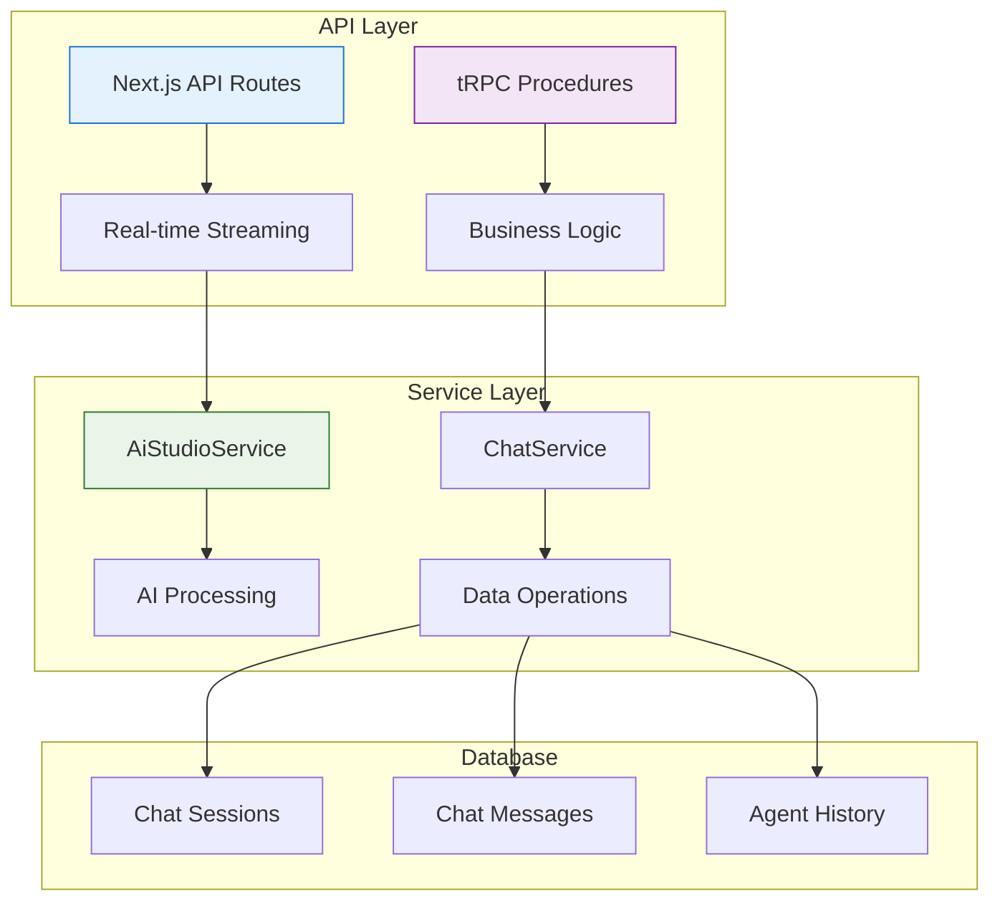

# Chat API Reference

> **Status**: ✅ Production Ready & Actively Maintained  
> **Last Updated**: January 2025  
> **API Version**: v1

## 1. Overview

This document provides comprehensive API reference for the Chat Sub-App, covering both tRPC procedures and Next.js API routes. The Chat API follows RESTful principles for HTTP endpoints and strongly-typed procedures for tRPC integration.

**Base URL**: `https://your-domain.com/api/chat`  
**Authentication**: Required for all endpoints  
**Content-Type**: `application/json`

## 2. API Architecture

### 2.1 API Structure



### 2.2 Endpoint Categories

| Category               | Implementation | Purpose                      |
| ---------------------- | -------------- | ---------------------------- |
| **Streaming**          | Next.js Route  | Real-time AI conversations   |
| **Session Management** | tRPC           | CRUD operations for sessions |
| **Message Operations** | tRPC           | Message history and search   |
| **Agent Management**   | tRPC           | Agent switching and control  |

## 3. Streaming API (Next.js Routes)

### 3.1 POST /api/chat/stream

**Purpose**: Real-time AI conversation streaming using Server-Sent Events

#### Request

```typescript
POST /api/chat/stream
Content-Type: application/json

{
  "chatSessionId": "session-123",
  "messages": [
    {
      "role": "user",
      "content": "Hello, how are you?"
    }
  ]
}
```

#### Request Schema

```typescript
interface StreamRequest {
  chatSessionId: string;
  messages: Array<{
    role: "user" | "assistant" | "system";
    content: string;
  }>;
}
```

#### Response

```typescript
// Streaming response with Server-Sent Events
Content-Type: text/plain; charset=utf-8
Cache-Control: no-cache, no-store, must-revalidate
Transfer-Encoding: chunked
Connection: keep-alive
X-Accel-Buffering: no

// Stream chunks
Hello
 from
 AI
 assistant
!
```

#### Response Headers

```typescript
{
  "Transfer-Encoding": "chunked",
  "Connection": "keep-alive",
  "Cache-Control": "no-cache, no-store, must-revalidate",
  "X-Accel-Buffering": "no"
}
```

#### Error Responses

```typescript
// Authentication Error
{
  "error": "Unauthorized",
  "status": 401
}

// Session Not Found
{
  "error": "Session not found",
  "status": 404
}

// AI Service Error
{
  "error": "AI service unavailable",
  "status": 503
}

// Validation Error
{
  "error": "Invalid parameters: chatSessionId and content are required",
  "status": 400
}
```

#### Example Usage

```javascript
// Frontend streaming implementation
const streamChatResponse = async (sessionId, message) => {
  const response = await fetch("/api/chat/stream", {
    method: "POST",
    headers: {
      "Content-Type": "application/json",
    },
    body: JSON.stringify({
      chatSessionId: sessionId,
      messages: [{ role: "user", content: message }],
    }),
  });

  if (!response.body) throw new Error("No response body");

  const reader = response.body.getReader();
  const decoder = new TextDecoder();

  while (true) {
    const { done, value } = await reader.read();
    if (done) break;

    const chunk = decoder.decode(value, { stream: true });
    console.log("Received chunk:", chunk);
  }
};
```

## 4. tRPC Procedures

### 4.1 Session Management

#### chat.createSession

**Purpose**: Create a new chat session

```typescript
// Input
interface CreateSessionInput {
  title?: string;
  firstMessage?: string;
  aiModelId?: string;
  aiAgentId?: string;
}

// Output
interface CreateSessionOutput {
  session: {
    id: string;
    title: string;
    aiModelId: string | null;
    aiAgentId: string | null;
    createdAt: string;
  };
  userMessage?: {
    id: string;
    content: string;
    createdAt: string;
  };
}

// Usage
const { session, userMessage } = await trpc.chat.createSession.mutate({
  title: "New Conversation",
  firstMessage: "Hello!",
  aiModelId: "gpt-4",
});
```

#### chat.getSessions

**Purpose**: List all sessions for the current user

```typescript
// Input
interface GetSessionsInput {
  limite?: number;
  offset?: number;
  search?: string;
}

// Output
interface GetSessionsOutput {
  sessions: Array<{
    id: string;
    title: string;
    aiModelId: string | null;
    aiAgentId: string | null;
    createdAt: string;
    updatedAt: string | null;
    lastMessage?: {
      content: string;
      createdAt: string;
    };
  }>;
  total: number;
}

// Usage
const { sessions, total } = await trpc.chat.getSessions.query({
  limite: 20,
  offset: 0,
  search: "typescript",
});
```

#### chat.getSession

**Purpose**: Get a specific session by ID

```typescript
// Input
interface GetSessionInput {
  sessionId: string;
}

// Output
interface GetSessionOutput {
  id: string;
  title: string;
  aiModelId: string | null;
  aiAgentId: string | null;
  activeAgentId: string | null;
  agentHistory: Array<{
    agentId: string;
    agentName: string;
    switchedAt: string;
    reason: string;
  }> | null;
  createdAt: string;
  updatedAt: string | null;
}

// Usage
const session = await trpc.chat.getSession.query({
  sessionId: "session-123",
});
```

#### chat.updateSession

**Purpose**: Update session properties

```typescript
// Input
interface UpdateSessionInput {
  sessionId: string;
  title?: string;
  aiModelId?: string;
  aiAgentId?: string;
}

// Output
interface UpdateSessionOutput {
  success: boolean;
  session: {
    id: string;
    title: string;
    aiModelId: string | null;
    aiAgentId: string | null;
    updatedAt: string;
  };
}

// Usage
const { success, session } = await trpc.chat.updateSession.mutate({
  sessionId: "session-123",
  title: "Updated Title",
  aiModelId: "gpt-4",
});
```

#### chat.deleteSession

**Purpose**: Delete a session and all its messages

```typescript
// Input
interface DeleteSessionInput {
  sessionId: string;
}

// Output
interface DeleteSessionOutput {
  success: boolean;
  deletedSession: {
    id: string;
    title: string;
  };
}

// Usage
const { success, deletedSession } = await trpc.chat.deleteSession.mutate({
  sessionId: "session-123",
});
```

### 4.2 Message Operations

#### chat.getMessages

**Purpose**: Get messages for a specific session

```typescript
// Input
interface GetMessagesInput {
  sessionId: string;
  limite?: number;
  offset?: number;
  ordem?: "asc" | "desc";
}

// Output
interface GetMessagesOutput {
  messages: Array<{
    id: string;
    chatSessionId: string;
    senderRole: "user" | "ai" | "system";
    content: string;
    status: "ok" | "error" | "pending";
    metadata: Record<string, unknown> | null;
    createdAt: string;
    updatedAt: string | null;
  }>;
  total: number;
}

// Usage
const { messages, total } = await trpc.chat.getMessages.query({
  sessionId: "session-123",
  limite: 20,
  offset: 0,
  ordem: "asc",
});
```

#### chat.createMessage

**Purpose**: Create a new message in a session

```typescript
// Input
interface CreateMessageInput {
  chatSessionId: string;
  content: string;
  senderRole: "user" | "ai" | "system";
  metadata?: Record<string, unknown>;
}

// Output
interface CreateMessageOutput {
  message: {
    id: string;
    chatSessionId: string;
    senderRole: "user" | "ai" | "system";
    content: string;
    status: "ok" | "error" | "pending";
    metadata: Record<string, unknown> | null;
    createdAt: string;
  };
}

// Usage
const { message } = await trpc.chat.createMessage.mutate({
  chatSessionId: "session-123",
  content: "Hello, world!",
  senderRole: "user",
});
```

#### chat.updateMessage

**Purpose**: Update message content or metadata

```typescript
// Input
interface UpdateMessageInput {
  messageId: string;
  content?: string;
  status?: "ok" | "error" | "pending";
  metadata?: Record<string, unknown>;
}

// Output
interface UpdateMessageOutput {
  success: boolean;
  message: {
    id: string;
    content: string;
    status: string;
    metadata: Record<string, unknown> | null;
    updatedAt: string;
  };
}

// Usage
const { success, message } = await trpc.chat.updateMessage.mutate({
  messageId: "msg-123",
  content: "Updated content",
  status: "ok",
});
```

#### chat.deleteMessage

**Purpose**: Delete a specific message

```typescript
// Input
interface DeleteMessageInput {
  messageId: string;
}

// Output
interface DeleteMessageOutput {
  success: boolean;
  deletedMessage: {
    id: string;
    content: string;
  };
}

// Usage
const { success, deletedMessage } = await trpc.chat.deleteMessage.mutate({
  messageId: "msg-123",
});
```

### 4.3 Agent Management

#### chat.switchAgent

**Purpose**: Switch the active agent for a session

```typescript
// Input
interface SwitchAgentInput {
  sessionId: string;
  agentId: string;
  reason: "user_switch" | "auto_suggestion" | "system_default";
}

// Output
interface SwitchAgentOutput {
  success: boolean;
  agent: {
    id: string;
    name: string;
    instructions: string;
  };
  session: {
    id: string;
    aiAgentId: string;
    activeAgentId: string;
    agentHistory: Array<{
      agentId: string;
      agentName: string;
      switchedAt: string;
      reason: string;
    }>;
  };
}

// Usage
const { success, agent, session } = await trpc.chat.switchAgent.mutate({
  sessionId: "session-123",
  agentId: "agent-456",
  reason: "user_switch",
});
```

#### chat.getAgentHistory

**Purpose**: Get agent switching history for a session

```typescript
// Input
interface GetAgentHistoryInput {
  sessionId: string;
}

// Output
interface GetAgentHistoryOutput {
  agentHistory: Array<{
    agentId: string;
    agentName: string;
    switchedAt: string;
    messageCount: number;
    reason: "user_switch" | "auto_suggestion" | "system_default";
  }>;
  currentAgent: {
    id: string;
    name: string;
    instructions: string;
  } | null;
}

// Usage
const { agentHistory, currentAgent } = await trpc.chat.getAgentHistory.query({
  sessionId: "session-123",
});
```

## 5. Error Handling

### 5.1 Error Response Format

```typescript
interface ErrorResponse {
  error: string;
  code?: string;
  details?: Record<string, unknown>;
  timestamp: string;
}
```

### 5.2 Common Error Codes

| Code                    | Status | Description                        |
| ----------------------- | ------ | ---------------------------------- |
| `UNAUTHORIZED`          | 401    | Authentication required            |
| `FORBIDDEN`             | 403    | Access denied to resource          |
| `NOT_FOUND`             | 404    | Session or message not found       |
| `VALIDATION_ERROR`      | 400    | Invalid request parameters         |
| `AI_SERVICE_ERROR`      | 503    | AI service temporarily unavailable |
| `RATE_LIMIT_EXCEEDED`   | 429    | Too many requests                  |
| `INTERNAL_SERVER_ERROR` | 500    | Unexpected server error            |

### 5.3 Error Handling Examples

```typescript
// tRPC Error Handling
try {
  const session = await trpc.chat.getSession.query({ sessionId: "invalid" });
} catch (error) {
  if (error.code === "NOT_FOUND") {
    console.log("Session not found");
  } else if (error.code === "UNAUTHORIZED") {
    console.log("Please log in");
  }
}

// Streaming Error Handling
const response = await fetch("/api/chat/stream", {
  method: "POST",
  body: JSON.stringify(data),
});

if (!response.ok) {
  const errorData = await response.json();
  console.error("Streaming error:", errorData);
}
```

## 6. Rate Limiting

### 6.1 Rate Limits

| Endpoint             | Rate Limit       | Window |
| -------------------- | ---------------- | ------ |
| `/api/chat/stream`   | 10 requests/min  | 1 min  |
| `chat.createSession` | 20 requests/min  | 1 min  |
| `chat.getMessages`   | 60 requests/min  | 1 min  |
| `chat.switchAgent`   | 5 requests/min   | 1 min  |
| Other endpoints      | 100 requests/min | 1 min  |

### 6.2 Rate Limit Headers

```typescript
{
  "X-RateLimit-Limit": "10",
  "X-RateLimit-Remaining": "9",
  "X-RateLimit-Reset": "1643723400"
}
```

## 7. Authentication

### 7.1 Authentication Flow

```typescript
// Authentication is handled via Next.js session cookies
// All requests must include valid session cookies

// Example authenticated request
const response = await fetch("/api/chat/stream", {
  method: "POST",
  headers: {
    "Content-Type": "application/json",
    // Session cookies automatically included
  },
  body: JSON.stringify(data),
});
```

### 7.2 Team Isolation

All API endpoints automatically enforce team isolation:

- Users can only access sessions/messages within their active team
- Agent switching is limited to team-owned agents
- Model selection is restricted to team-enabled models

## 8. Response Metadata

### 8.1 AI Response Metadata

```typescript
interface AIResponseMetadata {
  requestedModel: string;
  actualModelUsed: string;
  providerId: string;
  providerName: string;
  usage: {
    totalTokens: number;
    promptTokens: number;
    completionTokens: number;
  } | null;
  finishReason: "stop" | "length" | "interrupted";
  timestamp: string;
}
```

### 8.2 Session Metadata

```typescript
interface SessionMetadata {
  totalMessages: number;
  totalTokensUsed: number;
  averageResponseTime: number;
  lastActivity: string;
  modelUsageStats: Record<string, number>;
}
```

## 9. WebSocket Integration (Future)

### 9.1 Planned WebSocket Events

```typescript
// Connection
//your-domain.com/api/chat/ws

// Events
ws: interface ChatEvents {
  // Inbound
  "message:send": { sessionId: string; content: string };
  "agent:switch": { sessionId: string; agentId: string };
  "session:join": { sessionId: string };

  // Outbound
  "message:streaming": { sessionId: string; chunk: string };
  "message:complete": { sessionId: string; message: Message };
  "agent:switched": { sessionId: string; agent: Agent };
  "session:updated": { sessionId: string; updates: Partial<Session> };
}
```

## 10. Development Tools

### 10.1 tRPC Client Setup

```typescript
import { createTRPCNext } from "@trpc/next";

import type { AppRouter } from "./server";

export const trpc = createTRPCNext<AppRouter>({
  config() {
    return {
      url: "/api/trpc",
      headers: {
        "Content-Type": "application/json",
      },
    };
  },
});
```

### 10.2 API Testing

```bash
# Test streaming endpoint
curl -X POST http://localhost:3000/api/chat/stream \
  -H "Content-Type: application/json" \
  -d '{"chatSessionId":"session-123","messages":[{"role":"user","content":"Hello"}]}'

# Test session creation
curl -X POST http://localhost:3000/api/trpc/chat.createSession \
  -H "Content-Type: application/json" \
  -d '{"title":"Test Session","firstMessage":"Hello world"}'
```

### 10.3 API Documentation Generation

```bash
# Generate OpenAPI documentation
pnpm run api:generate-docs

# Serve documentation
pnpm run api:serve-docs
```

## 11. Performance Considerations

### 11.1 Optimizations

- **Connection Pooling**: Database connections are pooled for optimal performance
- **Query Optimization**: All database queries are optimized with proper indexes
- **Caching**: Session and configuration data is cached for 5 minutes
- **Streaming**: Uses native streaming for real-time responses

### 11.2 Monitoring

```typescript
// Performance metrics logged for all endpoints
{
  "endpoint": "/api/chat/stream",
  "duration": 350,
  "status": 200,
  "sessionId": "session-123",
  "tokensUsed": 150,
  "timestamp": "2025-01-03T10:30:00Z"
}
```

## 12. API Versioning

### 12.1 Version Strategy

- **Current Version**: v1 (default)
- **Version Header**: `X-API-Version: v1`
- **Backward Compatibility**: Maintained for 6 months
- **Deprecation Notice**: 90 days before removal

### 12.2 Version Migration

```typescript
// Version-specific endpoints
/api/v1/chat/stream  // Current
/api/v2/chat/stream  // Future

// Version headers
{
  "X-API-Version": "v1",
  "X-API-Deprecated": "false",
  "X-API-Sunset": null
}
```

---

> **API Philosophy**: Provide a clean, predictable, and well-documented API that abstracts the complexity of AI operations while maintaining flexibility for advanced use cases. Prioritize developer experience with comprehensive error handling, clear documentation, and consistent patterns.
