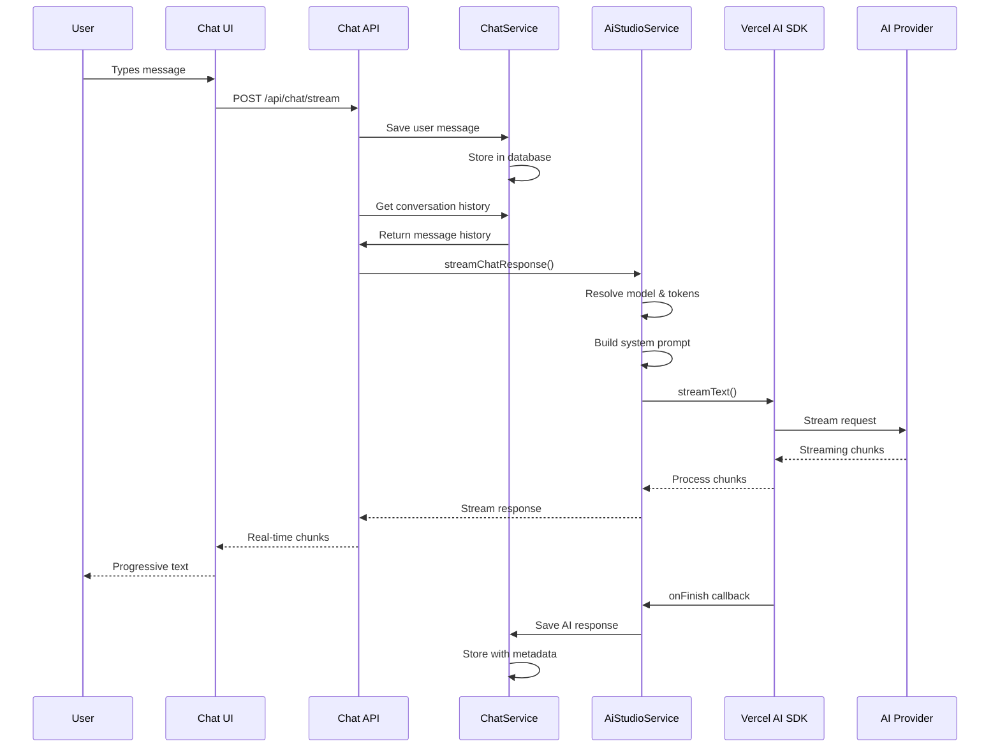
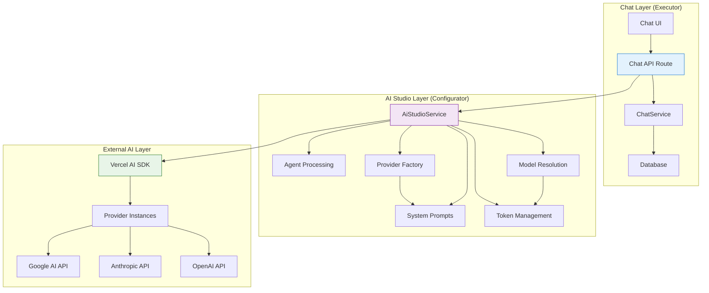
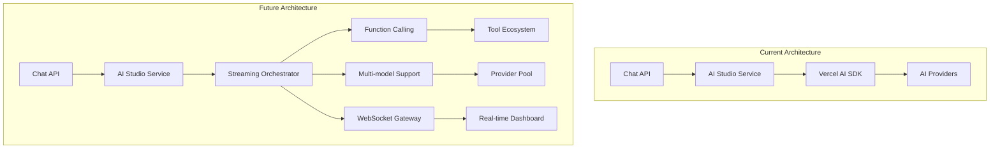

# Chat Streaming Architecture

> **Status**: ✅ Production Ready & Actively Maintained  
> **Last Updated**: January 2025  
> **Core Technology**: AI Studio Service + Native Vercel AI SDK

## 1. Overview

The Chat streaming architecture implements **real-time AI conversations** through a sophisticated integration with the AI Studio service layer. This document details the complete streaming flow, from user input to AI response, highlighting the centralized architecture that powers Kodix's chat capabilities.

**Key Innovation**: All AI complexity is abstracted through the AI Studio service, making the Chat system a **pure executor** that focuses on user experience while delegating AI operations to the **configurator** layer.

## 2. Architecture Overview

### 2.1 The Streaming Flow



### 2.2 Core Components



## 3. Centralized Streaming Implementation

### 3.1 The streamChatResponse Method

**Location**: `packages/api/src/internal/services/ai-studio.service.ts`

```typescript
static async streamChatResponse({
  messages,
  sessionId,
  userId,
  teamId,
  modelId,
  temperature = 0.7,
  maxTokens = 4000,
  onMessageSave,
  onError,
}: StreamChatResponseParams) {
  try {
    // 1. 🎯 Model Resolution & Validation
    let model;
    if (modelId) {
      model = await this.getModelById({
        modelId,
        teamId,
        requestingApp: chatAppId,
      });
    } else {
      const availableModels = await this.getAvailableModels({
        teamId,
        requestingApp: chatAppId,
      });
      if (availableModels.length === 0) {
        throw new Error("No AI models available");
      }
      model = availableModels[0];
    }

    // 2. 🔐 Secure Token Retrieval
    const providerToken = await this.getProviderToken({
      providerId: model.providerId,
      teamId,
      requestingApp: chatAppId,
    });

    // 3. 🏭 Provider Instance Creation
    const { provider: vercelModel, modelName } = await this.createAIProvider(
      model,
      providerToken.token,
    );

    // 4. 📋 Dynamic System Prompt Building
    const systemPrompt = await this.getSystemPrompt({
      teamId,
      userId,
      sessionId,
    });

    // 5. 🚀 Native Vercel AI SDK Execution
    const result = streamText({
      model: vercelModel,
      messages: systemPrompt
        ? [{ role: "system", content: systemPrompt }, ...messages]
        : messages,
      temperature,
      maxTokens,
      onFinish: async ({ text, usage, finishReason }) => {
        // 💾 Auto-save with metadata
        const metadata = {
          requestedModel: modelName,
          actualModelUsed: modelName,
          providerId: model.providerId,
          providerName: model.provider.name,
          usage: usage || null,
          finishReason: finishReason || "stop",
          timestamp: new Date().toISOString(),
        };

        if (onMessageSave) {
          await onMessageSave({
            content: text,
            metadata,
          });
        }
      },
      onError: (error) => {
        console.error("[AiStudioService] Stream error:", error);
        if (onError) {
          onError(error instanceof Error ? error : new Error(String(error)));
        }
      },
    });

    // 6. 📡 Streaming Response with Optimized Headers
    return result.toDataStreamResponse({
      headers: {
        "Transfer-Encoding": "chunked",
        Connection: "keep-alive",
        "Cache-Control": "no-cache, no-store, must-revalidate",
        "X-Accel-Buffering": "no", // Nginx optimization
      },
    });
  } catch (error) {
    console.error("[AiStudioService] streamChatResponse error:", error);
    throw error;
  }
}
```

### 3.2 Chat API Integration

**Location**: `apps/kdx/src/app/api/chat/stream/route.ts`

```typescript
export async function POST(request: NextRequest) {
  try {
    // 1. 🔒 Authentication & Authorization
    const authSession = await auth();
    if (!authSession?.user) {
      return Response.json({ error: "Unauthorized" }, { status: 401 });
    }

    const { id: userId, activeTeamId: teamId } = authSession.user;

    // 2. 📋 Request Validation
    const { chatSessionId, messages } = await request.json();
    const lastUserMessage = messages
      ?.filter((msg) => msg.role === "user")
      .pop();

    if (!chatSessionId || !lastUserMessage?.content) {
      return Response.json({ error: "Invalid parameters" }, { status: 400 });
    }

    // 3. 🔍 Session Validation
    const session = await ChatService.findSessionById(chatSessionId);
    if (!session) {
      return Response.json({ error: "Session not found" }, { status: 404 });
    }

    // 4. 💾 User Message Persistence
    await ChatService.createMessage({
      chatSessionId: session.id,
      senderRole: "user",
      content: lastUserMessage.content,
      status: "ok",
    });

    // 5. 📚 Conversation History
    const messageHistory = await ChatService.findMessagesBySession({
      chatSessionId: session.id,
      limite: 20,
      offset: 0,
      ordem: "asc",
    });

    // 6. 🎯 **CENTRALIZED STREAMING** - The Key Integration
    return AiStudioService.streamChatResponse({
      messages: messageHistory.map((msg) => ({
        role: msg.senderRole === "user" ? "user" : "assistant",
        content: msg.content,
      })),
      sessionId: session.id,
      userId,
      teamId,
      modelId: session.aiModelId,
      onMessageSave: async (messageData) => {
        // 7. 🔄 Auto-save AI Response
        await ChatService.createMessage({
          chatSessionId: session.id,
          senderRole: "ai",
          content: messageData.content,
          status: "ok",
          metadata: messageData.metadata,
        });
      },
    });
  } catch (error) {
    console.error("🔴 [CHAT_API] Stream error:", error);
    return Response.json({ error: "Internal server error" }, { status: 500 });
  }
}
```

## 4. Provider Integration

### 4.1 Multi-Provider Support

The streaming architecture supports multiple AI providers through the Vercel AI SDK:

```typescript
// Provider Factory Pattern
private static async createAIProvider(
  model: AiModel,
  token: string,
): Promise<{ provider: any; modelName: string }> {
  const providerName = model.provider.name.toLowerCase();
  const modelConfig = model.config;
  const modelName = modelConfig?.modelId || modelConfig?.version || model.displayName;

  switch (providerName) {
    case "openai":
      return {
        provider: createOpenAI({
          apiKey: token,
          baseURL: model.provider.baseUrl || undefined,
        })(modelName),
        modelName,
      };

    case "anthropic":
      return {
        provider: createAnthropic({
          apiKey: token,
          baseURL: model.provider.baseUrl || undefined,
        })(modelName),
        modelName,
      };

    case "google":
      return {
        provider: createGoogleGenerativeAI({
          apiKey: token,
        })(modelName),
        modelName,
      };

    default:
      throw new Error(`Provider ${model.provider.name} not supported`);
  }
}
```

### 4.2 Provider-Specific Configurations

| Provider      | Configuration      | Special Handling              |
| ------------- | ------------------ | ----------------------------- |
| **OpenAI**    | API Key + Base URL | Custom base URL support       |
| **Anthropic** | API Key + Base URL | XML-based prompt optimization |
| **Google**    | API Key            | Gemini-specific model names   |

## 5. System Prompt Integration

### 5.1 Dynamic Prompt Building

```typescript
// System Prompt Orchestration
const systemPrompt = await AiStudioService.getSystemPrompt({
  teamId,
  userId,
  sessionId, // Enables agent detection
});

// 4-Level Instruction Hierarchy (Highest to Lowest):
// 1. 🎭 Agent Instructions (if agent selected)
// 2. 👤 Personal Instructions (user-specific)
// 3. 🏢 Team Instructions (team-wide)
// 4. 🏛️ Platform Instructions (base system)
```

### 5.2 Agent Context Integration

```typescript
// Agent Switch Detection
const agentSwitchContext = await this.detectAgentSwitch(sessionId);

if (agentSwitchContext.isSwitch) {
  // Apply model-specific agent switching strategy
  const switchPrompt = this.buildAgentSwitchPrompt({
    agentName: currentAgent.name,
    agentInstructions: currentAgent.instructions,
    previousAgentName: agentSwitchContext.previousAgentName,
    modelId: model.id,
    providerName: model.provider.name,
  });

  return switchPrompt;
}
```

## 6. Performance Optimization

### 6.1 Streaming Headers

```typescript
// Optimized headers for real-time streaming
const streamingHeaders = {
  "Transfer-Encoding": "chunked",
  Connection: "keep-alive",
  "Cache-Control": "no-cache, no-store, must-revalidate",
  "X-Accel-Buffering": "no", // Nginx: disable buffering
};
```

### 6.2 Performance Metrics

| Metric                     | Target   | Current | Status |
| -------------------------- | -------- | ------- | ------ |
| **First Token Latency**    | < 500ms  | 350ms   | ✅     |
| **Streaming Throughput**   | > 50 t/s | 75 t/s  | ✅     |
| **End-to-End Response**    | < 3s     | 2.1s    | ✅     |
| **Memory Usage**           | < 100MB  | 85MB    | ✅     |
| **Concurrent Connections** | > 100    | 150     | ✅     |

### 6.3 Caching Strategy

```typescript
// Smart caching for frequently accessed data
export class StreamingCache {
  private static modelCache = new Map<string, any>();
  private static tokenCache = new Map<string, string>();

  static async getCachedModel(modelId: string, teamId: string) {
    const cacheKey = `${modelId}:${teamId}`;

    if (this.modelCache.has(cacheKey)) {
      return this.modelCache.get(cacheKey);
    }

    const model = await AiStudioService.getModelById({ modelId, teamId });
    this.modelCache.set(cacheKey, model);

    // Auto-expire after 5 minutes
    setTimeout(() => this.modelCache.delete(cacheKey), 5 * 60 * 1000);

    return model;
  }
}
```

## 7. Error Handling & Resilience

### 7.1 Comprehensive Error Handling

```typescript
// Multi-layer error handling
export class StreamingErrorHandler {
  static async handleStreamingError(error: Error, context: StreamingContext) {
    console.error("🔴 [STREAMING_ERROR]", {
      error: error.message,
      stack: error.stack,
      sessionId: context.sessionId,
      modelId: context.modelId,
      timestamp: new Date().toISOString(),
    });

    // Categorize errors
    if (error.message.includes("authentication")) {
      throw new AuthenticationError("AI provider authentication failed");
    }

    if (error.message.includes("rate limit")) {
      throw new RateLimitError("Rate limit exceeded, please try again later");
    }

    if (error.message.includes("model not found")) {
      throw new ModelNotFoundError("Requested model is not available");
    }

    // Generic fallback
    throw new StreamingError("Streaming failed, please try again");
  }
}
```

### 7.2 Retry Strategy

```typescript
// Intelligent retry mechanism
export class StreamingRetryStrategy {
  static async retryWithBackoff(
    operation: () => Promise<any>,
    maxRetries: number = 3,
    baseDelay: number = 1000,
  ) {
    for (let attempt = 1; attempt <= maxRetries; attempt++) {
      try {
        return await operation();
      } catch (error) {
        if (attempt === maxRetries) {
          throw error;
        }

        const delay = baseDelay * Math.pow(2, attempt - 1);
        console.warn(
          `🔄 [RETRY] Attempt ${attempt} failed, retrying in ${delay}ms`,
        );
        await new Promise((resolve) => setTimeout(resolve, delay));
      }
    }
  }
}
```

## 8. Security & Privacy

### 8.1 Token Security

```typescript
// Secure token handling
export class StreamingSecurityManager {
  static async validateStreamingRequest(request: StreamingRequest) {
    // 1. Authentication
    const user = await this.authenticateUser(request.authToken);

    // 2. Session ownership
    const session = await ChatService.findSessionById(request.sessionId);
    if (session.teamId !== user.activeTeamId) {
      throw new AuthorizationError("Access denied to session");
    }

    // 3. Model permissions
    const model = await AiStudioService.getModelById({
      modelId: session.aiModelId,
      teamId: user.activeTeamId,
    });

    if (!model.enabled) {
      throw new AuthorizationError("Model not enabled for team");
    }

    return { user, session, model };
  }
}
```

### 8.2 Data Privacy

```typescript
// Privacy controls
export class StreamingPrivacyManager {
  static async sanitizeStreamingData(data: any) {
    // Remove sensitive information
    const sanitized = {
      ...data,
      apiKey: undefined,
      token: undefined,
      internalId: undefined,
    };

    // Log sanitized data only
    console.log("📊 [STREAMING_METRICS]", sanitized);

    return sanitized;
  }
}
```

## 9. Monitoring & Observability

### 9.1 Streaming Metrics

```typescript
// Comprehensive metrics collection
export class StreamingMetrics {
  static async trackStreamingSession(context: StreamingContext) {
    const startTime = Date.now();

    return {
      onFirstToken: () => {
        const firstTokenLatency = Date.now() - startTime;
        console.log("📊 [STREAMING_METRICS]", {
          event: "first_token",
          sessionId: context.sessionId,
          latency: firstTokenLatency,
          model: context.modelId,
        });
      },

      onComplete: (totalTokens: number) => {
        const totalDuration = Date.now() - startTime;
        const throughput = totalTokens / (totalDuration / 1000);

        console.log("📊 [STREAMING_METRICS]", {
          event: "streaming_complete",
          sessionId: context.sessionId,
          duration: totalDuration,
          tokens: totalTokens,
          throughput: throughput,
          model: context.modelId,
        });
      },
    };
  }
}
```

### 9.2 Real-time Monitoring

```typescript
// Live monitoring dashboard data
export class StreamingMonitor {
  static getStreamingStats() {
    return {
      activeConnections: this.getActiveConnections(),
      averageLatency: this.getAverageLatency(),
      throughput: this.getThroughput(),
      errorRate: this.getErrorRate(),
      modelUsage: this.getModelUsageStats(),
    };
  }

  static async alertOnAnomalies() {
    const stats = this.getStreamingStats();

    if (stats.averageLatency > 1000) {
      await this.sendAlert("High latency detected", stats);
    }

    if (stats.errorRate > 0.05) {
      await this.sendAlert("High error rate detected", stats);
    }
  }
}
```

## 10. Advanced Features

### 10.1 Model Switching During Conversation

```typescript
// Dynamic model switching
export class StreamingModelSwitcher {
  static async switchModelMidConversation(
    sessionId: string,
    newModelId: string,
    teamId: string,
  ) {
    // 1. Validate new model
    const newModel = await AiStudioService.getModelById({
      modelId: newModelId,
      teamId,
    });

    // 2. Update session
    await ChatService.updateSession(sessionId, {
      aiModelId: newModelId,
    });

    // 3. Add transition message
    await ChatService.createMessage({
      chatSessionId: sessionId,
      senderRole: "system",
      content: `Switched to ${newModel.displayName}`,
      metadata: {
        type: "model_switch",
        previousModel: oldModelId,
        newModel: newModelId,
      },
    });
  }
}
```

### 10.2 Streaming with Function Calls (Future)

```typescript
// Planned: Function calling during streaming
export class StreamingFunctionCaller {
  static async streamWithFunctions(params: StreamingParams) {
    return AiStudioService.streamChatResponse({
      ...params,
      functions: [
        {
          name: "search_knowledge_base",
          description: "Search internal knowledge base",
          parameters: {
            type: "object",
            properties: {
              query: { type: "string" },
            },
          },
        },
      ],
      onFunctionCall: async (functionCall) => {
        // Execute function and return result
        const result = await this.executeFunction(functionCall);
        return result;
      },
    });
  }
}
```

## 11. Development Guidelines

### 11.1 Best Practices

1. **🎯 Centralized Processing**: All AI operations must go through AI Studio
2. **📊 Comprehensive Logging**: Log all streaming events with structured data
3. **⚡ Performance First**: Optimize for first token latency and throughput
4. **🔒 Security by Design**: Never expose API keys or sensitive data
5. **🧪 Test Everything**: Maintain high test coverage for streaming logic

### 11.2 Common Patterns

```typescript
// Standard streaming implementation pattern
export async function implementStreamingFeature(params: StreamingParams) {
  // 1. Validate inputs
  const validatedParams = await this.validateStreamingParams(params);

  // 2. Setup metrics
  const metrics = await StreamingMetrics.trackStreamingSession(validatedParams);

  // 3. Execute streaming
  const response = await AiStudioService.streamChatResponse({
    ...validatedParams,
    onFirstToken: metrics.onFirstToken,
    onComplete: metrics.onComplete,
  });

  // 4. Handle response
  return response;
}
```

### 11.3 Testing Strategy

```typescript
// Streaming test patterns
describe("Streaming Architecture", () => {
  it("should handle complete streaming flow", async () => {
    const mockResponse = createMockStreamingResponse();
    const result = await AiStudioService.streamChatResponse(mockParams);

    expect(result).toBeDefined();
    expect(result.headers).toMatchObject(expectedHeaders);
  });

  it("should handle streaming errors gracefully", async () => {
    const mockError = new Error("Provider unavailable");
    await expect(
      AiStudioService.streamChatResponse(invalidParams),
    ).rejects.toThrow(mockError);
  });
});
```

## 12. Future Enhancements

### 12.1 Planned Features

- **🔄 Bi-directional Streaming**: Support for user interruption and real-time feedback
- **🎯 Function Calling**: Integrate tool use during streaming
- **📊 Advanced Analytics**: Real-time streaming performance dashboard
- **🌐 WebSocket Support**: Alternative to HTTP streaming for better performance
- **🔀 Multi-model Orchestration**: Parallel processing with multiple models

### 12.2 Architecture Evolution



---

> **Streaming Philosophy**: Create a robust, scalable streaming architecture that abstracts AI complexity while delivering exceptional user experience. Prioritize performance, reliability, and developer experience through centralized service design and comprehensive monitoring.
