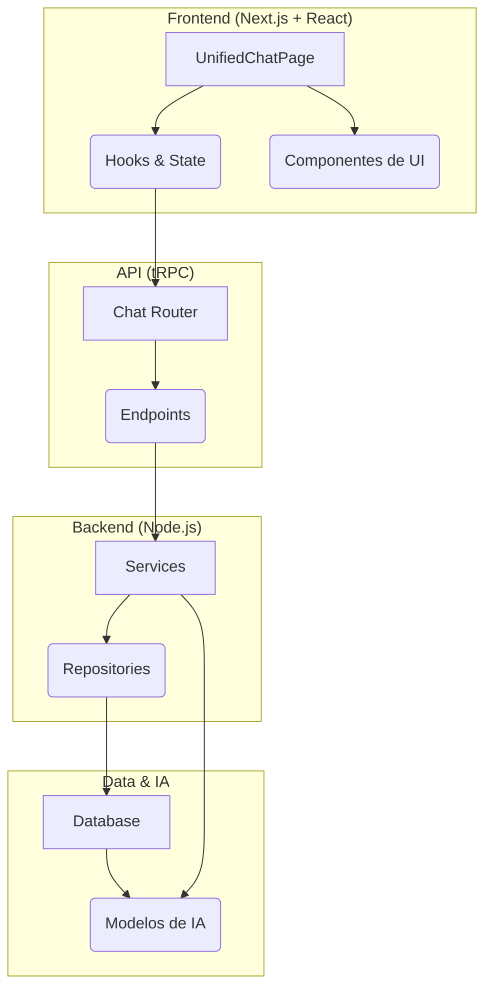

# Arquitetura do SubApp de Chat

> Este documento descreve a arquitetura de alto nível do SubApp de Chat, focando em seus componentes principais, fluxo de dados e padrões de implementação.

---

## 1. 🏗️ Visão Geral da Arquitetura

O Chat do Kodix utiliza uma arquitetura moderna e desacoplada, com uma clara separação de responsabilidades entre o frontend, a API e os serviços de backend.

- **Frontend**: Orquestrado pelo `UnifiedChatPage`, gerencia o estado da UI e a interação do usuário.
- **API**: A camada tRPC expõe procedimentos seguros e tipados para o frontend.
- **Backend**: Os serviços (`ChatService`, `AiStudioService`) contêm a lógica de negócio principal.
- **Data & IA**: O banco de dados armazena as sessões e mensagens, enquanto o `AiStudioService` se conecta aos provedores de IA.

---

## 2. 🎯 Arquitetura de Frontend

O frontend é construído em torno do **`UnifiedChatPage`**, que atua como um orquestrador central.

### Responsabilidades do `UnifiedChatPage`:

- **Fonte Única da Verdade**: Gerencia estados críticos como `selectedSessionId`, `selectedModelId`, e `selectedAgentId`.
- **Orquestração de Dados**: Utiliza `useQuery` e `useMutation` (TanStack Query) para buscar dados e executar ações, com estratégias de cache para otimizar a performance.
- **Navegação Centralizada**: Controla o `router` do Next.js para garantir uma navegação consistente e livre de bugs.
- **Comunicação entre Componentes**: Atua como mediador entre `AppSidebar` e `ChatWindow`, passando estado e callbacks.

### Fluxo da Primeira Mensagem (Frontend-Driven)

Para garantir a consistência do `useChat` (Vercel AI SDK), o envio da primeira mensagem é totalmente controlado pelo frontend:

1.  **Usuário envia mensagem** no `EmptyThreadState`.
2.  `useChatSessionManager` cria uma sessão **vazia** no backend.
3.  A aplicação navega para a nova URL da sessão.
4.  A mensagem é salva no `sessionStorage`.
5.  O `ActiveChatWindow` é montado, lê a mensagem do `sessionStorage` e a envia para o `useChat` via `append()`, iniciando o streaming.

---

## 3. ⚙️ Arquitetura de Backend

### Backend: Orquestração e Execução do Streaming

A API de streaming do Chat (`/api/chat/stream/route.ts`) atua como o **orquestrador principal** da interação com a IA.

1.  **Consumo do `AiStudioService`**: Para cada requisição, a API do Chat chama o `AiStudioService` para obter toda a configuração necessária: o `systemPrompt` (já com a lógica de hierarquia e "Hard Reset" aplicada), os detalhes do modelo e o token de acesso.
2.  **Execução do Streaming**: Com a configuração em mãos, a API do Chat instancia os clientes do Vercel AI SDK (`createOpenAI`, etc.) e executa a função `streamText`. Ela gerencia todo o ciclo de vida do streaming.
3.  **Persistência com `onFinish`**: No callback `onFinish` do `streamText`, a API do Chat chama seu próprio `ChatService` para salvar a resposta da IA no banco de dados, garantindo que a lógica de persistência permaneça no domínio do Chat.

Este padrão de delegação é fundamental para a arquitetura do Kodix:

- **Chat**: É o "cliente" e o "executor". Ele sabe _quando_ e _como_ iniciar uma conversa.
- **AI Studio**: É o "cérebro" e o "configurador". Ele sabe _o que_ a IA deve dizer.

### API tRPC (`chatRouter`)

A API expõe um conjunto de procedimentos fortemente tipados para o frontend, incluindo:

- **Gerenciamento de Sessões e Pastas**: CRUD completo para `chatSession` e `chatFolder`.
- **Gerenciamento de Agentes**: Endpoints dedicados como `switchAgent`, `getAvailableAgents`, e `getAgentHistory` que orquestram a funcionalidade de troca de agentes.

---

## 4. 🗄️ Camada de Dados (Data Layer)

O schema do banco de dados no `packages/db/src/schema/apps/chat.ts` é a base da funcionalidade.

### Tabela `chatSession`

Os campos mais importantes para a lógica do chat são:

- `aiAgentId`: O agente que **define o comportamento** da IA (usado pelo `AiStudioService`).
- `activeAgentId`: O agente **visível na UI** (usado para detecção de troca).
- `agentHistory`: Um array JSON que registra cada troca, servindo como o **gatilho para a estratégia "Hard Reset"**.

---

## 5. 💡 Padrões e Lições Críticas

Esta arquitetura é o resultado de várias iterações. As seguintes lições são agora padrões mandatórios:

- **Navegação Centralizada**: Toda a navegação deve ser controlada por um único handler para evitar bugs de rotas.
- **Invalidação Precisa de Cache**: Uma mutação deve invalidar todas as queries de tRPC afetadas por ela para garantir a sincronização da UI. Evitar invalidações em massa e preferir atualizações otimistas com `setQueryData` quando possível.
- **Comunicação via Callbacks**: Para componentes irmãos, a comunicação deve ser mediada pelo componente pai através de callbacks.
- **Fonte de Tipos tRPC**: Manter um `shared.ts` para os tipos do `RouterOutputs` é crucial para garantir a segurança de tipos de ponta a ponta.
- **Componentes Coesos**: Manter os componentes pequenos e focados em uma única responsabilidade (regra das ~200-300 linhas).
- **Prioridade do Código-Fonte**: A documentação é um guia, mas o código-fonte é sempre a fonte final da verdade. Qualquer refatoração deve começar pela análise do código atual.

---

## 6. 🧠 O Motor por Trás do Chat: AI Studio

É crucial entender que o SubApp de Chat, embora gerencie toda a interface e o estado da conversa, **não contém lógica de execução de IA**. Ele atua como um consumidor do **AI Studio**, que é o verdadeiro motor de IA da plataforma.

- **Delegação de Responsabilidade**: Quando uma mensagem é enviada, o backend do Chat delega a tarefa de gerar uma resposta para o `AiStudioService`.
- **Inteligência Centralizada**: O `AiStudioService` é quem de fato constrói os prompts, seleciona o modelo e interage com a API do provedor de IA.

> Para entender em detalhes como o AI Studio executa essa lógica, incluindo a hierarquia de prompts e a estratégia de "Hard Reset" para troca de agentes, consulte o [**Guia de Arquitetura do AI Studio**](../../ai-studio/ai-studio-architecture.md).
