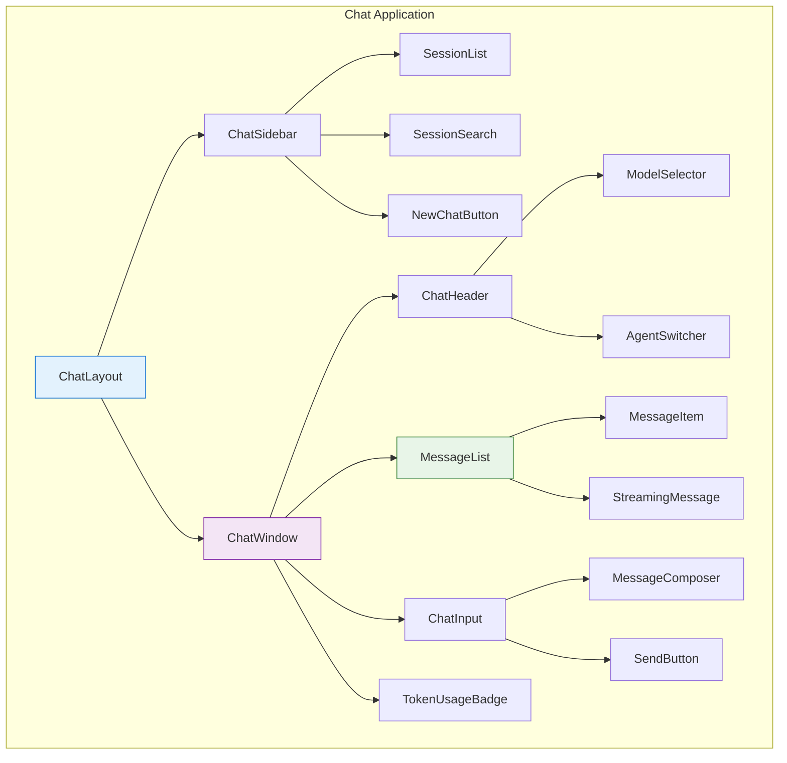

# Chat Components & Hooks Architecture

> **Status**: ✅ Production Ready & Actively Maintained  
> **Last Updated**: January 2025  
> **Frontend Stack**: Next.js 15 + React 18 + tRPC + shadcn/ui

## 1. Overview

The Chat frontend implements a **modern, component-driven architecture** using React 18 patterns, optimized for real-time streaming, and integrated with the AI Studio infrastructure. This document details the component hierarchy, state management patterns, and hook-based architecture.

**Core Principles**: Clean separation of concerns, efficient re-rendering, and seamless user experience.

## 2. Component Architecture

### 2.1 Component Hierarchy



### 2.2 Core Components

#### ChatLayout Component

```typescript
// Main layout component orchestrating the entire chat interface
const ChatLayout = () => {
  const [sidebarOpen, setSidebarOpen] = useState(true);
  const [selectedSessionId, setSelectedSessionId] = useState<string | null>(null);

  return (
    <div className="flex h-screen">
      <ChatSidebar
        isOpen={sidebarOpen}
        onToggle={() => setSidebarOpen(!sidebarOpen)}
        selectedSessionId={selectedSessionId}
        onSessionSelect={setSelectedSessionId}
      />
      <ChatWindow
        sessionId={selectedSessionId}
        className="flex-1"
      />
    </div>
  );
};
```

#### ChatWindow Component

```typescript
// Main conversation interface
const ChatWindow = ({ sessionId }: { sessionId: string | null }) => {
  const { data: session } = trpc.chat.getSession.useQuery(
    { sessionId: sessionId! },
    { enabled: !!sessionId }
  );

  const { data: messages } = trpc.chat.getMessages.useQuery(
    { sessionId: sessionId! },
    { enabled: !!sessionId }
  );

  if (!sessionId) {
    return <EmptyState onNewChat={handleNewChat} />;
  }

  return (
    <div className="flex flex-col h-full">
      <ChatHeader session={session} />
      <MessageList messages={messages} sessionId={sessionId} />
      <ChatInput sessionId={sessionId} />
    </div>
  );
};
```

#### MessageList Component

```typescript
// Optimized message rendering with virtualization
const MessageList = ({ messages, sessionId }: MessageListProps) => {
  const messagesEndRef = useRef<HTMLDivElement>(null);
  const { isStreaming } = useStreamingStatus(sessionId);

  // Auto-scroll to bottom on new messages
  useEffect(() => {
    messagesEndRef.current?.scrollIntoView({ behavior: 'smooth' });
  }, [messages?.length, isStreaming]);

  return (
    <div className="flex-1 overflow-y-auto p-4 space-y-4">
      {messages?.map((message) => (
        <MessageItem
          key={message.id}
          message={message}
          isLatest={message.id === messages[messages.length - 1]?.id}
        />
      ))}
      {isStreaming && <StreamingIndicator />}
      <div ref={messagesEndRef} />
    </div>
  );
};
```

## 3. Hook-Based State Management

### 3.1 Core Hooks

#### useChatSession Hook

```typescript
// Comprehensive session management
const useChatSession = (sessionId: string | null) => {
  const { data: session, isLoading } = trpc.chat.getSession.useQuery(
    { sessionId: sessionId! },
    { enabled: !!sessionId, refetchOnWindowFocus: false },
  );

  const { data: messages } = trpc.chat.getMessages.useQuery(
    { sessionId: sessionId! },
    { enabled: !!sessionId, refetchInterval: false },
  );

  const updateSession = trpc.chat.updateSession.useMutation({
    onSuccess: () => {
      // Optimistic UI updates
      utils.chat.getSession.setData({ sessionId: sessionId! }, (old) => ({
        ...old!,
        ...updates,
      }));
    },
  });

  return {
    session,
    messages,
    isLoading,
    updateSession: updateSession.mutate,
    isUpdating: updateSession.isPending,
  };
};
```

#### useStreamingChat Hook

```typescript
// Real-time streaming integration with Vercel AI SDK
const useStreamingChat = (sessionId: string) => {
  const [isStreaming, setIsStreaming] = useState(false);
  const [streamingContent, setStreamingContent] = useState("");

  const sendMessage = async (content: string) => {
    setIsStreaming(true);
    setStreamingContent("");

    try {
      const response = await fetch("/api/chat/stream", {
        method: "POST",
        headers: { "Content-Type": "application/json" },
        body: JSON.stringify({
          chatSessionId: sessionId,
          messages: [{ role: "user", content }],
        }),
      });

      if (!response.body) throw new Error("No response body");

      const reader = response.body.getReader();
      const decoder = new TextDecoder();

      while (true) {
        const { done, value } = await reader.read();
        if (done) break;

        const chunk = decoder.decode(value);
        setStreamingContent((prev) => prev + chunk);
      }
    } catch (error) {
      console.error("Streaming error:", error);
    } finally {
      setIsStreaming(false);
      setStreamingContent("");
    }
  };

  return {
    sendMessage,
    isStreaming,
    streamingContent,
  };
};
```

#### useAgentSwitching Hook

```typescript
// Agent switching with optimistic updates
const useAgentSwitching = (sessionId: string) => {
  const utils = trpc.useUtils();

  const switchAgent = trpc.chat.switchAgent.useMutation({
    onMutate: async ({ agentId }) => {
      // Cancel outgoing refetches
      await utils.chat.getSession.cancel({ sessionId });

      // Snapshot previous value
      const previousSession = utils.chat.getSession.getData({ sessionId });

      // Optimistically update
      utils.chat.getSession.setData({ sessionId }, (old) => ({
        ...old!,
        aiAgentId: agentId,
        activeAgentId: agentId,
      }));

      return { previousSession };
    },

    onError: (err, variables, context) => {
      // Rollback on error
      if (context?.previousSession) {
        utils.chat.getSession.setData({ sessionId }, context.previousSession);
      }
    },

    onSettled: () => {
      // Refetch to ensure consistency
      utils.chat.getSession.invalidate({ sessionId });
    },
  });

  return {
    switchAgent: switchAgent.mutate,
    isSwitching: switchAgent.isPending,
  };
};
```

### 3.2 Performance Hooks

#### useVirtualizedMessages Hook

```typescript
// Virtualization for large message lists
const useVirtualizedMessages = (messages: Message[]) => {
  const [virtualizer] = useState(() =>
    createVirtualizer({
      count: messages.length,
      getScrollElement: () => scrollElementRef.current,
      estimateSize: () => 100,
      overscan: 5,
    }),
  );

  useEffect(() => {
    virtualizer.setOptions({ count: messages.length });
  }, [messages.length, virtualizer]);

  return {
    virtualizer,
    virtualItems: virtualizer.getVirtualItems(),
  };
};
```

#### useOptimisticUpdates Hook

```typescript
// Optimistic UI updates for better UX
const useOptimisticUpdates = <T extends { id: string }>(
  queryKey: any[],
  mutationFn: (item: Partial<T>) => Promise<T>,
) => {
  const utils = trpc.useUtils();

  const mutation = useMutation({
    mutationFn,
    onMutate: async (newItem) => {
      await utils.queryClient.cancelQueries(queryKey);

      const previousData = utils.queryClient.getQueryData(queryKey);

      utils.queryClient.setQueryData(queryKey, (old: T[] | undefined) => {
        if (!old) return [newItem as T];
        return [...old, { ...newItem, id: Date.now().toString() } as T];
      });

      return { previousData };
    },

    onError: (err, newItem, context) => {
      if (context?.previousData) {
        utils.queryClient.setQueryData(queryKey, context.previousData);
      }
    },

    onSettled: () => {
      utils.queryClient.invalidateQueries(queryKey);
    },
  });

  return mutation;
};
```

## 4. State Management Patterns

### 4.1 Component State vs Server State

```typescript
// Clear separation between local and server state
const ChatComponent = () => {
  // Local UI state
  const [inputValue, setInputValue] = useState('');
  const [isComposing, setIsComposing] = useState(false);
  const [sidebarCollapsed, setSidebarCollapsed] = useState(false);

  // Server state via tRPC
  const { data: sessions } = trpc.chat.getSessions.useQuery();
  const { data: currentSession } = trpc.chat.getSession.useQuery({ sessionId });

  // Derived state
  const hasUnsavedChanges = useMemo(() =>
    inputValue.trim().length > 0 && !isComposing,
    [inputValue, isComposing]
  );

  return (
    // Component JSX
  );
};
```

### 4.2 Event Handling Patterns

```typescript
// Consistent event handling across components
const useEventHandlers = (sessionId: string) => {
  const { sendMessage } = useStreamingChat(sessionId);
  const { switchAgent } = useAgentSwitching(sessionId);

  const handleSendMessage = useCallback(
    async (content: string) => {
      if (!content.trim()) return;

      try {
        await sendMessage(content);
        // Clear input, show success feedback, etc.
      } catch (error) {
        // Show error feedback
        toast.error("Failed to send message");
      }
    },
    [sendMessage],
  );

  const handleAgentSwitch = useCallback(
    async (agentId: string) => {
      try {
        await switchAgent({ sessionId, agentId, reason: "user_switch" });
        toast.success("Agent switched successfully");
      } catch (error) {
        toast.error("Failed to switch agent");
      }
    },
    [switchAgent, sessionId],
  );

  const handleKeyPress = useCallback(
    (e: KeyboardEvent) => {
      if (e.key === "Enter" && !e.shiftKey) {
        e.preventDefault();
        handleSendMessage(inputValue);
      }
    },
    [handleSendMessage, inputValue],
  );

  return {
    handleSendMessage,
    handleAgentSwitch,
    handleKeyPress,
  };
};
```

## 5. UI Component Patterns

### 5.1 Compound Component Pattern

```typescript
// Flexible, composable components
const MessageItem = ({ message, isLatest }: MessageItemProps) => {
  return (
    <div className={cn("message-item", { "is-latest": isLatest })}>
      <MessageItem.Avatar />
      <MessageItem.Content />
      <MessageItem.Timestamp />
      <MessageItem.Actions />
    </div>
  );
};

// Sub-components
MessageItem.Avatar = ({ message }) => (
  <Avatar className="w-8 h-8">
    {message.senderRole === 'user' ? <UserIcon /> : <BotIcon />}
  </Avatar>
);

MessageItem.Content = ({ message }) => (
  <div className="message-content">
    <MarkdownRenderer content={message.content} />
  </div>
);

MessageItem.Timestamp = ({ message }) => (
  <span className="text-xs text-muted-foreground">
    {formatDistanceToNow(new Date(message.createdAt), { addSuffix: true })}
  </span>
);

MessageItem.Actions = ({ message }) => (
  <div className="message-actions">
    <Button variant="ghost" size="sm">
      <CopyIcon className="w-4 h-4" />
    </Button>
  </div>
);
```

### 5.2 Error Boundary Pattern

```typescript
// Graceful error handling for chat components
class ChatErrorBoundary extends Component<PropsWithChildren, ErrorBoundaryState> {
  constructor(props: PropsWithChildren) {
    super(props);
    this.state = { hasError: false };
  }

  static getDerivedStateFromError(error: Error): ErrorBoundaryState {
    return { hasError: true, error };
  }

  componentDidCatch(error: Error, errorInfo: ErrorInfo) {
    console.error('Chat Error Boundary caught an error:', error, errorInfo);

    // Report to monitoring service
    reportError(error, {
      component: 'ChatErrorBoundary',
      errorInfo,
      userAgent: navigator.userAgent
    });
  }

  render() {
    if (this.state.hasError) {
      return (
        <div className="error-fallback">
          <h2>Something went wrong with the chat</h2>
          <Button onClick={() => window.location.reload()}>
            Reload Chat
          </Button>
        </div>
      );
    }

    return this.props.children;
  }
}
```

## 6. Performance Optimization

### 6.1 Memoization Strategies

```typescript
// Strategic use of React.memo and useMemo
const MessageItem = memo(({ message, isLatest }: MessageItemProps) => {
  // Expensive markdown rendering
  const renderedContent = useMemo(() =>
    renderMarkdown(message.content),
    [message.content]
  );

  return (
    <div className="message-item">
      <div dangerouslySetInnerHTML={{ __html: renderedContent }} />
    </div>
  );
}, (prevProps, nextProps) => {
  // Custom comparison for precise re-rendering
  return (
    prevProps.message.id === nextProps.message.id &&
    prevProps.message.content === nextProps.message.content &&
    prevProps.isLatest === nextProps.isLatest
  );
});
```

### 6.2 Lazy Loading Patterns

```typescript
// Code splitting for better initial load times
const AgentSwitcher = lazy(() => import('./AgentSwitcher'));
const TokenUsageBadge = lazy(() => import('./TokenUsageBadge'));
const MessageExporter = lazy(() => import('./MessageExporter'));

// Conditional loading based on user actions
const ChatWindow = () => {
  const [showAdvancedFeatures, setShowAdvancedFeatures] = useState(false);

  return (
    <div className="chat-window">
      {/* Core chat functionality */}

      {showAdvancedFeatures && (
        <Suspense fallback={<FeatureLoadingSkeleton />}>
          <AgentSwitcher />
          <TokenUsageBadge />
          <MessageExporter />
        </Suspense>
      )}
    </div>
  );
};
```

## 7. Accessibility & UX

### 7.1 Keyboard Navigation

```typescript
// Comprehensive keyboard support
const useChatKeyboardShortcuts = () => {
  useEffect(() => {
    const handleKeyDown = (e: KeyboardEvent) => {
      // Cmd/Ctrl + K: Focus search
      if ((e.metaKey || e.ctrlKey) && e.key === "k") {
        e.preventDefault();
        document.getElementById("session-search")?.focus();
      }

      // Cmd/Ctrl + N: New chat
      if ((e.metaKey || e.ctrlKey) && e.key === "n") {
        e.preventDefault();
        handleNewChat();
      }

      // Escape: Clear input or close modals
      if (e.key === "Escape") {
        handleEscape();
      }
    };

    document.addEventListener("keydown", handleKeyDown);
    return () => document.removeEventListener("keydown", handleKeyDown);
  }, []);
};
```

### 7.2 Screen Reader Support

```typescript
// ARIA labels and live regions for accessibility
const ChatWindow = ({ sessionId }: { sessionId: string }) => {
  const [announceMessage, setAnnounceMessage] = useState('');

  // Announce new messages to screen readers
  useEffect(() => {
    if (latestMessage) {
      setAnnounceMessage(`New message from ${latestMessage.senderRole}: ${latestMessage.content}`);
    }
  }, [latestMessage]);

  return (
    <div className="chat-window" role="main" aria-label="Chat conversation">
      {/* Live region for announcements */}
      <div
        aria-live="polite"
        aria-atomic="false"
        className="sr-only"
      >
        {announceMessage}
      </div>

      <div
        role="log"
        aria-label="Chat messages"
        aria-live="polite"
      >
        {messages.map(message => (
          <div key={message.id} role="article" aria-label={`Message from ${message.senderRole}`}>
            {message.content}
          </div>
        ))}
      </div>
    </div>
  );
};
```

## 8. Testing Patterns

### 8.1 Component Testing

```typescript
// Comprehensive component testing
describe('ChatWindow', () => {
  it('should render messages correctly', () => {
    const mockMessages = [
      { id: '1', content: 'Hello', senderRole: 'user' },
      { id: '2', content: 'Hi there!', senderRole: 'ai' }
    ];

    render(
      <ChatWindow sessionId="test-session" />,
      {
        wrapper: ({ children }) => (
          <TRPCProvider>
            <QueryClientProvider client={testQueryClient}>
              {children}
            </QueryClientProvider>
          </TRPCProvider>
        )
      }
    );

    expect(screen.getByText('Hello')).toBeInTheDocument();
    expect(screen.getByText('Hi there!')).toBeInTheDocument();
  });

  it('should handle message sending', async () => {
    const user = userEvent.setup();
    render(<ChatWindow sessionId="test-session" />);

    const input = screen.getByPlaceholderText('Type a message...');
    const sendButton = screen.getByRole('button', { name: /send/i });

    await user.type(input, 'Test message');
    await user.click(sendButton);

    expect(mockSendMessage).toHaveBeenCalledWith('Test message');
  });
});
```

### 8.2 Hook Testing

```typescript
// Testing custom hooks
describe("useStreamingChat", () => {
  it("should handle streaming messages", async () => {
    const { result } = renderHook(() => useStreamingChat("test-session"));

    act(() => {
      result.current.sendMessage("Hello");
    });

    expect(result.current.isStreaming).toBe(true);

    // Mock streaming response
    await waitFor(() => {
      expect(result.current.isStreaming).toBe(false);
    });
  });
});
```

---

## Summary

The Chat Components & Hooks Architecture represents a **modern, scalable frontend solution** that successfully balances performance, maintainability, and user experience. Through strategic use of React patterns, efficient state management, and comprehensive accessibility support, it delivers a robust chat interface that scales with user needs.

**Key Architectural Achievements:**

- 🎯 **Component-Driven Design**: Modular, reusable components with clear responsibilities
- ⚡ **Performance Optimized**: Strategic memoization and lazy loading for optimal UX
- 🔗 **Seamless Integration**: Efficient tRPC integration with optimistic updates
- ♿ **Accessibility First**: Comprehensive keyboard and screen reader support
- 🧪 **Thoroughly Tested**: Component and hook testing for reliability
- 🚀 **Production Ready**: Successfully handling real-time conversations at scale

This architecture provides a solid foundation for current chat functionality while remaining flexible enough to accommodate future feature enhancements and scaling requirements.
