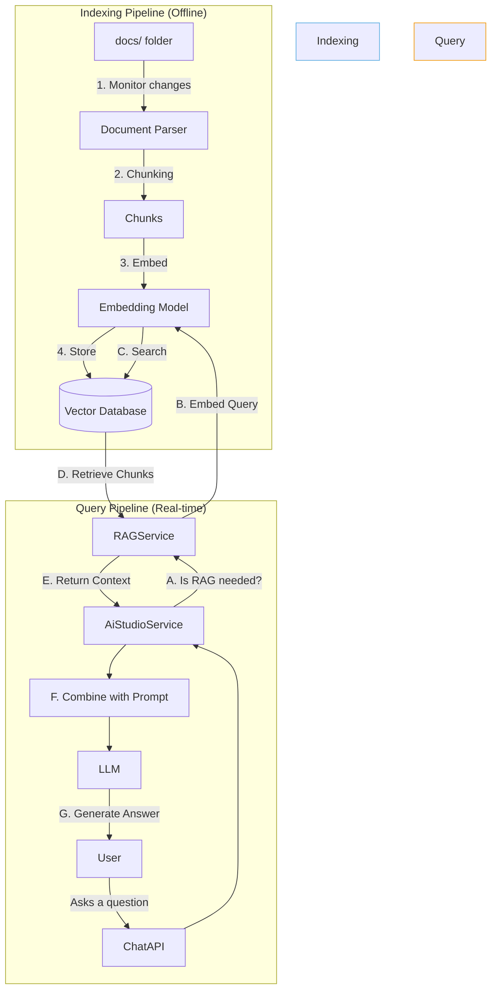

# 📚 Chat Knowledge Base (RAG) Strategy

> **Status**: Proposal
> **Version**: 1.0

## 1. 🎯 Guiding Principle: Grounding AI in Factual Knowledge

To elevate our AI from a generalist assistant to a genuine Kodix expert, we must ground its responses in a verified, internal knowledge base. This is achieved through Retrieval-Augmented Generation (RAG), a technique that allows the AI to find and cite relevant information from our own documentation before answering a question.

**The Goal**: When a user asks "How does our chat's agent switching work?", the AI should not guess. It should find `agent-switching-architecture.md`, read it, and provide a summarized, accurate answer based on that document.

---

## 2. 🏗️ Proposed Architecture: RAG as a Service

We propose creating a new, dedicated `RAGService` that integrates with a vector database. This service will be responsible for the entire RAG pipeline: indexing, searching, and retrieving context.



### How It Would Work

**Part 1: Indexing (Asynchronous/On-Demand)**

1.  **Parsing & Chunking**: A script will monitor the `docs/` directory. When files are added or changed, the `RAGService` will parse them (e.g., `.md`, `.ts`) and split them into smaller, semantically meaningful chunks (e.g., paragraphs or function blocks).
2.  **Embedding**: Each chunk will be passed to an embedding model (e.g., `text-embedding-3-small`), which converts the text into a numerical vector representing its meaning.
3.  **Storing**: These vectors, along with the original text chunk and metadata (source file, line numbers), will be stored in a vector database (e.g., Pinecone, Supabase PGVector).

**Part 2: Retrieval (Real-time)**

1.  **Query Analysis**: When a user sends a message, a preliminary check (potentially by a smaller LLM) determines if the query is a candidate for RAG (i.e., it looks like a question that could be answered by documentation).
2.  **Query Embedding**: If RAG is triggered, the user's query is converted into a vector using the same embedding model.
3.  **Semantic Search**: The `RAGService` searches the vector database for the text chunks whose vectors are most similar to the query vector.
4.  **Context Injection**: The top `K` relevant chunks are retrieved and passed to the `AiStudioService`. They are then injected into the system prompt, along with a directive.

**Example of an Injected Prompt:**

```
<system_prompt>
  You are an expert assistant for the Kodix platform.
  Answer the user's question based *only* on the provided context below.
  If the context does not contain the answer, say that you could not find the information.
  Cite the source file for your answer.
</system_prompt>

<retrieved_context>
  **Source: docs/subapps/chat/agent-switching-architecture.md**
  "To overcome the 'contextual inertia' of LLMs, we use a 'Hard Reset' mechanism...
   It is triggered by checking the `agentHistory` field in the `chatSession`..."
</retrieved_context>

<user_question>
  How do we handle agent switching in the chat?
</user_question>
```

### Benefits of This Approach

- **Reduces Hallucinations**: Answers are based on factual, verifiable internal documents, not the LLM's general knowledge.
- **Always Up-to-Date**: By re-indexing when documents change, the AI's knowledge base remains current with the codebase.
- **Increases Trust**: Citing sources allows users to verify the information and builds confidence in the AI's responses.
- **Unlocks New Capabilities**: Enables the creation of specialized agents, like a "Documentation Expert" or a "Codebase Navigator."
