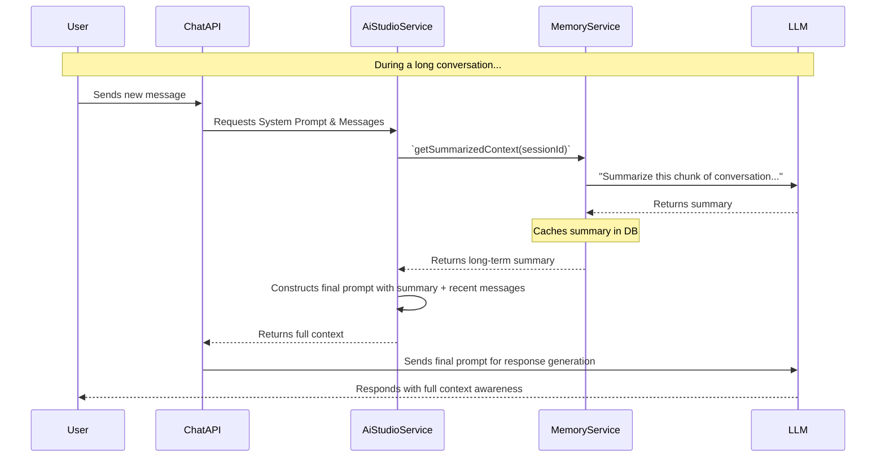

# 🧠 Chat Memory Strategy

> **Status**: Partially Implemented; Long-Term Memory is a proposal.
> **Version**: 1.0

## 1. 🎯 Guiding Principle: Layered Memory for Contextual Depth

A robust AI agent requires more than just the immediate context of a conversation. Our memory strategy is designed to be layered, combining a high-fidelity short-term memory with an efficient, summarized long-term memory. This ensures the AI has access to both the fine-grained details of the recent conversation and the high-level context of the entire interaction.

---

## 2. 💾 Short-Term Memory: The Conversation History (Implemented)

This is the foundational layer of the AI's memory.

- **Implementation**: The system passes the most recent messages from the current `chatSession` as part of the payload to the LLM.
- **Mechanism**: The `AiStudioService` retrieves the last `N` messages (where `N` is determined by the model's context window size and a token budget) and formats them into the prompt.
- **Strength**: Provides perfect, turn-by-turn recall of the immediate conversation, which is essential for maintaining a coherent dialogue.
- **Limitation**: Finite context window. As the conversation grows, older messages are pushed out of the context, leading to "amnesia" about the beginning of the discussion.

---

## 3. 🧠 Long-Term Memory: Summarization Strategy (Proposed)

To overcome the limitation of the fixed context window, we propose a new service responsible for creating and injecting a summarized history into the prompt.

### Proposed Architecture: The `MemoryService`



### How It Would Work

1.  **Trigger**: The `MemoryService` would be triggered asynchronously after a certain number of messages have accumulated in a session (e.g., every 10-15 messages).
2.  **Summarization**: It would take a chunk of older messages, send them to a fast and cheap LLM (like `claude-3-haiku` or `gpt-4o-mini`) with a dedicated prompt: `"Summarize the key points, decisions, and unanswered questions from this conversation chunk."`
3.  **Storage**: This summary would be stored in a new field in the `chatSession` table, likely `longTermMemorySummary: jsonb`. The summaries would be appended over time.
4.  **Injection**: When constructing the main prompt, the `AiStudioService` would retrieve this summary from the `MemoryService` and inject it at the beginning of the prompt, right after the system instructions but before the short-term message history.

**Example of an Injected Prompt:**

```
<system_prompt>
  You are a helpful assistant...
</system_prompt>

<long_term_memory_summary>
  - The user is working on a React component named 'DataGrid'.
  - A bug related to pagination was discussed and solved.
  - The user's main goal is to add a new filtering feature.
</long_term_memory_summary>

<message history>
  User: Okay, the pagination is fixed. Now, where should I start with the filtering logic?
  ...
</message>
```

### Benefits of This Approach

- **Infinite Context**: Effectively gives the AI an "infinite" memory of the conversation's key points.
- **Cost-Effective**: Uses cheaper models for the background task of summarization.
- **Performance**: The main chat response is not blocked, as summarization happens asynchronously.
- **Deeper Understanding**: Allows the AI to reference past decisions and context, leading to more intelligent and consistent responses over long interactions.
