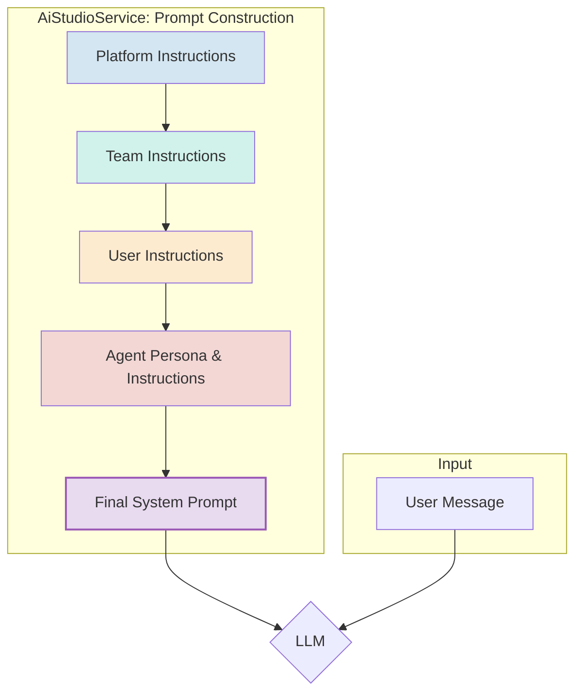

# 📜 Chat Prompting Strategy

> **Status**: Active & In Use
> **Version**: 1.0

## 1. 🎯 Guiding Principle: Hierarchical & Dynamic Prompts

The core of our prompting strategy is a hierarchical system that builds a rich, multi-layered context for the AI. This ensures that the AI's behavior is aligned with platform-wide rules, team-specific needs, user preferences, and the chosen agent's personality, in that precise order of priority.

This strategy is orchestrated entirely by the **`AiStudioService`**, which acts as the central "prompt factory" for the entire Kodix ecosystem.

---

## 2. 🏗️ The Prompt Hierarchy

The final system prompt sent to the AI is assembled from four distinct layers. Lower layers override or refine the layers above them.



- **Level 1: Platform Instructions (`PlatformContext`)**

  - **Source**: Hardcoded in `AiStudioService`.
  - **Content**: Global, non-negotiable rules. Defines the absolute base behavior for any AI in Kodix (e.g., security constraints, core brand voice, ethical guidelines).
  - **Example**: "You are an assistant within the Kodix platform. You must never ask for passwords."

- **Level 2: Team Instructions (`TeamContext`)**

  - **Source**: `Team.settings` in the database.
  - **Content**: Team-wide configurations and directives.
  - **Example**: "All code snippets provided must be in TypeScript and follow our internal linting rules."

- **Level 3: User Instructions (`UserContext`)**

  - **Source**: `User.settings` (future implementation).
  - **Content**: User-specific preferences to personalize the interaction.
  - **Example**: "Explain technical concepts as if I were a junior developer."

- **Level 4: Agent Persona & Instructions (`AgentContext`)**
  - **Source**: `AIAgent.prompt` in the database.
  - **Content**: The specific personality and skill set for the selected agent. This is the most specific layer.
  - **Example**: "You are a DevOps expert. Your tone is direct and technical."

---

## 3. 🔄 The "Hard Reset" Strategy for Agent Switching

To overcome the "contextual inertia" of LLMs, we use a "Hard Reset" mechanism when a user switches agents mid-conversation. This is a critical piece of prompt engineering that forces the model to adopt the new persona immediately.

### How It Works

When the `AiStudioService` detects a recent agent change (by checking the `agentHistory` field in the `chatSession`), it injects a special "Hard Reset" command at the **top** of the generated `AgentContext`.

**Example "Hard Reset" Prompt:**

```xml
<system_reset>
  IMPORTANT: Your previous identity and instructions are now obsolete.
  You must fully adopt the new persona and guidelines defined below.
  Do not refer to your past identity. This is a complete and immediate change.
</system_reset>

<new_identity>
  You are now "CodeMaster," an expert in database architecture...
  (rest of the new agent's prompt follows)
</new_identity>
```

- **Detection**: The trigger is a new entry in the `chatSession.agentHistory` array.
- **Execution**: The logic is contained within `AiStudioService.getSystemPrompt()`.
- **Effect**: This explicitly commands the model to discard its previous persona, ensuring the user's intent is respected without fail.

For a more detailed breakdown of the backend logic, see the [**Agent Switching Architecture Guide**](../agent-switching-architecture.md).

---

This consolidated and hierarchical approach gives us fine-grained control over the AI's behavior while maintaining a clear and scalable architecture.
