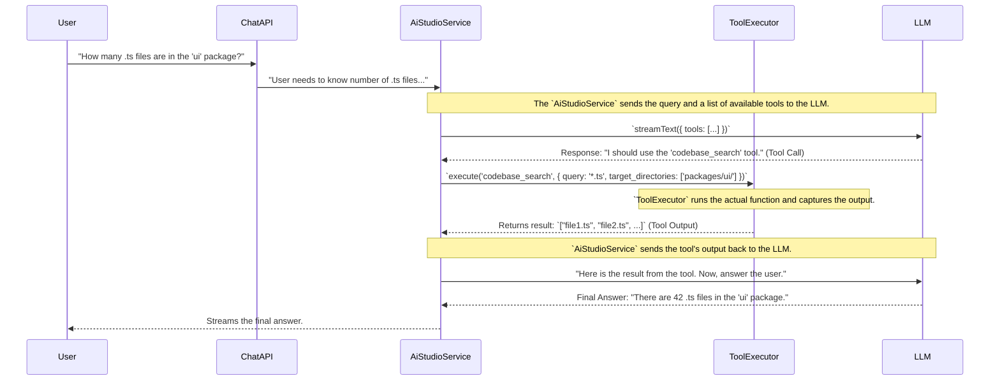

# 🛠️ Chat Tooling Strategy

> **Status**: Proposal
> **Version**: 1.0

## 1. 🎯 Guiding Principle: From Conversationalist to Actor

The ultimate goal of our AI is to move from being a passive conversationalist to an active participant in the development workflow. To do this, we must empower it with **tools**—pre-defined functions it can call to interact with the Kodix ecosystem, retrieve live information, and perform actions on behalf of the user.

This is the most critical step in creating a truly autonomous agent.

---

## 2. 🏗️ Proposed Architecture: A Tool-Use Framework

We propose an architecture based on the "tool calling" or "function calling" capabilities inherent in modern LLMs (like those from OpenAI, Anthropic, and Google). The flow involves the LLM identifying the need for a tool, calling it, and then using its output to formulate a final response.

### Core Components

1.  **Tool Definition (`tools.ts`)**:

    - A central file where all available tools are defined.
    - Each tool definition will include:
      - `name`: e.g., `codebase_search`.
      - `description`: A clear, natural language description for the LLM to understand what the tool does (e.g., "Searches the codebase for files matching a pattern.").
      - `schema`: A Zod schema defining the input parameters (e.g., `{ query: z.string(), target_directories: z.array(z.string()) }`). This is crucial for the LLM to construct valid tool calls.

2.  **`AiStudioService` (Orchestrator)**:

    - When calling the LLM, `AiStudioService` will pass the list of available tool definitions.
    - It will be responsible for parsing the LLM's response. If it's a tool call, it will pause streaming, send the call to the `ToolExecutor`, and wait for the result.
    - It then sends the tool's result back to the LLM in a new turn to generate the final, user-facing response.

3.  **`ToolExecutor` (Executor)**:
    - A secure service that receives a tool name and parameters from the `AiStudioService`.
    - It maps the tool name to the actual function implementation and executes it.
    - This layer is critical for security, ensuring that the LLM can only execute predefined, safe functions and cannot run arbitrary code.

### Proposed Initial Toolset

We can start with a small, high-impact set of tools:

| Tool Name          | Description                                         | Parameters                              |
| ------------------ | --------------------------------------------------- | --------------------------------------- |
| `codebase_search`  | Finds code by meaning, not just exact text.         | `{ query, target_directories }`         |
| `grep_search`      | Finds exact text matches or regex patterns.         | `{ query, include_pattern }`            |
| `read_file`        | Reads the contents of a specific file.              | `{ target_file, start_line, end_line }` |
| `list_dir`         | Lists the contents of a directory.                  | `{ relative_workspace_path }`           |
| `run_terminal_cmd` | Executes a terminal command (with strict controls). | `{ command }`                           |

### Benefits of This Approach

- **Unlocks True Agency**: The AI can actively solve problems instead of just talking about them.
- **Access to Live Data**: The AI is no longer limited to its training data; it can query the current state of the codebase and environment.
- **Automation of Tedious Tasks**: Users can ask the AI to perform multi-step tasks like "Find all uses of the `Button` component and tell me which ones don't have a `variant` prop."
- **Extensible**: The framework allows us to easily add new tools in the future, continuously expanding the AI's capabilities.
