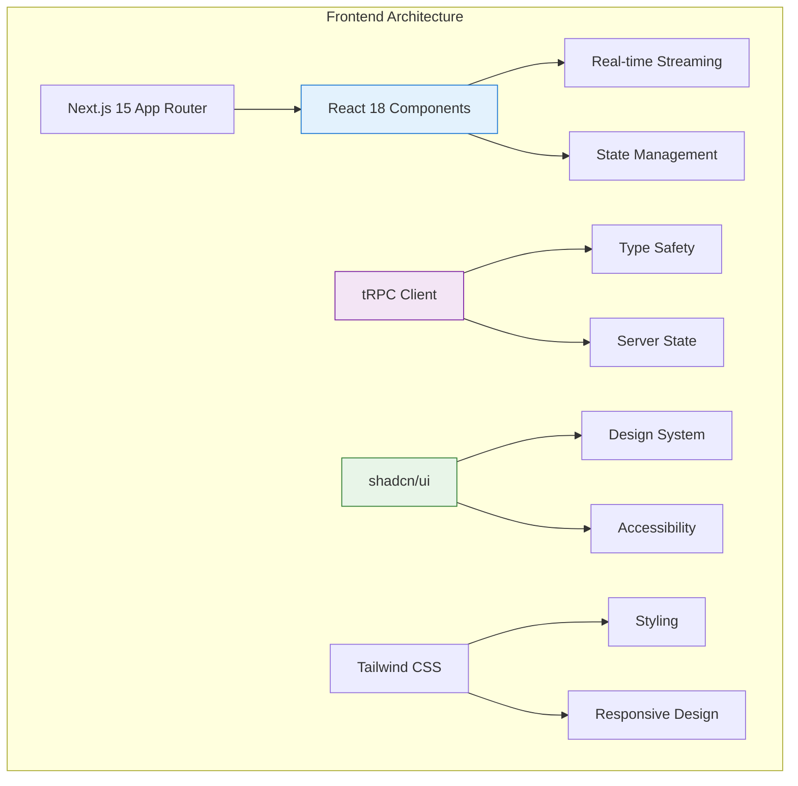
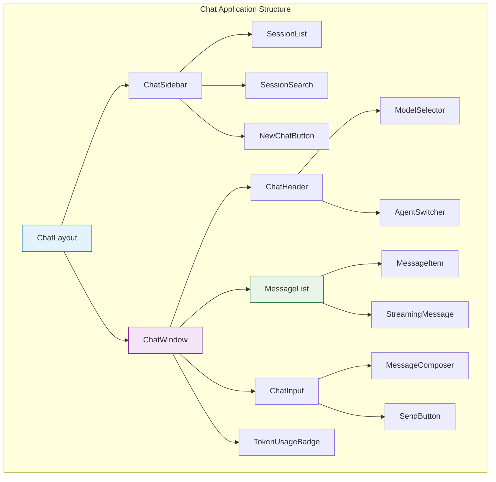

# Chat Frontend Architecture

> **Status**: ✅ Production Ready & Actively Maintained  
> **Last Updated**: January 2025  
> **Frontend Stack**: Next.js 15 + React 18 + tRPC + shadcn/ui

## 1. Overview

The Chat frontend implements a **modern, component-driven architecture** using React 18 patterns, optimized for real-time streaming, and integrated with the AI Studio infrastructure. This section provides comprehensive documentation for frontend developers working on the Chat system.

**Core Principles**: Clean separation of concerns, efficient re-rendering, seamless user experience, and comprehensive testing coverage.

## 2. Documentation Index

### 🎨 **Core Frontend Architecture**

- **[🧩 Components & Hooks](./components-and-hooks.md)** - Complete component hierarchy and React patterns
- **[🧪 Testing Strategy](./testing-strategy.md)** - Comprehensive testing approach and best practices

### 🏗️ **Related Backend Integration**

- **[🚀 Streaming Architecture](../backend/streaming-architecture.md)** - Understanding backend streaming integration
- **[📋 API Reference](../backend/api-reference.md)** - API endpoints and tRPC procedures

## 3. Architecture Overview

### 3.1 Frontend Stack



### 3.2 Key Technologies

| Technology       | Purpose              | Version | Status        |
| ---------------- | -------------------- | ------- | ------------- |
| **Next.js**      | React framework      | 15.x    | ✅ Production |
| **React**        | UI library           | 18.x    | ✅ Production |
| **TypeScript**   | Type safety          | 5.x     | ✅ Production |
| **tRPC**         | Type-safe API client | 11.x    | ✅ Production |
| **shadcn/ui**    | Component library    | Latest  | ✅ Production |
| **Tailwind CSS** | Utility-first CSS    | 3.x     | ✅ Production |
| **Vitest**       | Testing framework    | 1.x     | ✅ Production |
| **Playwright**   | E2E testing          | 1.x     | ✅ Production |

## 4. Component Architecture

### 4.1 Component Hierarchy



### 4.2 Core Components

#### ChatLayout Component

**Purpose**: Main layout orchestrator for the entire chat interface

```typescript
const ChatLayout = () => {
  const [sidebarOpen, setSidebarOpen] = useState(true);
  const [selectedSessionId, setSelectedSessionId] = useState<string | null>(null);

  return (
    <div className="flex h-screen">
      <ChatSidebar
        isOpen={sidebarOpen}
        onToggle={() => setSidebarOpen(!sidebarOpen)}
        selectedSessionId={selectedSessionId}
        onSessionSelect={setSelectedSessionId}
      />
      <ChatWindow
        sessionId={selectedSessionId}
        className="flex-1"
      />
    </div>
  );
};
```

#### ChatWindow Component

**Purpose**: Main conversation interface with real-time streaming

```typescript
const ChatWindow = ({ sessionId }: { sessionId: string | null }) => {
  const { data: session } = trpc.chat.getSession.useQuery(
    { sessionId: sessionId! },
    { enabled: !!sessionId }
  );

  const { data: messages } = trpc.chat.getMessages.useQuery(
    { sessionId: sessionId! },
    { enabled: !!sessionId }
  );

  if (!sessionId) {
    return <EmptyState onNewChat={handleNewChat} />;
  }

  return (
    <div className="flex flex-col h-full">
      <ChatHeader session={session} />
      <MessageList messages={messages} sessionId={sessionId} />
      <ChatInput sessionId={sessionId} />
    </div>
  );
};
```

## 5. State Management

### 5.1 React State Patterns

```typescript
// Local component state for UI interactions
const [isOpen, setIsOpen] = useState(false);
const [inputValue, setInputValue] = useState("");

// Ref for DOM manipulation
const messagesEndRef = useRef<HTMLDivElement>(null);
const inputRef = useRef<HTMLTextAreaElement>(null);

// Effect for side effects
useEffect(() => {
  messagesEndRef.current?.scrollIntoView({ behavior: "smooth" });
}, [messages?.length]);
```

### 5.2 Server State with tRPC

```typescript
// Query for fetching data
const { data: sessions, isLoading } = trpc.chat.getSessions.useQuery({
  limite: 20,
  offset: 0,
});

// Mutation for data changes
const createSession = trpc.chat.createSession.useMutation({
  onSuccess: (newSession) => {
    // Optimistic updates
    utils.chat.getSessions.setData(undefined, (old) =>
      old ? [newSession, ...old.sessions] : [newSession],
    );
  },
});

// Subscription for real-time updates (planned)
const subscription = trpc.chat.onMessageUpdated.useSubscription(
  {
    sessionId: activeSessionId,
  },
  {
    onData: (message) => {
      // Handle real-time message updates
      updateMessageList(message);
    },
  },
);
```

### 5.3 Custom Hooks

```typescript
// Session management hook
const useChatSession = (sessionId: string | null) => {
  const { data: session, isLoading } = trpc.chat.getSession.useQuery(
    { sessionId: sessionId! },
    { enabled: !!sessionId },
  );

  const updateSession = trpc.chat.updateSession.useMutation();

  return {
    session,
    isLoading,
    updateSession: updateSession.mutate,
    isUpdating: updateSession.isPending,
  };
};

// Streaming hook
const useStreamingChat = (sessionId: string) => {
  const [isStreaming, setIsStreaming] = useState(false);
  const [streamingContent, setStreamingContent] = useState("");

  const sendMessage = useCallback(
    async (content: string) => {
      setIsStreaming(true);
      setStreamingContent("");

      try {
        const response = await fetch("/api/chat/stream", {
          method: "POST",
          headers: { "Content-Type": "application/json" },
          body: JSON.stringify({
            chatSessionId: sessionId,
            messages: [{ role: "user", content }],
          }),
        });

        // Handle streaming response
        const reader = response.body?.getReader();
        // ... streaming logic
      } finally {
        setIsStreaming(false);
      }
    },
    [sessionId],
  );

  return { sendMessage, isStreaming, streamingContent };
};
```

## 6. Real-time Streaming

### 6.1 Streaming Implementation

```typescript
// Frontend streaming handler
const handleStreamingResponse = async (sessionId: string, message: string) => {
  const response = await fetch("/api/chat/stream", {
    method: "POST",
    headers: { "Content-Type": "application/json" },
    body: JSON.stringify({
      chatSessionId: sessionId,
      messages: [{ role: "user", content: message }],
    }),
  });

  if (!response.body) throw new Error("No response body");

  const reader = response.body.getReader();
  const decoder = new TextDecoder();
  let accumulatedText = "";

  while (true) {
    const { done, value } = await reader.read();
    if (done) break;

    const chunk = decoder.decode(value, { stream: true });
    accumulatedText += chunk;

    // Update UI with streaming content
    setStreamingContent(accumulatedText);
  }
};
```

### 6.2 Streaming UI Components

```typescript
// Streaming message component
const StreamingMessage = ({ content, isComplete }: StreamingMessageProps) => {
  return (
    <div className="message ai-message">
      <MessageContent content={content} />
      {!isComplete && (
        <div className="streaming-indicator">
          <div className="animate-pulse">●</div>
        </div>
      )}
    </div>
  );
};

// Auto-scroll during streaming
const MessageList = ({ messages, isStreaming }: MessageListProps) => {
  const messagesEndRef = useRef<HTMLDivElement>(null);

  useEffect(() => {
    if (isStreaming) {
      messagesEndRef.current?.scrollIntoView({ behavior: 'smooth' });
    }
  }, [isStreaming, messages]);

  return (
    <div className="message-list">
      {messages.map(message => (
        <MessageItem key={message.id} message={message} />
      ))}
      {isStreaming && <StreamingIndicator />}
      <div ref={messagesEndRef} />
    </div>
  );
};
```

## 7. User Experience Features

### 7.1 Progressive Enhancement

```typescript
// Progressive message rendering
const MessageContent = ({ content }: { content: string }) => {
  const [displayContent, setDisplayContent] = useState("");
  const [isTyping, setIsTyping] = useState(false);

  useEffect(() => {
    if (content !== displayContent) {
      setIsTyping(true);

      // Simulate typing effect for better UX
      const timer = setTimeout(() => {
        setDisplayContent(content);
        setIsTyping(false);
      }, 50);

      return () => clearTimeout(timer);
    }
  }, [content, displayContent]);

  return (
    <div className="message-content">
      <MarkdownRenderer content={displayContent} />
      {isTyping && <TypingIndicator />}
    </div>
  );
};
```

### 7.2 Accessibility Features

```typescript
// Accessible chat interface
const ChatInterface = () => {
  return (
    <div role="main" aria-label="Chat conversation">
      <div
        role="log"
        aria-live="polite"
        aria-label="Chat messages"
        className="message-list"
      >
        {messages.map(message => (
          <div
            key={message.id}
            role="article"
            aria-label={`${message.senderRole} message`}
          >
            {message.content}
          </div>
        ))}
      </div>

      <div role="form" aria-label="Send message">
        <textarea
          aria-label="Type your message"
          placeholder="Type a message..."
          onKeyDown={handleKeyDown}
        />
        <button
          aria-label="Send message"
          onClick={handleSend}
        >
          Send
        </button>
      </div>
    </div>
  );
};
```

## 8. Performance Optimization

### 8.1 React Optimization

```typescript
// Memoized components for performance
const MessageItem = memo(({ message }: MessageItemProps) => {
  return (
    <div className="message-item">
      <MessageAvatar sender={message.senderRole} />
      <MessageContent content={message.content} />
      <MessageTimestamp timestamp={message.createdAt} />
    </div>
  );
}, (prevProps, nextProps) => {
  // Custom comparison for optimal re-rendering
  return prevProps.message.id === nextProps.message.id &&
         prevProps.message.content === nextProps.message.content;
});

// Optimized list rendering
const MessageList = ({ messages }: MessageListProps) => {
  // Virtual scrolling for large message lists
  const virtualizer = useVirtualizer({
    count: messages.length,
    getScrollElement: () => scrollElementRef.current,
    estimateSize: () => 100,
  });

  return (
    <div ref={scrollElementRef} className="message-list">
      <div style={{ height: virtualizer.getTotalSize() }}>
        {virtualizer.getVirtualItems().map(virtualItem => (
          <div
            key={virtualItem.index}
            style={{
              position: 'absolute',
              top: 0,
              left: 0,
              width: '100%',
              transform: `translateY(${virtualItem.start}px)`,
            }}
          >
            <MessageItem message={messages[virtualItem.index]} />
          </div>
        ))}
      </div>
    </div>
  );
};
```

### 8.2 Loading States

```typescript
// Smart loading states
const ChatSkeleton = () => (
  <div className="chat-skeleton">
    <div className="skeleton-sidebar">
      {Array.from({ length: 5 }).map((_, i) => (
        <div key={i} className="skeleton-session animate-pulse" />
      ))}
    </div>
    <div className="skeleton-main">
      <div className="skeleton-header animate-pulse" />
      <div className="skeleton-messages">
        {Array.from({ length: 3 }).map((_, i) => (
          <div key={i} className="skeleton-message animate-pulse" />
        ))}
      </div>
    </div>
  </div>
);

// Suspense boundaries
const ChatApp = () => (
  <Suspense fallback={<ChatSkeleton />}>
    <ErrorBoundary fallback={<ChatErrorState />}>
      <ChatLayout />
    </ErrorBoundary>
  </Suspense>
);
```

## 9. Error Handling

### 9.1 Error Boundaries

```typescript
// Chat-specific error boundary
class ChatErrorBoundary extends Component<
  { children: ReactNode; fallback: ComponentType<{ error: Error }> },
  { hasError: boolean; error: Error | null }
> {
  constructor(props: any) {
    super(props);
    this.state = { hasError: false, error: null };
  }

  static getDerivedStateFromError(error: Error) {
    return { hasError: true, error };
  }

  componentDidCatch(error: Error, errorInfo: ErrorInfo) {
    console.error('Chat Error Boundary caught an error:', error, errorInfo);

    // Report to monitoring service
    this.reportError(error, errorInfo);
  }

  render() {
    if (this.state.hasError) {
      const FallbackComponent = this.props.fallback;
      return <FallbackComponent error={this.state.error!} />;
    }

    return this.props.children;
  }
}

// Error fallback component
const ChatErrorFallback = ({ error }: { error: Error }) => (
  <div className="chat-error-state">
    <h2>Something went wrong</h2>
    <p>We encountered an error while loading the chat.</p>
    <details>
      <summary>Error details</summary>
      <pre>{error.message}</pre>
    </details>
    <button onClick={() => window.location.reload()}>
      Reload Chat
    </button>
  </div>
);
```

### 9.2 Network Error Handling

```typescript
// Robust error handling for API calls
const useResilientMutation = <T, U>(mutation: any) => {
  const [retryCount, setRetryCount] = useState(0);
  const maxRetries = 3;

  const executeMutation = async (params: T) => {
    try {
      return await mutation.mutateAsync(params);
    } catch (error) {
      if (retryCount < maxRetries && isRetryableError(error)) {
        setRetryCount((prev) => prev + 1);
        // Exponential backoff
        await new Promise((resolve) =>
          setTimeout(resolve, Math.pow(2, retryCount) * 1000),
        );
        return executeMutation(params);
      }
      throw error;
    }
  };

  return {
    ...mutation,
    mutateAsync: executeMutation,
    retryCount,
    canRetry: retryCount < maxRetries,
  };
};
```

## 10. Responsive Design

### 10.1 Mobile-First Approach

```typescript
// Responsive chat layout
const ChatLayout = () => {
  const [isMobile, setIsMobile] = useState(false);
  const [sidebarOpen, setSidebarOpen] = useState(false);

  useEffect(() => {
    const checkMobile = () => {
      setIsMobile(window.innerWidth < 768);
      if (window.innerWidth < 768) {
        setSidebarOpen(false);
      }
    };

    checkMobile();
    window.addEventListener('resize', checkMobile);
    return () => window.removeEventListener('resize', checkMobile);
  }, []);

  return (
    <div className="flex h-screen">
      {/* Mobile: Overlay sidebar, Desktop: Side-by-side */}
      <ChatSidebar
        isOpen={sidebarOpen}
        onClose={() => setSidebarOpen(false)}
        className={cn(
          "transition-transform duration-300",
          isMobile ? "fixed inset-y-0 left-0 z-50" : "relative",
          isMobile && !sidebarOpen && "-translate-x-full"
        )}
      />

      {/* Mobile overlay */}
      {isMobile && sidebarOpen && (
        <div
          className="fixed inset-0 bg-black/20 z-40"
          onClick={() => setSidebarOpen(false)}
        />
      )}

      <ChatWindow
        className="flex-1"
        onOpenSidebar={() => setSidebarOpen(true)}
        showSidebarToggle={isMobile}
      />
    </div>
  );
};
```

### 10.2 Responsive Components

```typescript
// Adaptive message layout
const MessageItem = ({ message }: MessageItemProps) => {
  return (
    <div className={cn(
      "flex gap-3 p-4",
      // Desktop: More spacing, mobile: Compact
      "md:gap-4 md:p-6",
      message.senderRole === "user" ? "justify-end" : "justify-start"
    )}>
      {message.senderRole === "ai" && (
        <Avatar className="w-8 h-8 md:w-10 md:h-10">
          <AvatarImage src="/ai-avatar.png" />
          <AvatarFallback>AI</AvatarFallback>
        </Avatar>
      )}

      <div className={cn(
        "max-w-[85%] md:max-w-[70%]",
        message.senderRole === "user"
          ? "bg-primary text-primary-foreground"
          : "bg-muted",
        "rounded-lg p-3 md:p-4"
      )}>
        <MessageContent content={message.content} />
      </div>
    </div>
  );
};
```

## 11. Development Guidelines

### 11.1 Component Development

```typescript
// Component template
interface ComponentProps {
  // Props interface
}

const Component = ({ prop1, prop2 }: ComponentProps) => {
  // Hooks
  const [state, setState] = useState();

  // Callbacks
  const handleAction = useCallback(() => {
    // Handler logic
  }, [dependencies]);

  // Effects
  useEffect(() => {
    // Side effects
  }, [dependencies]);

  // Render
  return (
    <div className="component-class">
      {/* JSX */}
    </div>
  );
};

// Export with display name for debugging
Component.displayName = "Component";
export default Component;
```

### 11.2 Best Practices

1. **🎯 Performance First**: Use React.memo, useMemo, useCallback appropriately
2. **🔒 Type Safety**: Leverage TypeScript for all props and state
3. **♿ Accessibility**: Include ARIA labels and semantic HTML
4. **📱 Mobile Ready**: Design mobile-first with responsive patterns
5. **🧪 Test Coverage**: Maintain comprehensive test coverage

### 11.3 Code Organization

```
apps/kdx/src/app/[locale]/(authed)/apps/chat/
├── components/
│   ├── chat-layout.tsx          # Main layout component
│   ├── chat-window.tsx          # Conversation interface
│   ├── chat-sidebar.tsx         # Session management
│   ├── message-list.tsx         # Message rendering
│   ├── message-item.tsx         # Individual messages
│   └── chat-input.tsx           # Message composition
├── hooks/
│   ├── use-chat-session.ts      # Session management
│   ├── use-streaming-chat.ts    # Real-time streaming
│   └── use-chat-history.ts      # Message history
├── lib/
│   ├── chat-utils.ts            # Utility functions
│   └── chat-constants.ts        # Constants
└── page.tsx                     # Main chat page
```

## 12. Next Steps

### For Frontend Developers

1. **📚 Start with**: [Components & Hooks](./components-and-hooks.md) for detailed implementation
2. **🧪 Then explore**: [Testing Strategy](./testing-strategy.md) for testing best practices
3. **🔄 Integration**: [Streaming Architecture](../backend/streaming-architecture.md) for backend understanding

### For UI/UX Designers

1. **🎨 Design System**: Study shadcn/ui components and patterns
2. **📱 Responsive**: Review mobile-first design implementations
3. **♿ Accessibility**: Understand ARIA patterns and semantic structure

### For Product Managers

1. **🎯 Features**: Review component capabilities and limitations
2. **📊 Metrics**: Understand performance optimization strategies
3. **🔮 Roadmap**: Plan new features based on architecture capabilities

---

> **Frontend Philosophy**: Build a delightful, performant, and accessible chat experience that seamlessly integrates with the AI Studio infrastructure. Prioritize user experience through progressive enhancement, intelligent loading states, and smooth real-time interactions.
