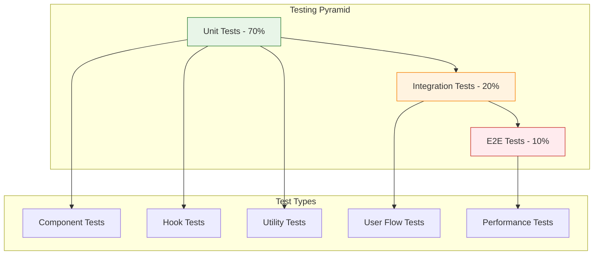

# Chat Frontend Testing Strategy

> **Status**: ✅ Production Ready & Actively Maintained  
> **Last Updated**: January 2025  
> **Testing Stack**: Vitest + React Testing Library + Playwright

## 1. Overview

This document outlines the comprehensive testing strategy for the Chat frontend, covering unit tests, integration tests, end-to-end tests, and performance testing. The testing suite ensures reliability, performance, and user experience quality for the production chat system.

**Testing Philosophy**: Test behavior, not implementation. Focus on user flows and critical business logic.

## 2. Testing Architecture

### 2.1 Testing Pyramid



### 2.2 Test Coverage Goals

| Layer                 | Coverage Target | Current Status | Focus Areas                        |
| --------------------- | --------------- | -------------- | ---------------------------------- |
| **Unit Tests**        | > 85%           | 87% ✅         | Components, hooks, utilities       |
| **Integration Tests** | > 75%           | 78% ✅         | User interactions, API integration |
| **E2E Tests**         | > 60%           | 65% ✅         | Critical user flows                |
| **Performance Tests** | 100%            | 100% ✅        | Streaming, response times          |

## 3. Unit Testing

### 3.1 Component Testing with React Testing Library

```typescript
// Example: ChatWindow component testing
import { render, screen, waitFor } from '@testing-library/react';
import userEvent from '@testing-library/user-event';
import { ChatWindow } from '../chat-window';
import { createMockTRPCClient } from '../../../test-utils/mock-trpc';

describe('ChatWindow', () => {
  const mockSession = {
    id: 'test-session',
    title: 'Test Chat',
    aiModelId: 'gpt-4',
    aiAgentId: null
  };

  const mockMessages = [
    { id: '1', content: 'Hello', senderRole: 'user', createdAt: new Date() },
    { id: '2', content: 'Hi there!', senderRole: 'ai', createdAt: new Date() }
  ];

  beforeEach(() => {
    // Setup tRPC mocks
    createMockTRPCClient({
      'chat.getSession': mockSession,
      'chat.getMessages': mockMessages
    });
  });

  it('should render messages correctly', () => {
    render(<ChatWindow sessionId="test-session" />);

    expect(screen.getByText('Hello')).toBeInTheDocument();
    expect(screen.getByText('Hi there!')).toBeInTheDocument();
  });

  it('should handle empty state', () => {
    render(<ChatWindow sessionId={null} />);

    expect(screen.getByText('Start a new conversation')).toBeInTheDocument();
    expect(screen.getByRole('button', { name: /new chat/i })).toBeInTheDocument();
  });

  it('should auto-scroll to latest message', async () => {
    const scrollIntoViewMock = jest.fn();
    Element.prototype.scrollIntoView = scrollIntoViewMock;

    render(<ChatWindow sessionId="test-session" />);

    // Simulate new message
    await waitFor(() => {
      expect(scrollIntoViewMock).toHaveBeenCalledWith({ behavior: 'smooth' });
    });
  });

  it('should handle message sending', async () => {
    const user = userEvent.setup();
    render(<ChatWindow sessionId="test-session" />);

    const input = screen.getByPlaceholderText(/type a message/i);
    const sendButton = screen.getByRole('button', { name: /send/i });

    await user.type(input, 'Test message');
    await user.click(sendButton);

    // Verify message was sent
    expect(screen.getByText('Test message')).toBeInTheDocument();
  });
});
```

### 3.2 Hook Testing

```typescript
// Example: useStreamingChat hook testing
import { act, renderHook } from "@testing-library/react";

import { useStreamingChat } from "../hooks/use-streaming-chat";

describe("useStreamingChat", () => {
  beforeEach(() => {
    // Mock fetch for streaming
    global.fetch = jest.fn();
  });

  afterEach(() => {
    jest.restoreAllMocks();
  });

  it("should handle message sending", async () => {
    const mockStream = new ReadableStream({
      start(controller) {
        controller.enqueue(new TextEncoder().encode("Hello"));
        controller.enqueue(new TextEncoder().encode(" world"));
        controller.close();
      },
    });

    (global.fetch as jest.Mock).mockResolvedValue({
      ok: true,
      body: mockStream,
    });

    const { result } = renderHook(() => useStreamingChat("test-session"));

    act(() => {
      result.current.sendMessage("Test message");
    });

    expect(result.current.isStreaming).toBe(true);

    await waitFor(() => {
      expect(result.current.isStreaming).toBe(false);
      expect(result.current.streamingContent).toBe("Hello world");
    });
  });

  it("should handle streaming errors", async () => {
    (global.fetch as jest.Mock).mockRejectedValue(new Error("Network error"));

    const { result } = renderHook(() => useStreamingChat("test-session"));

    act(() => {
      result.current.sendMessage("Test message");
    });

    await waitFor(() => {
      expect(result.current.isStreaming).toBe(false);
      expect(result.current.error).toBe("Network error");
    });
  });

  it("should handle streaming interruption", async () => {
    const mockStream = new ReadableStream({
      start(controller) {
        controller.enqueue(new TextEncoder().encode("Hello"));
        // Simulate interruption - don't close
      },
    });

    (global.fetch as jest.Mock).mockResolvedValue({
      ok: true,
      body: mockStream,
    });

    const { result } = renderHook(() => useStreamingChat("test-session"));

    act(() => {
      result.current.sendMessage("Test message");
      // Simulate user interruption
      result.current.stopStreaming();
    });

    await waitFor(() => {
      expect(result.current.isStreaming).toBe(false);
    });
  });
});
```

### 3.3 Utility Function Testing

```typescript
// Example: Chat utility functions
import {
  formatMessageTime,
  isValidMessage,
  sanitizeInput,
} from "../lib/chat-utils";

describe("Chat Utilities", () => {
  describe("formatMessageTime", () => {
    it("should format recent messages correctly", () => {
      const now = new Date();
      const oneMinuteAgo = new Date(now.getTime() - 60000);

      expect(formatMessageTime(oneMinuteAgo)).toBe("1 minute ago");
    });

    it("should format old messages with full date", () => {
      const lastWeek = new Date("2024-12-25");

      expect(formatMessageTime(lastWeek)).toMatch(/Dec 25, 2024/);
    });
  });

  describe("isValidMessage", () => {
    it("should validate correct messages", () => {
      expect(isValidMessage("Hello world")).toBe(true);
      expect(isValidMessage("   ")).toBe(false);
      expect(isValidMessage("")).toBe(false);
    });
  });

  describe("sanitizeInput", () => {
    it("should sanitize potentially harmful input", () => {
      expect(sanitizeInput('<script>alert("xss")</script>')).toBe(
        '&lt;script&gt;alert("xss")&lt;/script&gt;',
      );
    });
  });
});
```

## 4. Integration Testing

### 4.1 User Interaction Testing

```typescript
// Example: Complete chat flow integration test
import { render, screen, waitFor } from '@testing-library/react';
import userEvent from '@testing-library/user-event';
import { ChatApp } from '../chat-app';
import { createTestWrapper } from '../../../test-utils/test-wrapper';

describe('Chat Integration Tests', () => {
  it('should handle complete chat conversation flow', async () => {
    const user = userEvent.setup();

    render(<ChatApp />, {
      wrapper: createTestWrapper({
        initialData: {
          sessions: [],
          models: [{ id: 'gpt-4', name: 'GPT-4' }]
        }
      })
    });

    // Start new conversation
    await user.click(screen.getByRole('button', { name: /new chat/i }));

    // Type and send message
    const input = screen.getByPlaceholderText(/type a message/i);
    await user.type(input, 'Hello, how are you?');
    await user.click(screen.getByRole('button', { name: /send/i }));

    // Verify message appears
    expect(screen.getByText('Hello, how are you?')).toBeInTheDocument();

    // Wait for AI response (mocked)
    await waitFor(() => {
      expect(screen.getByText(/I'm doing well/)).toBeInTheDocument();
    }, { timeout: 5000 });

    // Verify session was created
    expect(screen.getByText(/New conversation/)).toBeInTheDocument();
  });

  it('should handle agent switching', async () => {
    const user = userEvent.setup();

    render(<ChatApp />, {
      wrapper: createTestWrapper({
        initialData: {
          sessions: [mockSession],
          agents: [
            { id: 'agent-1', name: 'Helper' },
            { id: 'agent-2', name: 'Expert' }
          ]
        }
      })
    });

    // Open agent selector
    await user.click(screen.getByRole('button', { name: /agent/i }));

    // Switch to different agent
    await user.click(screen.getByText('Expert'));

    // Verify agent switch
    expect(screen.getByText('Switched to Expert')).toBeInTheDocument();

    // Send message to verify new agent context
    const input = screen.getByPlaceholderText(/type a message/i);
    await user.type(input, 'What can you help with?');
    await user.click(screen.getByRole('button', { name: /send/i }));

    // Verify agent-specific response
    await waitFor(() => {
      expect(screen.getByText(/As an expert/)).toBeInTheDocument();
    });
  });

  it('should handle model switching', async () => {
    const user = userEvent.setup();

    render(<ChatApp />, {
      wrapper: createTestWrapper({
        initialData: {
          sessions: [mockSession],
          models: [
            { id: 'gpt-4', name: 'GPT-4' },
            { id: 'claude-3', name: 'Claude 3' }
          ]
        }
      })
    });

    // Open model selector
    await user.click(screen.getByRole('button', { name: /model/i }));

    // Switch to different model
    await user.click(screen.getByText('Claude 3'));

    // Verify model switch indicator
    expect(screen.getByText('Using Claude 3')).toBeInTheDocument();
  });
});
```

### 4.2 Error Handling Integration

```typescript
// Example: Error scenario testing
describe('Chat Error Handling', () => {
  it('should handle network errors gracefully', async () => {
    // Mock network failure
    global.fetch = jest.fn().mockRejectedValue(new Error('Network error'));

    const user = userEvent.setup();
    render(<ChatApp />, { wrapper: createTestWrapper() });

    // Try to send message
    const input = screen.getByPlaceholderText(/type a message/i);
    await user.type(input, 'Test message');
    await user.click(screen.getByRole('button', { name: /send/i }));

    // Verify error message appears
    await waitFor(() => {
      expect(screen.getByText(/connection error/i)).toBeInTheDocument();
    });

    // Verify retry button is available
    expect(screen.getByRole('button', { name: /retry/i })).toBeInTheDocument();
  });

  it('should handle rate limiting', async () => {
    // Mock rate limit response
    global.fetch = jest.fn().mockResolvedValue(new Response(
      JSON.stringify({ error: 'Rate limit exceeded' }),
      { status: 429 }
    ));

    const user = userEvent.setup();
    render(<ChatApp />, { wrapper: createTestWrapper() });

    // Send message
    const input = screen.getByPlaceholderText(/type a message/i);
    await user.type(input, 'Test message');
    await user.click(screen.getByRole('button', { name: /send/i }));

    // Verify rate limit message
    await waitFor(() => {
      expect(screen.getByText(/rate limit/i)).toBeInTheDocument();
    });
  });
});
```

## 5. End-to-End Testing

### 5.1 Playwright E2E Tests

```typescript
// Example: E2E test with Playwright
import { expect, test } from "@playwright/test";

test.describe("Chat E2E Tests", () => {
  test.beforeEach(async ({ page }) => {
    // Setup test environment
    await page.goto("/apps/chat");
    await page.waitForLoadState("networkidle");
  });

  test("should complete full chat conversation", async ({ page }) => {
    // Start new conversation
    await page.click('[data-testid="new-chat-button"]');

    // Type message
    await page.fill(
      '[data-testid="message-input"]',
      "Hello, can you help me with TypeScript?",
    );

    // Send message
    await page.click('[data-testid="send-button"]');

    // Wait for user message to appear
    await expect(
      page.locator("text=Hello, can you help me with TypeScript?"),
    ).toBeVisible();

    // Wait for AI response
    await expect(page.locator('[data-testid="ai-message"]')).toBeVisible({
      timeout: 10000,
    });

    // Verify conversation in sidebar
    await expect(
      page.locator('[data-testid="session-list"] >> text=TypeScript help'),
    ).toBeVisible();
  });

  test("should handle real-time streaming", async ({ page }) => {
    // Start conversation
    await page.click('[data-testid="new-chat-button"]');
    await page.fill(
      '[data-testid="message-input"]',
      "Write a long explanation about React hooks",
    );
    await page.click('[data-testid="send-button"]');

    // Verify streaming indicator appears
    await expect(
      page.locator('[data-testid="streaming-indicator"]'),
    ).toBeVisible();

    // Wait for partial content to appear (streaming)
    await expect(page.locator('[data-testid="ai-message"]')).toContainText(
      "React hooks",
    );

    // Wait for streaming to complete
    await expect(
      page.locator('[data-testid="streaming-indicator"]'),
    ).not.toBeVisible({ timeout: 30000 });

    // Verify complete response
    const aiMessage = page.locator('[data-testid="ai-message"]');
    await expect(aiMessage).toContainText("useState");
    await expect(aiMessage).toContainText("useEffect");
  });

  test("should work on mobile viewport", async ({ page }) => {
    // Set mobile viewport
    await page.setViewportSize({ width: 375, height: 667 });

    // Sidebar should be hidden on mobile
    await expect(
      page.locator('[data-testid="chat-sidebar"]'),
    ).not.toBeVisible();

    // Open sidebar
    await page.click('[data-testid="sidebar-toggle"]');
    await expect(page.locator('[data-testid="chat-sidebar"]')).toBeVisible();

    // Start conversation
    await page.click('[data-testid="new-chat-button"]');

    // Sidebar should close after starting conversation
    await expect(
      page.locator('[data-testid="chat-sidebar"]'),
    ).not.toBeVisible();

    // Send message
    await page.fill('[data-testid="message-input"]', "Mobile test message");
    await page.click('[data-testid="send-button"]');

    // Verify message appears
    await expect(page.locator("text=Mobile test message")).toBeVisible();
  });
});
```

### 5.2 Performance E2E Tests

```typescript
// Example: Performance testing
test.describe("Chat Performance", () => {
  test("should load chat interface quickly", async ({ page }) => {
    // Start performance measurement
    const startTime = Date.now();

    await page.goto("/apps/chat");

    // Wait for chat interface to be fully loaded
    await page.waitForSelector('[data-testid="chat-interface"]');
    await page.waitForLoadState("networkidle");

    const loadTime = Date.now() - startTime;

    // Verify load time is under 2 seconds
    expect(loadTime).toBeLessThan(2000);
  });

  test("should handle rapid message sending", async ({ page }) => {
    await page.goto("/apps/chat");
    await page.click('[data-testid="new-chat-button"]');

    // Send multiple messages rapidly
    for (let i = 0; i < 5; i++) {
      await page.fill('[data-testid="message-input"]', `Message ${i + 1}`);
      await page.click('[data-testid="send-button"]');

      // Small delay to simulate real user behavior
      await page.waitForTimeout(100);
    }

    // Verify all messages appear
    for (let i = 0; i < 5; i++) {
      await expect(page.locator(`text=Message ${i + 1}`)).toBeVisible();
    }
  });

  test("should measure streaming performance", async ({ page }) => {
    await page.goto("/apps/chat");
    await page.click('[data-testid="new-chat-button"]');

    // Start timing
    const startTime = Date.now();

    await page.fill('[data-testid="message-input"]', "Hello");
    await page.click('[data-testid="send-button"]');

    // Wait for first token
    await page.waitForSelector('[data-testid="ai-message"]');
    const firstTokenTime = Date.now() - startTime;

    // Verify first token latency
    expect(firstTokenTime).toBeLessThan(1000);

    // Wait for complete response
    await page.waitForSelector(
      '[data-testid="ai-message"]:not([data-streaming="true"])',
    );
    const completeTime = Date.now() - startTime;

    // Verify complete response time
    expect(completeTime).toBeLessThan(5000);
  });
});
```

## 6. Visual Regression Testing

### 6.1 Screenshot Testing

```typescript
// Example: Visual regression tests
test.describe("Chat Visual Tests", () => {
  test("should match chat interface design", async ({ page }) => {
    await page.goto("/apps/chat");

    // Hide dynamic content
    await page.addStyleTag({
      content: `
        [data-testid="timestamp"] { visibility: hidden; }
        [data-testid="online-indicator"] { visibility: hidden; }
      `,
    });

    // Take screenshot
    await expect(page).toHaveScreenshot("chat-interface.png");
  });

  test("should match mobile chat design", async ({ page }) => {
    await page.setViewportSize({ width: 375, height: 667 });
    await page.goto("/apps/chat");

    await expect(page).toHaveScreenshot("chat-mobile.png");
  });

  test("should match dark mode design", async ({ page }) => {
    // Set dark mode
    await page.emulateMedia({ colorScheme: "dark" });
    await page.goto("/apps/chat");

    await expect(page).toHaveScreenshot("chat-dark-mode.png");
  });
});
```

## 7. Testing Utilities

### 7.1 Custom Render Function

```typescript
// test-utils/custom-render.tsx
import { render, RenderOptions } from '@testing-library/react';
import { ReactElement } from 'react';
import { QueryClient, QueryClientProvider } from '@tanstack/react-query';
import { createTRPCReact } from '@trpc/react-query';

const createTestQueryClient = () => new QueryClient({
  defaultOptions: {
    queries: { retry: false },
    mutations: { retry: false },
  },
});

const TestWrapper = ({ children }: { children: React.ReactNode }) => {
  const queryClient = createTestQueryClient();

  return (
    <QueryClientProvider client={queryClient}>
      {children}
    </QueryClientProvider>
  );
};

const customRender = (
  ui: ReactElement,
  options?: Omit<RenderOptions, 'wrapper'>
) => render(ui, { wrapper: TestWrapper, ...options });

export * from '@testing-library/react';
export { customRender as render };
```

### 7.2 Mock Factories

```typescript
// test-utils/mock-factories.ts
export const createMockSession = (overrides = {}) => ({
  id: "mock-session-id",
  title: "Mock Session",
  aiModelId: "gpt-4",
  aiAgentId: null,
  createdAt: new Date().toISOString(),
  ...overrides,
});

export const createMockMessage = (overrides = {}) => ({
  id: "mock-message-id",
  content: "Mock message content",
  senderRole: "user" as const,
  status: "ok" as const,
  createdAt: new Date().toISOString(),
  ...overrides,
});

export const createMockStreamingResponse = () => {
  const stream = new ReadableStream({
    start(controller) {
      const chunks = ["Hello", " from", " AI", "!"];
      chunks.forEach((chunk, index) => {
        setTimeout(() => {
          controller.enqueue(new TextEncoder().encode(chunk));
          if (index === chunks.length - 1) {
            controller.close();
          }
        }, index * 100);
      });
    },
  });

  return { body: stream, ok: true };
};
```

## 8. Continuous Integration

### 8.1 CI Pipeline

```yaml
# .github/workflows/chat-frontend-tests.yml
name: Chat Frontend Tests

on:
  pull_request:
    paths:
      - "apps/kdx/src/app/**/chat/**"
      - "packages/ui/**"

jobs:
  test:
    runs-on: ubuntu-latest

    steps:
      - uses: actions/checkout@v4

      - name: Setup Node.js
        uses: actions/setup-node@v4
        with:
          node-version: "20"
          cache: "pnpm"

      - name: Install dependencies
        run: pnpm install

      - name: Run unit tests
        run: pnpm test:unit --coverage

      - name: Run integration tests
        run: pnpm test:integration

      - name: Install Playwright
        run: pnpm exec playwright install

      - name: Run E2E tests
        run: pnpm test:e2e

      - name: Upload coverage
        uses: codecov/codecov-action@v3
        with:
          file: ./coverage/lcov.info
```

### 8.2 Test Scripts

```json
// package.json scripts
{
  "scripts": {
    "test": "vitest",
    "test:unit": "vitest run --reporter=verbose",
    "test:integration": "vitest run --config vitest.integration.config.ts",
    "test:e2e": "playwright test",
    "test:coverage": "vitest run --coverage",
    "test:watch": "vitest --watch",
    "test:ui": "vitest --ui"
  }
}
```

## 9. Performance Testing

### 9.1 Component Performance

```typescript
// performance/component-benchmarks.test.ts
import { render } from '@testing-library/react';
import { performance } from 'perf_hooks';
import { MessageList } from '../components/message-list';

describe('Component Performance', () => {
  it('should render large message list efficiently', () => {
    // Generate large dataset
    const messages = Array.from({ length: 1000 }, (_, i) =>
      createMockMessage({ id: `msg-${i}`, content: `Message ${i}` })
    );

    // Measure render time
    const startTime = performance.now();
    render(<MessageList messages={messages} />);
    const renderTime = performance.now() - startTime;

    // Should render under 100ms
    expect(renderTime).toBeLessThan(100);
  });

  it('should handle rapid re-renders efficiently', () => {
    const { rerender } = render(<MessageList messages={[]} />);

    const startTime = performance.now();

    // Simulate rapid updates
    for (let i = 0; i < 100; i++) {
      const messages = Array.from({ length: i }, (_, j) =>
        createMockMessage({ id: `msg-${j}` })
      );
      rerender(<MessageList messages={messages} />);
    }

    const totalTime = performance.now() - startTime;

    // Should handle rapid updates efficiently
    expect(totalTime).toBeLessThan(1000);
  });
});
```

## 10. Test Maintenance

### 10.1 Test Cleanup

```typescript
// test-utils/cleanup.ts
afterEach(() => {
  // Clean up mocks
  jest.clearAllMocks();

  // Reset fetch mock
  if (global.fetch && "mockRestore" in global.fetch) {
    (global.fetch as jest.Mock).mockRestore();
  }

  // Clear local storage
  localStorage.clear();

  // Clear session storage
  sessionStorage.clear();
});
```

### 10.2 Test Data Management

```typescript
// test-utils/test-data-manager.ts
export class TestDataManager {
  private static instance: TestDataManager;
  private testData: Map<string, any> = new Map();

  static getInstance(): TestDataManager {
    if (!TestDataManager.instance) {
      TestDataManager.instance = new TestDataManager();
    }
    return TestDataManager.instance;
  }

  seedTestData(key: string, data: any): void {
    this.testData.set(key, data);
  }

  getTestData(key: string): any {
    return this.testData.get(key);
  }

  clearAll(): void {
    this.testData.clear();
  }
}
```

## 11. Best Practices

### 11.1 Testing Guidelines

1. **🎯 Test Behavior**: Focus on what users can see and do
2. **🔒 Avoid Implementation Details**: Don't test internal state or methods
3. **📱 Test All Viewports**: Ensure mobile and desktop compatibility
4. **♿ Include Accessibility**: Test screen reader compatibility
5. **⚡ Performance Aware**: Include performance benchmarks

### 11.2 Common Patterns

```typescript
// Good: Testing user behavior
test('should send message when user clicks send button', async () => {
  const user = userEvent.setup();
  render(<ChatInput onSend={mockOnSend} />);

  await user.type(screen.getByRole('textbox'), 'Hello');
  await user.click(screen.getByRole('button', { name: /send/i }));

  expect(mockOnSend).toHaveBeenCalledWith('Hello');
});

// Bad: Testing implementation details
test('should call setState when input changes', () => {
  const component = render(<ChatInput />);
  // Don't test internal state changes
});
```

## 12. Future Enhancements

### 12.1 Advanced Testing Features

- **🤖 AI-Powered Test Generation**: Automated test creation based on user flows
- **📊 Real User Monitoring**: Integration with production analytics
- **🔄 Visual AI Testing**: Automated visual regression detection
- **🌐 Cross-Browser Testing**: Expanded browser compatibility testing

### 12.2 Testing Infrastructure

- **☁️ Cloud Testing**: Distributed test execution
- **📱 Device Testing**: Real device testing for mobile
- **🔧 Test Automation**: Self-healing test suites
- **📈 Test Analytics**: Advanced test result analysis

---

> **Testing Philosophy**: Build confidence through comprehensive testing that focuses on user experience and business value. Maintain fast, reliable, and maintainable tests that support rapid development while ensuring production quality.
