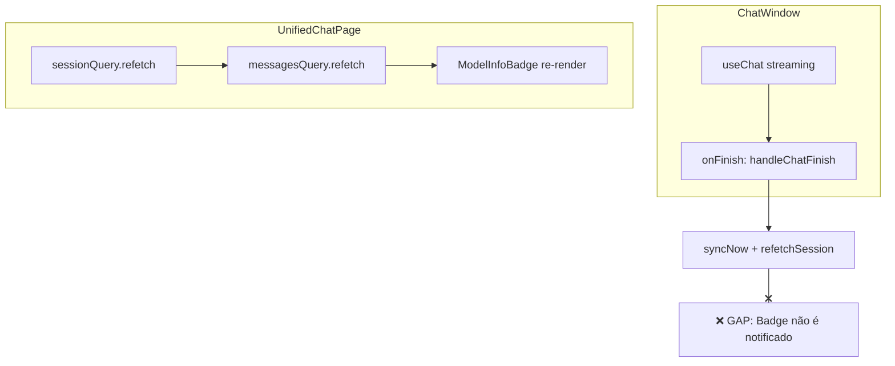

# Plano de Ação: Correção de Sincronização do Model Info Badge

- **Data:** 2025-07-26
- **Status:** Planejado
- **Responsável:** Agente Kodix
- **Issue Relacionada:** O `ModelInfoBadge` não atualiza para o status "verificado" (✓) após o usuário trocar o modelo e enviar uma nova mensagem.

---

## 1. Resumo do Problema

O `ModelInfoBadge` exibe corretamente o status "aguardando" (⏱️) quando o modelo de IA é alterado. No entanto, após o envio de uma nova mensagem e o recebimento da resposta completa do novo modelo, o badge não atualiza seu estado para "verificado" (✓). A atualização só ocorre após um refresh manual da página, o que prejudica a confiança do usuário na interface.

## 2. Análise da Causa Raiz

A investigação, baseada nos logs e na análise da arquitetura atual, identificou duas causas principais:

1.  **Falta de Comunicação Direta:** Não existe um canal de comunicação explícito entre o `ChatWindow` (onde o evento `onFinish` do `useChat` é acionado) e o `UnifiedChatPage` (que gerencia os dados que alimentam o `ModelInfoBadge`).
2.  **Timing e Race Condition:** O `ModelInfoBadge` é renderizado com dados de cache (`lastMessageMetadata`) que ainda não foram atualizados no momento em que a UI é re-renderizada após a conclusão do streaming.

O fluxo de dados é interrompido, como mostra o diagrama:



## 3. Estratégia de Correção: O Padrão de Callback Chain

A solução mais robusta e alinhada com a arquitetura do React é implementar um **"Callback Chain"** (Cadeia de Callbacks).

- **Descrição:** O componente pai (`UnifiedChatPage`) passará uma função de callback (`onStreamingFinished`) para o `ChatWindow`. Quando o streaming terminar, o `ChatWindow` chamará essa função, notificando o componente pai. O `UnifiedChatPage`, por sua vez, forçará a invalidação das queries necessárias para que o `ModelInfoBadge` se atualize com os dados mais recentes.

- **Por que esta estratégia?**
  - **Fluxo de Dados Explícito:** Respeita a arquitetura React, tornando o fluxo de controle claro.
  - **Desacoplamento:** O `ChatWindow` não precisa conhecer os detalhes de implementação de seus componentes irmãos.
  - **Manutenibilidade:** A lógica de atualização fica centralizada no `UnifiedChatPage`, onde os dados são gerenciados.

## 4. Plano de Implementação Detalhado

A implementação será feita de forma incremental e segura, focada nos seguintes arquivos:

- `apps/kdx/src/app/[locale]/(authed)/apps/chat/_components/unified-chat-page.tsx`
- `apps/kdx/src/app/[locale]/(authed)/apps/chat/_components/chat-window.tsx`

### Etapa 1: Definir e Propagar o Callback

1.  **Em `unified-chat-page.tsx`:**

    - Criar uma função `handleStreamingFinished` usando `useCallback`.
    - Dentro dela, invalidar a `messagesQuery` para forçar a busca da `lastMessageMetadata` mais recente.
    - Passar `onStreamingFinished={handleStreamingFinished}` como prop para o `<ChatWindow />`.

2.  **Em `chat-window.tsx`:**
    - Receber a prop `onStreamingFinished`.
    - Modificar o callback `onFinish` do hook `useChat`.
    - Dentro do `onFinish`, chamar a prop `onStreamingFinished?.()` para notificar o componente pai.

### Etapa 2: Garantir a Re-renderização do Badge

Para garantir que o badge se atualize visualmente de forma consistente, mesmo em cenários de cache agressivo, vamos adicionar um trigger de re-renderização.

1.  **Em `unified-chat-page.tsx`:**

    - Adicionar um estado simples: `const [badgeUpdateTrigger, setBadgeUpdateTrigger] = useState(0);`.
    - Na função `handleStreamingFinished`, chamar `setBadgeUpdateTrigger(prev => prev + 1);`.
    - Adicionar `badgeUpdateTrigger` à `key` do componente `ModelInfoBadge` para forçar seu re-mount.

    ```typescript
    <ModelInfoBadge
      key={`model-info-${selectedSessionId}-${badgeUpdateTrigger}`}
      // ... outras props
    />
    ```

### Etapa 3: Validação e Testes

1.  **Teste Manual:**
    - Acessar um chat.
    - Mudar o modelo de IA no `ModelSelector`.
    - Verificar se o `ModelInfoBadge` exibe o status "aguardando" (⏱️).
    - Enviar uma nova mensagem.
    - Após o fim da resposta, verificar se o badge atualiza **instantaneamente** para "verificado" (✓) sem a necessidade de refresh.
2.  **Validação de Logs:**
    - Confirmar nos logs do console que a sequência de eventos (onFinish → handleStreamingFinished → Invalidação de Query → Re-render do Badge) ocorre na ordem correta.

## 5. Próximos Passos

- **Concluído:** O plano de correção foi definido.
- **A seguir:** Executar as etapas de implementação descritas acima.
- **Cleanup:** Após a validação da correção, os arquivos de planejamento legados (`model-info-badge-debugging-plan.md` e `model-info-badge-lessons-learned.md`) serão removidos.

---
