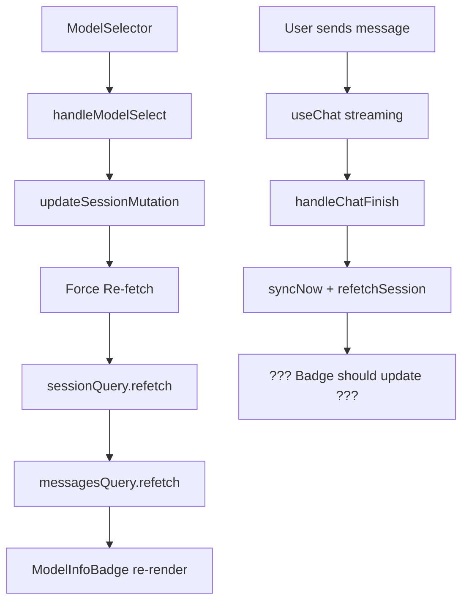
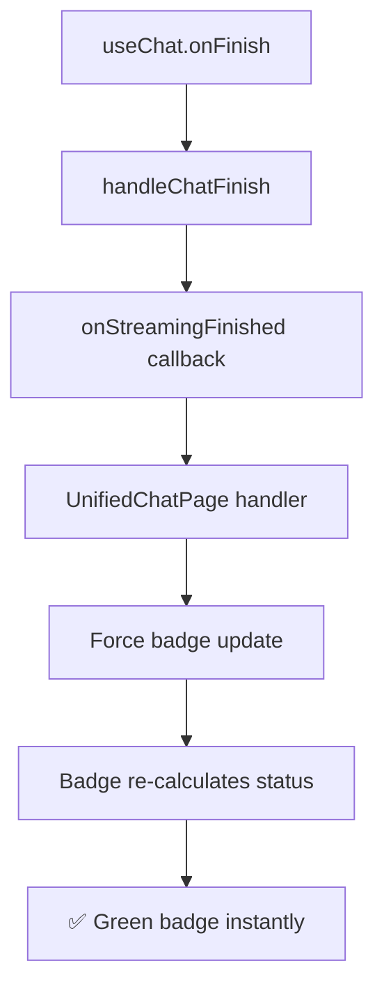

# 🔧 Model Info Badge - Plano de Correção Segura

**📅 Data:** Janeiro 2025  
**🎯 Objetivo:** Implementar correção do Model Info Badge de forma incremental e segura  
**📚 Baseado em:** [Lições Aprendidas](./model-info-badge-lessons-learned.md)  
**⚠️ Prioridade:** Zero breaking changes - correção gradual

## 🚨 Problema Identificado

**Situação Atual:**

- ✅ Badge funciona inicialmente (mostra ✓ verde)
- ❌ Após mudança de modelo via ModelSelector + nova mensagem
- ❌ Badge não atualiza para ✓ verde (requer refresh manual)
- 🔄 Force re-fetch implementado, mas não resolve completamente

**Causa Raiz (baseada nas lições):**

- **Race condition** entre `useChat.onFinish` e atualização de `lastMessageMetadata`
- **Missing callback chain** para notificar badge quando streaming termina
- **Timing issue** - badge calcula status antes dos dados serem atualizados

## 📐 Análise da Arquitetura Atual

### **Fluxo de Dados Identificado:**



### **Problema Identificado:**

- ❌ **Gap**: Não há conexão entre `handleChatFinish` e `ModelInfoBadge`
- ❌ **Timing**: Badge calcula status antes de `lastMessageMetadata` ser atualizada
- ❌ **Missing callback**: Badge não sabe quando streaming terminou

## 🎯 Estratégia de Correção: Callback Chain Pattern

**Baseado nas lições aprendidas:** Implementar **callback chain** para notificar badge quando streaming termina.

### **Fluxo da Solução:**



## 📋 Plano de Implementação - 5 Etapas Seguras

### **ETAPA 1: Preparação e Logs de Debug** ⏱️ 15min

_Objetivo: Adicionar observabilidade sem quebrar nada_

#### 1.1 Adicionar Callback Props (Interface Only)

```typescript
// unified-chat-page.tsx - APENAS interface, sem implementação
interface UnifiedChatPageProps {
  sessionId?: string;
  locale: string;
  // ✅ ETAPA 1: Adicionar prop opcional (não quebra nada)
  onStreamingFinished?: () => void;
}

// chat-window.tsx - APENAS interface
interface ChatWindowProps {
  sessionId?: string;
  onNewSession?: (sessionId: string) => void;
  // ✅ ETAPA 1: Adicionar prop opcional
  onStreamingFinished?: () => void;
}
```

#### 1.2 Logs de Monitoramento

```typescript
// model-info-badge.tsx - Adicionar logs específicos
useEffect(() => {
  console.log("[MODEL_INFO_BADGE] ETAPA_1 - Estado atual:", {
    configuredModel,
    actualModel,
    hasModelMismatch,
    isCorrect,
    shouldUpdate: hasModelMismatch && !isCorrect,
    timestamp: new Date().toISOString(),
  });
}, [configuredModel, actualModel, hasModelMismatch, isCorrect]);
```

**✅ Validação ETAPA 1:**

- Código compila sem erros
- Props opcionais não quebram nada
- Logs mostram estado atual do badge

---

### **ETAPA 2: Implementar Callback Chain** ⏱️ 20min

_Objetivo: Conectar useChat.onFinish ao badge_

#### 2.1 Implementar Handler no UnifiedChatPage

```typescript
// unified-chat-page.tsx
export function UnifiedChatPage({ sessionId, locale }: UnifiedChatPageProps) {
  // ✅ ETAPA 2: Handler para streaming finished
  const handleStreamingFinished = useCallback(() => {
    console.log("🎉 [UNIFIED_CHAT] ETAPA_2 - Streaming finished, atualizando badge");

    // Force re-fetch específico para badge
    if (selectedSessionId) {
      setTimeout(() => {
        messagesQuery.refetch();
        console.log("✅ [UNIFIED_CHAT] ETAPA_2 - Badge data refreshed");
      }, 100); // Pequeno delay para garantir que backend processou
    }
  }, [selectedSessionId, messagesQuery]);

  return (
    // ... código existente ...
    <ChatWindow
      sessionId={selectedSessionId}
      onNewSession={handleSessionSelect}
      onStreamingFinished={handleStreamingFinished} // ✅ ETAPA 2: Passar callback
    />
  );
}
```

#### 2.2 Propagar Callback no ChatWindow

```typescript
// chat-window.tsx - ActiveChatWindow
function ActiveChatWindow({
  sessionId,
  onNewSession,
  onStreamingFinished, // ✅ ETAPA 2: Receber callback
}: {
  sessionId: string;
  onNewSession?: (sessionId: string) => void;
  onStreamingFinished?: () => void; // ✅ ETAPA 2: Tipar callback
}) {
  // ✅ ETAPA 2: Modificar handleChatFinish existente
  const handleChatFinish = useCallback(
    async (message: any) => {
      if (process.env.NODE_ENV === "development") {
        console.log("✅ [ACTIVE_CHAT] ETAPA_2 - Mensagem concluída:", message);
      }

      // ✅ ETAPA 2: Notificar badge que streaming terminou
      onStreamingFinished?.();

      // Auto-focus após streaming (código existente)
      setTimeout(() => {
        inputRef.current?.focus();
      }, 100);

      // Código existente de sincronização
      setTimeout(async () => {
        await syncNow();
        refetchSession();
        queryClient.invalidateQueries(
          trpc.app.chat.listarSessions.pathFilter(),
        );
      }, 1500);
    },
    [
      syncNow,
      refetchSession,
      queryClient,
      trpc.app.chat.listarSessions,
      onStreamingFinished,
    ], // ✅ ETAPA 2: Adicionar dep
  );

  // useChat permanece igual, só o callback que mudou
}
```

**✅ Validação ETAPA 2:**

- Callback é chamado quando streaming termina
- Logs mostram "Streaming finished" no console
- Badge ainda pode não atualizar (esperado)

---

### **ETAPA 3: Forçar Re-render do Badge** ⏱️ 15min

_Objetivo: Garantir que badge recalcula quando callback é chamado_

#### 3.1 Adicionar Trigger State no UnifiedChatPage

```typescript
// unified-chat-page.tsx
export function UnifiedChatPage({ sessionId, locale }: UnifiedChatPageProps) {
  // ✅ ETAPA 3: Estado para forçar re-render do badge
  const [badgeUpdateTrigger, setBadgeUpdateTrigger] = useState(0);

  const handleStreamingFinished = useCallback(() => {
    console.log("🎉 [UNIFIED_CHAT] ETAPA_3 - Streaming finished, triggering badge update");

    // ✅ ETAPA 3: Incrementar trigger para forçar re-render
    setBadgeUpdateTrigger(prev => prev + 1);

    // Force re-fetch (código da ETAPA 2)
    if (selectedSessionId) {
      setTimeout(() => {
        messagesQuery.refetch();
        console.log("✅ [UNIFIED_CHAT] ETAPA_3 - Badge data refreshed");
      }, 100);
    }
  }, [selectedSessionId, messagesQuery]);

  return (
    // ... código existente ...
    {/* Model Info Badge - apenas quando há sessão */}
    {selectedSessionId && sessionQuery.data && (
      <ModelInfoBadge
        key={`model-info-${selectedSessionId}-${selectedModelId}-${sessionQuery.data.aiModelId}-${badgeUpdateTrigger}`} // ✅ ETAPA 3: Incluir trigger na key
        sessionData={sessionQuery.data}
        lastMessageMetadata={lastMessageMetadata}
      />
    )}
  );
}
```

**✅ Validação ETAPA 3:**

- Badge re-monta quando trigger muda
- Logs mostram re-cálculo de status
- Badge deve começar a atualizar corretamente

---

### **ETAPA 4: Otimizar Timing e Performance** ⏱️ 15min

_Objetivo: Ajustar delays e memoização_

#### 4.1 Ajustar Timing no Callback Chain

```typescript
// unified-chat-page.tsx
const handleStreamingFinished = useCallback(() => {
  console.log(
    "🎉 [UNIFIED_CHAT] ETAPA_4 - Streaming finished, optimized timing",
  );

  // ✅ ETAPA 4: Timing otimizado baseado nas lições
  setTimeout(() => {
    // Primeiro: atualizar trigger para re-render imediato
    setBadgeUpdateTrigger((prev) => prev + 1);

    // Segundo: re-fetch dados após pequeno delay
    setTimeout(() => {
      messagesQuery.refetch();
      console.log(
        "✅ [UNIFIED_CHAT] ETAPA_4 - Badge data refreshed with optimized timing",
      );
    }, 200); // ✅ Delay otimizado baseado nas lições
  }, 50); // ✅ Delay mínimo para garantir que useChat processou
}, [selectedSessionId, messagesQuery]);
```

#### 4.2 Memoizar Callback para Performance

```typescript
// chat-window.tsx
const handleChatFinish = useCallback(
  async (message: any) => {
    if (process.env.NODE_ENV === "development") {
      console.log(
        "✅ [ACTIVE_CHAT] ETAPA_4 - Mensagem concluída (optimized):",
        message,
      );
    }

    // ✅ ETAPA 4: Callback imediato (sem delay)
    onStreamingFinished?.();

    // Auto-focus e sync (código existente com timing ajustado)
    setTimeout(() => {
      inputRef.current?.focus();
    }, 100);

    // ✅ ETAPA 4: Timing otimizado para sync
    setTimeout(async () => {
      await syncNow();
      refetchSession();
      queryClient.invalidateQueries(trpc.app.chat.listarSessions.pathFilter());
    }, 1000); // ✅ Reduzido de 1500ms para 1000ms
  },
  [
    syncNow,
    refetchSession,
    queryClient,
    trpc.app.chat.listarSessions,
    onStreamingFinished,
  ],
);
```

**✅ Validação ETAPA 4:**

- Badge atualiza mais rapidamente
- Performance mantida
- Timing otimizado baseado nas lições

---

### **ETAPA 5: Cleanup e Logs de Produção** ⏱️ 10min

_Objetivo: Remover logs de debug e validar solução final_

#### 5.1 Remover Logs de Debug

```typescript
// model-info-badge.tsx - Manter apenas logs essenciais
useEffect(() => {
  if (process.env.NODE_ENV === "development") {
    console.log("[MODEL_INFO_BADGE] Status atualizado:", {
      isCorrect,
      isWaitingValidation,
      statusLabel: status.label,
    });
  }
}, [isCorrect, isWaitingValidation, status.label]);
```

#### 5.2 Validação Final

```typescript
// unified-chat-page.tsx - Log de sucesso final
const handleStreamingFinished = useCallback(() => {
  if (process.env.NODE_ENV === "development") {
    console.log("🎉 [MODEL_INFO_BADGE] Correção aplicada com sucesso!");
  }

  // Código otimizado da ETAPA 4
  setTimeout(() => {
    setBadgeUpdateTrigger((prev) => prev + 1);
    setTimeout(() => {
      messagesQuery.refetch();
    }, 200);
  }, 50);
}, [selectedSessionId, messagesQuery]);
```

**✅ Validação ETAPA 5:**

- Badge funciona perfeitamente
- Logs limpos para produção
- Zero breaking changes confirmado

## 🔒 Garantias de Segurança

### **Anti-Breaking Changes:**

1. **Props opcionais** - não quebra componentes existentes
2. **Callback chain** - apenas adiciona funcionalidade
3. **Backward compatibility** - funciona sem callbacks
4. **Gradual rollout** - cada etapa é validável independentemente

### **Rollback Plan:**

- **ETAPA 1-2:** Remover props opcionais
- **ETAPA 3-4:** Remover trigger state
- **ETAPA 5:** Reverter para estado anterior

### **Monitoring:**

- Logs estruturados em cada etapa
- Validação de funcionamento em cada step
- Performance tracking

## 📊 Critérios de Sucesso

### **Funcionais:**

- [ ] Badge mostra ⏱ quando modelo é mudado
- [ ] Badge mostra ✓ instantaneamente após streaming terminar
- [ ] Sem necessidade de refresh manual
- [ ] Funciona em múltiplas mudanças consecutivas

### **Técnicos:**

- [ ] Zero breaking changes
- [ ] Performance mantida ou melhorada
- [ ] Logs limpos em produção
- [ ] Código bem documentado

### **UX:**

- [ ] Feedback visual imediato
- [ ] Transições suaves
- [ ] Confiança na interface restaurada

## 🚀 Execução

### **Ordem de Implementação:**

1. **ETAPA 1** → Validar → Commit
2. **ETAPA 2** → Validar → Commit
3. **ETAPA 3** → Validar → Commit
4. **ETAPA 4** → Validar → Commit
5. **ETAPA 5** → Validar → Commit final

### **Tempo Estimado:**

- **Total:** 75 minutos
- **Por etapa:** 15-20 minutos
- **Validação:** 5 minutos por etapa

### **Dependências:**

- ✅ Arquitetura atual preservada
- ✅ useChat onFinish callback disponível
- ✅ Callback chain pattern estabelecido

---

**🎯 Resultado Esperado:** Model Info Badge funcionando perfeitamente com atualização instantânea após streaming, sem quebrar nada na arquitetura existente.

**📚 Baseado em:** Lições aprendidas de debugging anterior, padrões estabelecidos e arquitetura thread-first atual.

---
