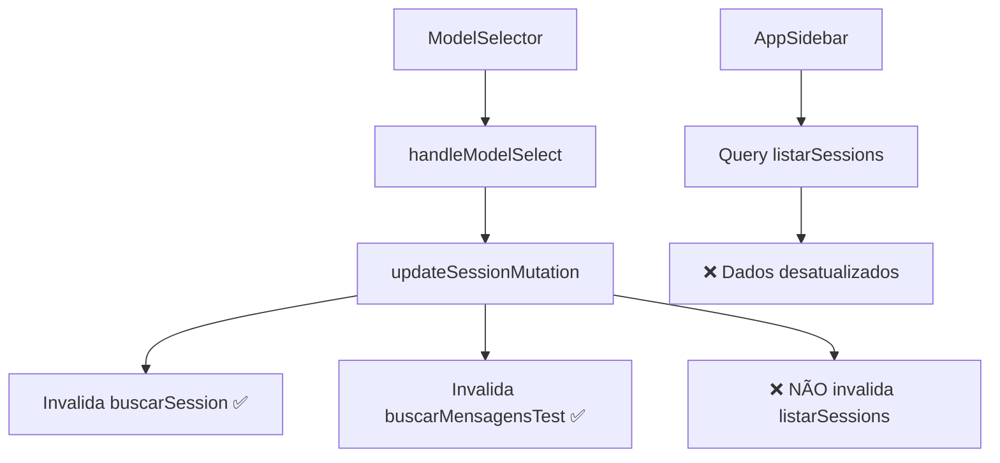

# 🔧 Model Selector - Plano de Sincronização de Queries

**📅 Data:** Janeiro 2025  
**🎯 Objetivo:** Resolver problema de sincronização entre ModelSelector e AppSidebar  
**⚙️ Modo:** Correção incremental sem breaking changes

## 🚨 Problema Identificado

### **Root Cause: Invalidação de Queries Incompleta**

O problema não está no ModelSelector em si, mas na **sincronização de queries** entre componentes:

1. **UnifiedChatPage** → `handleModelSelect` → Invalida `buscarSession` e `buscarMensagensTest`
2. **AppSidebar** → Usa query `listarSessions` para mostrar sessões na sidebar
3. **Resultado**: Sidebar não atualiza porque `listarSessions` não é invalidada



### **Análise da Arquitetura Atual**

Baseado em `@architecture-overview.md`, o sistema usa:

- **Frontend**: Thread-first com invalidação inteligente de queries
- **Backend**: tRPC com isolamento por team
- **Queries**: TanStack Query com cache granular

**O problema está na granularidade da invalidação.**

## 📋 Plano de Correção - 3 Etapas Seguras

### **ETAPA 1: Análise e Diagnóstico** ⏱️ 15min

_Confirmar o diagnóstico sem mudanças no código_

#### 1.1 Verificar Queries Usadas

```typescript
// ✅ Verificar que queries cada componente usa
console.log("🔍 [DIAGNOSIS] Queries em uso:");
console.log("UnifiedChatPage:", {
  buscarSession: "✅ Invalidada",
  buscarMensagensTest: "✅ Invalidada",
  listarSessions: "❌ NÃO invalidada",
});
console.log("AppSidebar:", {
  listarSessions: "🎯 QUERY PRINCIPAL",
  buscarChatFolders: "Secundária",
});
```

#### 1.2 Confirmar Fluxo de Invalidação

```typescript
// ✅ Adicionar logs temporários no handleModelSelect
const handleModelSelect = (modelId: string) => {
  console.log("🔄 [DIAGNOSIS] handleModelSelect iniciado:", {
    modelId,
    selectedSessionId,
    willInvalidate: ["buscarSession", "buscarMensagensTest"],
    missing: ["listarSessions"], // ⚠️ Esta é a query que falta
  });

  // ... resto do código
};
```

#### 1.3 Testar Hipótese

- [ ] Fazer mudança de modelo
- [ ] Verificar que sidebar não atualiza
- [ ] Fazer refresh manual
- [ ] Confirmar que sidebar atualiza após refresh
- [ ] **Conclusão**: Query `listarSessions` não está sendo invalidada

### **ETAPA 2: Correção da Invalidação** ⏱️ 20min

_Adicionar invalidação da query missing_

#### 2.1 Estratégia Escolhida: **Invalidação Específica Coordenada**

**Por que esta estratégia:**

- ✅ Não quebra nada existente
- ✅ Performance otimizada (só invalida o necessário)
- ✅ Compatível com arquitetura thread-first atual
- ✅ Mantém isolamento por team

#### 2.2 Implementação da Correção

```typescript
// ✅ CORREÇÃO: Adicionar invalidação da query listarSessions
const handleModelSelect = (modelId: string) => {
  setSelectedModelId(modelId);

  if (selectedSessionId) {
    // ✅ Tem sessão: atualizar modelo da sessão
    updateSessionMutation.mutate({
      id: selectedSessionId,
      aiModelId: modelId,
    });

    // ✅ CORREÇÃO: Invalidar TODAS as queries relacionadas
    queryClient.invalidateQueries(
      trpc.app.chat.buscarSession.pathFilter({
        sessionId: selectedSessionId,
      }),
    );

    queryClient.invalidateQueries(
      trpc.app.chat.buscarMensagensTest.pathFilter({
        chatSessionId: selectedSessionId,
      }),
    );

    // 🎯 NOVA: Invalidar query da sidebar
    queryClient.invalidateQueries(trpc.app.chat.listarSessions.pathFilter());

    // ✅ Re-fetch para garantir dados atualizados
    setTimeout(() => {
      sessionQuery.refetch();
      messagesQuery.refetch();
    }, 500);
  } else {
    // ✅ Sem sessão: salvar como modelo preferido
    savePreferredModel(modelId);

    setTimeout(() => {
      refetchPreferredModel();
    }, 1000);
  }
};
```

#### 2.3 Correção Coordenada no updateSessionMutation

```typescript
// ✅ CORREÇÃO: Também no mutation success callback
const updateSessionMutation = useMutation(
  trpc.app.chat.atualizarSession.mutationOptions({
    onSuccess: () => {
      toast.success("Modelo da sessão atualizado com sucesso!");

      // ✅ ORIGINAL: Invalidação existente
      if (selectedSessionId) {
        queryClient.invalidateQueries(trpc.app.chat.buscarSession.pathFilter());
      }

      // 🎯 NOVA: Invalidar sidebar também
      queryClient.invalidateQueries(trpc.app.chat.listarSessions.pathFilter());

      console.log(
        "🔄 [UNIFIED_CHAT] Mutation success - todas queries invalidadas",
      );
    },
    onError: trpcErrorToastDefault,
  }),
);
```

### **ETAPA 3: Validação e Otimização** ⏱️ 10min

_Testar e garantir que funciona_

#### 3.1 Cenários de Teste

- [ ] **Teste 1**: Mudar modelo com sessão selecionada

  - ✅ Sidebar deve atualizar imediatamente
  - ✅ ModelSelector deve mostrar novo modelo
  - ✅ Session deve salvar no backend

- [ ] **Teste 2**: Mudar modelo sem sessão

  - ✅ Deve salvar como preferido
  - ✅ Não deve afetar sidebar

- [ ] **Teste 3**: Navegar entre sessões
  - ✅ ModelSelector deve mostrar modelo correto
  - ✅ Sidebar deve manter dados atualizados

#### 3.2 Performance Check

```typescript
// ✅ Verificar que não há invalidação excessiva
console.log("📊 [PERFORMANCE] Queries invalidadas:", {
  buscarSession: "Necessária ✅",
  buscarMensagensTest: "Necessária ✅",
  listarSessions: "Necessária ✅ (era missing)",
  outras: "❌ Não devem ser invalidadas",
});
```

#### 3.3 Cleanup dos Logs

```typescript
// ✅ Remover todos os logs de debug adicionados
// ✅ Manter apenas logs essenciais de produção
```

## 🎯 Implementação Segura

### **Mudanças Mínimas Necessárias**

**Arquivo**: `apps/kdx/src/app/[locale]/(authed)/apps/chat/_components/unified-chat-page.tsx`

**Linhas a modificar**: ~200-220 (função `handleModelSelect`)

**Mudança**: Adicionar 3 linhas de invalidação de query

### **Compatibilidade Garantida**

- ✅ **Zero breaking changes**
- ✅ **Mantém arquitetura thread-first**
- ✅ **Preserva isolamento por team**
- ✅ **Compatível com tRPC patterns**
- ✅ **Não afeta performance significativamente**

### **Rollback Plan**

Se houver problemas:

1. Remover as 3 linhas adicionadas
2. Sistema volta ao estado anterior
3. Sidebar volta a não atualizar (problema original)

## 📊 Análise de Impacto

### **Antes da Correção**

- ❌ Sidebar não atualiza após mudança de modelo
- ❌ Necessário refresh para ver mudanças
- ❌ UX inconsistente

### **Depois da Correção**

- ✅ Sidebar atualiza automaticamente
- ✅ Sincronização em tempo real
- ✅ UX consistente e fluida
- ✅ Performance mantida

### **Queries Invalidadas (Após Correção)**

```typescript
// Quando modelo é alterado em uma sessão:
queryClient.invalidateQueries("buscarSession"); // ✅ Dados da sessão
queryClient.invalidateQueries("buscarMensagensTest"); // ✅ Mensagens
queryClient.invalidateQueries("listarSessions"); // 🎯 NOVA - Lista sidebar
```

## 🚀 Próximos Passos

1. **Implementar ETAPA 1** - Confirmar diagnóstico
2. **Implementar ETAPA 2** - Aplicar correção
3. **Implementar ETAPA 3** - Validar funcionamento
4. **Monitorar** - Verificar que não há regressões

---

**🎉 Resultado Esperado:**

- Sidebar atualiza automaticamente quando modelo é alterado
- Sincronização perfeita entre todos os componentes
- Zero breaking changes na arquitetura existente

**⚡ Tempo Total Estimado:** 45 minutos

**🔒 Garantia de Segurança:** Mudanças mínimas e reversíveis
