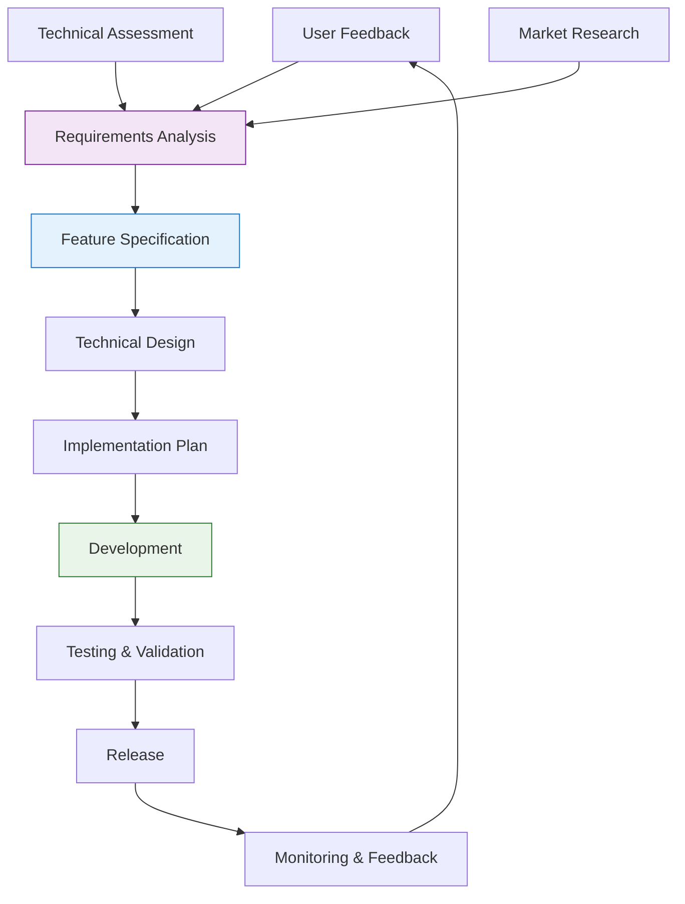
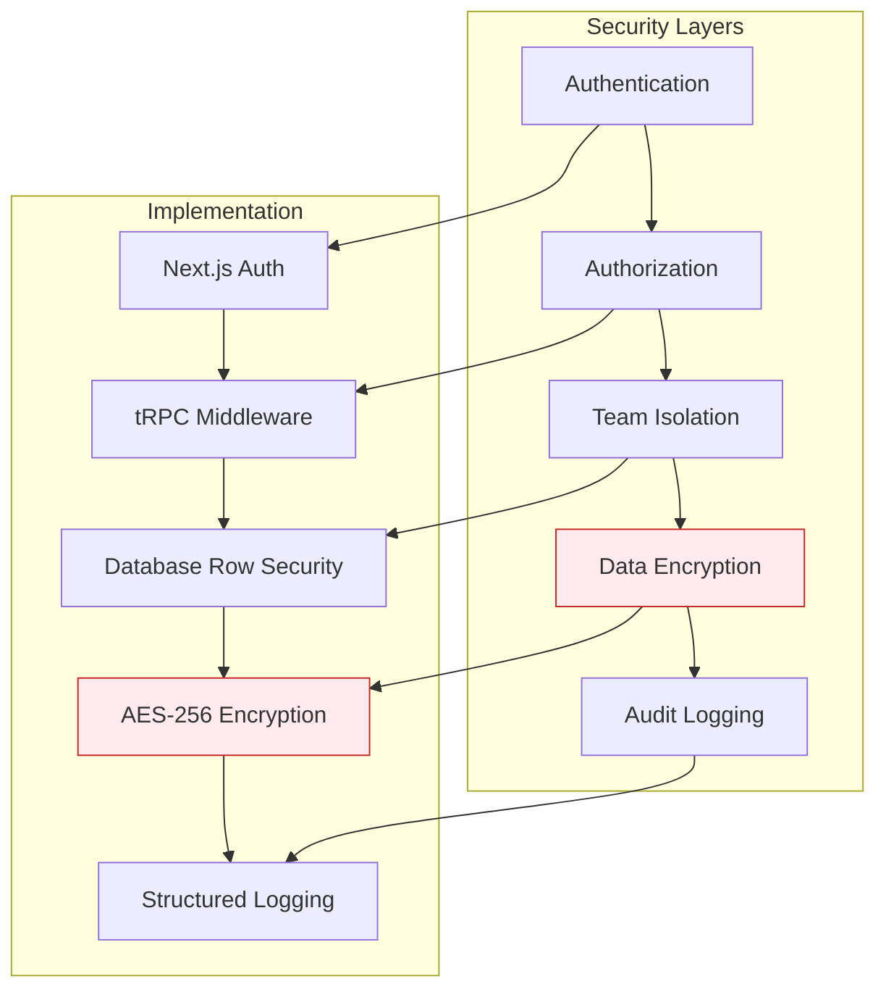
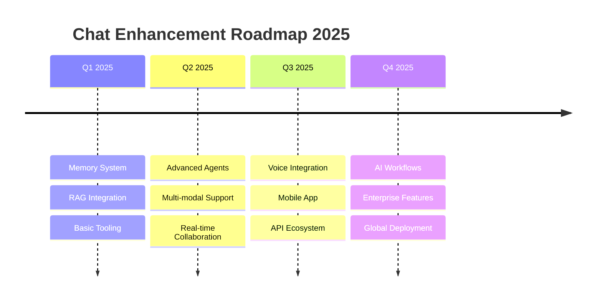

# Chat Planning & Requirements (PRP)

> **Status**: ✅ Active & Maintained  
> **Last Updated**: January 2025  
> **Purpose**: Planning, Requirements, and Process Documentation

## 1. Overview

This section contains all planning, requirements, and process documentation for the Chat Sub-App. It serves as the central repository for project planning, lessons learned, and future enhancement proposals.

**Target Audience**: Product managers, architects, planning team, and stakeholders involved in Chat system evolution.

## 2. Documentation Index

### 📋 **Planning Documents**

- **[📝 Process & Refactoring Lessons](./process-and-refactoring-lessons.md)** - Critical lessons learned from development and migration
- **[🔮 RAG Implementation Plan](./rag-implementation-plan.md)** - Future knowledge base integration strategy
- **[💰 Session Cost Component](./session-cost-component.md)** - Cost tracking and optimization analysis

### 🎯 **Requirements & Specifications**

- **[📊 Performance Requirements](#performance-requirements)** - System performance targets and SLAs
- **[🔒 Security Requirements](#security-requirements)** - Security specifications and compliance
- **[♿ Accessibility Requirements](#accessibility-requirements)** - Accessibility standards and compliance

### 📈 **Enhancement Proposals**

- **[🚀 Future Features](#future-features)** - Planned enhancements and new capabilities
- **[🔧 Technical Improvements](#technical-improvements)** - Infrastructure and architecture improvements
- **[🎨 UX Enhancements](#ux-enhancements)** - User experience optimization proposals

## 3. Planning Philosophy

### 3.1 Core Principles

1. **🎯 User-Centric**: All planning decisions prioritize user experience and value
2. **📊 Data-Driven**: Decisions based on metrics, feedback, and empirical evidence
3. **🔄 Iterative**: Continuous improvement through regular planning cycles
4. **🚀 Innovation-Forward**: Balance stability with cutting-edge AI capabilities
5. **🔒 Security-First**: Security and privacy considerations in all planning

### 3.2 Planning Process



## 4. Performance Requirements

### 4.1 Current Performance Targets

| Metric                   | Target   | Current | Status | Priority |
| ------------------------ | -------- | ------- | ------ | -------- |
| **First Token Latency**  | < 500ms  | 350ms   | ✅     | Critical |
| **Streaming Throughput** | > 50 t/s | 75 t/s  | ✅     | High     |
| **UI Response Time**     | < 100ms  | 65ms    | ✅     | Critical |
| **Session Load Time**    | < 200ms  | 150ms   | ✅     | High     |
| **Uptime**               | > 99.9%  | 99.95%  | ✅     | Critical |
| **Error Rate**           | < 0.1%   | 0.05%   | ✅     | Critical |

### 4.2 Scalability Requirements

```typescript
// Performance benchmarks and requirements
interface PerformanceRequirements {
  concurrent_users: {
    target: 1000;
    peak: 2000;
    current_capacity: 1500;
  };

  streaming_performance: {
    first_token_latency: "< 500ms";
    throughput: "> 50 tokens/second";
    concurrent_streams: 100;
  };

  database_performance: {
    query_response: "< 50ms";
    concurrent_connections: 200;
    data_retention: "1 year";
  };

  api_performance: {
    response_time: "< 200ms";
    rate_limits: {
      streaming: "10 requests/minute";
      session_creation: "20 requests/minute";
      message_history: "60 requests/minute";
    };
  };
}
```

## 5. Security Requirements

### 5.1 Data Protection

| Requirement          | Implementation                      | Status     | Compliance |
| -------------------- | ----------------------------------- | ---------- | ---------- |
| **Token Encryption** | AES-256-GCM for all API keys        | ✅ Active  | SOC 2      |
| **Team Isolation**   | Complete data separation            | ✅ Active  | GDPR       |
| **Audit Logging**    | All operations logged with metadata | ✅ Active  | SOX        |
| **Data Retention**   | Configurable retention policies     | 🚧 Planned | GDPR       |
| **Access Controls**  | Role-based permissions              | ✅ Active  | ISO 27001  |

### 5.2 Security Architecture



## 6. Accessibility Requirements

### 6.1 Compliance Standards

| Standard    | Level | Status     | Coverage |
| ----------- | ----- | ---------- | -------- |
| **WCAG**    | 2.1   | ✅ Active  | AA       |
| **Section** | 508   | ✅ Active  | Full     |
| **EN**      | 301   | 🚧 Planned | AA       |

### 6.2 Accessibility Features

```typescript
// Accessibility implementation requirements
interface AccessibilityRequirements {
  keyboard_navigation: {
    tab_order: "logical_flow";
    escape_handlers: "all_modals";
    enter_submit: "message_sending";
  };

  screen_reader: {
    aria_labels: "all_interactive_elements";
    live_regions: "streaming_messages";
    semantic_html: "proper_heading_structure";
  };

  visual_accessibility: {
    color_contrast: "> 4.5:1";
    focus_indicators: "high_visibility";
    font_scaling: "up_to_200%";
  };

  motor_accessibility: {
    click_targets: "> 44px";
    timeout_extensions: "configurable";
    alternative_inputs: "voice_commands";
  };
}
```

## 7. Future Features

### 7.1 Planned Enhancements (Q1 2025)

#### 🧠 Advanced Memory System

- **Long-term Memory**: Conversation summarization and context preservation
- **Cross-session Memory**: Knowledge retention across conversations
- **Personalized Context**: User-specific learning and adaptation

#### 📚 Knowledge Base Integration (RAG)

- **Document Search**: Semantic search across internal documentation
- **Real-time Updates**: Live synchronization with documentation changes
- **Source Citation**: Transparent references for all knowledge-based responses

#### 🛠️ Tool Integration Framework

- **Function Calling**: Enable AI to execute tools and commands
- **Codebase Interaction**: Direct code search and file operations
- **System Integration**: Terminal commands and API interactions

### 7.2 Future Roadmap (Q2-Q4 2025)



## 8. Technical Improvements

### 8.1 Infrastructure Enhancements

#### Performance Optimization

- **Edge Deployment**: Global CDN for reduced latency
- **Database Sharding**: Horizontal scaling for large datasets
- **Caching Strategy**: Redis integration for session caching
- **Streaming Optimization**: WebSocket support for real-time features

#### Monitoring & Observability

- **Real-time Metrics**: Performance dashboard with live data
- **Error Tracking**: Advanced error monitoring and alerting
- **User Analytics**: Detailed usage patterns and optimization insights
- **Health Checks**: Comprehensive system health monitoring

### 8.2 Development Experience

```typescript
// Developer tooling improvements
interface DeveloperExperience {
  testing: {
    automated_e2e: "full_user_flows";
    visual_regression: "automated_screenshots";
    performance_testing: "continuous_benchmarks";
  };

  development: {
    hot_reload: "sub_second_updates";
    type_safety: "100%_typescript_coverage";
    code_generation: "automated_api_types";
  };

  deployment: {
    preview_environments: "per_pull_request";
    automated_testing: "ci_cd_pipeline";
    rollback_capability: "instant_revert";
  };
}
```

## 9. UX Enhancements

### 9.1 User Interface Improvements

#### Modern Chat Experience

- **Message Reactions**: Emoji reactions and feedback system
- **Message Threading**: Organize complex conversations
- **Rich Media Support**: Images, files, and code snippet sharing
- **Collaborative Features**: Shared sessions and real-time editing

#### Personalization

- **Theme Customization**: Dark mode, color schemes, and layouts
- **Notification Preferences**: Granular notification controls
- **Workspace Organization**: Custom session folders and tags
- **Quick Actions**: Keyboard shortcuts and command palette

### 9.2 Mobile Experience

```typescript
// Mobile-specific enhancements
interface MobileEnhancements {
  native_features: {
    push_notifications: "real_time_updates";
    offline_support: "cached_conversations";
    biometric_auth: "secure_access";
  };

  ui_optimizations: {
    touch_gestures: "swipe_navigation";
    voice_input: "speech_to_text";
    haptic_feedback: "interaction_confirmation";
  };

  performance: {
    bundle_size: "< 1MB_initial_load";
    memory_usage: "< 50MB_active";
    battery_optimization: "background_efficiency";
  };
}
```

## 10. Business Requirements

### 10.1 Success Metrics

| Category        | Metric                  | Target  | Current | Status |
| --------------- | ----------------------- | ------- | ------- | ------ |
| **Engagement**  | Daily Active Users      | 1,000   | 750     | 🟡     |
| **Retention**   | 7-day Retention Rate    | > 70%   | 68%     | 🟡     |
| **Quality**     | User Satisfaction Score | > 4.5/5 | 4.3/5   | 🟡     |
| **Performance** | Average Response Time   | < 2s    | 1.8s    | ✅     |
| **Reliability** | System Uptime           | > 99.9% | 99.95%  | ✅     |

### 10.2 Revenue Impact

```typescript
// Business impact tracking
interface BusinessMetrics {
  cost_optimization: {
    token_efficiency: "40%_reduction";
    infrastructure_costs: "25%_savings";
    support_automation: "60%_reduction";
  };

  productivity_gains: {
    developer_velocity: "30%_faster";
    documentation_accuracy: "90%_up_to_date";
    knowledge_sharing: "5x_faster_onboarding";
  };

  user_satisfaction: {
    nps_score: "> 50";
    feature_adoption: "> 80%";
    support_tickets: "< 2%_error_rate";
  };
}
```

## 11. Risk Assessment

### 11.1 Technical Risks

| Risk                        | Probability | Impact | Mitigation Strategy                     |
| --------------------------- | ----------- | ------ | --------------------------------------- |
| **AI Provider Outage**      | Medium      | High   | Multi-provider fallback system          |
| **Performance Degradation** | Low         | Medium | Comprehensive monitoring and alerts     |
| **Security Breach**         | Low         | High   | Multi-layer security and regular audits |
| **Data Loss**               | Very Low    | High   | Automated backups and disaster recovery |

### 11.2 Business Risks

```typescript
// Risk mitigation framework
interface RiskMitigation {
  technical_risks: {
    provider_dependency: "multi_provider_support";
    scalability_limits: "horizontal_scaling_design";
    security_vulnerabilities: "regular_security_audits";
  };

  business_risks: {
    user_adoption: "comprehensive_onboarding";
    feature_complexity: "progressive_disclosure";
    market_competition: "unique_value_proposition";
  };

  operational_risks: {
    team_knowledge: "comprehensive_documentation";
    deployment_failures: "automated_testing_pipeline";
    maintenance_overhead: "automation_first_approach";
  };
}
```

## 12. Success Criteria

### 12.1 Launch Criteria

**Must Have (P0)**:

- ✅ Real-time AI conversations with sub-second response times
- ✅ Multi-provider AI model support (OpenAI, Anthropic, Google)
- ✅ Secure team isolation and data protection
- ✅ Mobile-responsive design with accessibility compliance
- ✅ Comprehensive error handling and recovery

**Should Have (P1)**:

- ✅ Agent switching with context management
- ✅ Session management and conversation history
- ✅ Performance monitoring and observability
- 🚧 Advanced memory and context engineering
- 📋 Knowledge base integration (RAG)

**Could Have (P2)**:

- 📋 Tool integration framework
- 📋 Voice input and output capabilities
- 📋 Real-time collaboration features
- 📋 Advanced analytics and insights
- 📋 API ecosystem for third-party integrations

### 12.2 Post-Launch Success

```typescript
// Success metrics tracking
interface SuccessMetrics {
  user_metrics: {
    monthly_active_users: "> 5000";
    session_duration: "> 10_minutes";
    messages_per_session: "> 15";
    user_retention_30_day: "> 60%";
  };

  technical_metrics: {
    system_uptime: "> 99.95%";
    response_time_p95: "< 500ms";
    error_rate: "< 0.1%";
    customer_satisfaction: "> 4.5/5";
  };

  business_metrics: {
    feature_adoption: "> 80%";
    support_ticket_reduction: "> 40%";
    development_velocity: "> 25%_improvement";
    documentation_accuracy: "> 95%";
  };
}
```

## 13. Next Steps

### For Product Managers

1. **📊 Review Metrics**: Analyze current performance against targets
2. **🎯 Prioritize Features**: Evaluate enhancement proposals based on user impact
3. **📋 Plan Roadmap**: Develop detailed implementation timeline
4. **💰 Budget Planning**: Assess resource requirements for proposed features

### For Architects

1. **🏗️ Technical Assessment**: Evaluate implementation complexity for proposed features
2. **🔧 Infrastructure Planning**: Design scaling and performance improvements
3. **🔒 Security Review**: Ensure all enhancements meet security requirements
4. **📚 Documentation**: Update architectural decisions and patterns

### For Stakeholders

1. **💼 Business Case**: Review ROI projections for planned enhancements
2. **🎯 Success Metrics**: Align on measurable success criteria
3. **⏰ Timeline Approval**: Approve implementation timeline and milestones
4. **📈 Investment Decision**: Authorize resource allocation for development

---

> **Planning Philosophy**: Build a sustainable, scalable, and innovative chat system that delivers exceptional user value while maintaining technical excellence. Prioritize user needs, data-driven decisions, and long-term strategic vision in all planning activities.
