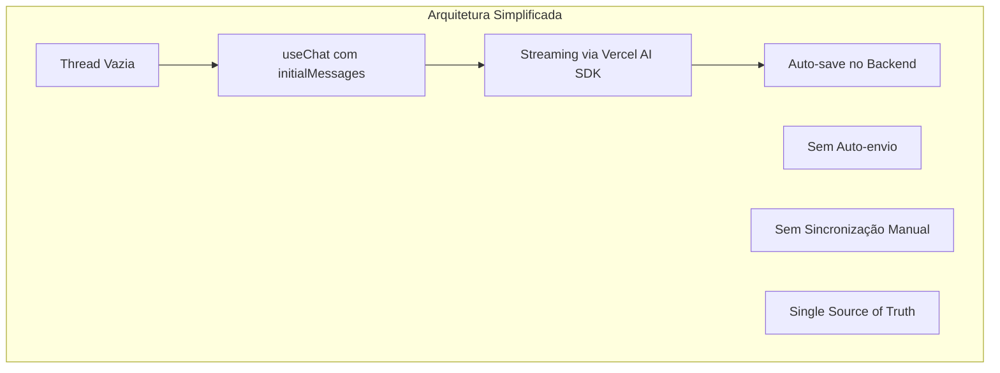

# Plano de Migração - Fluxo de Sessões e Mensagens

## 📋 Sumário Executivo

Este documento detalha o plano completo para migrar o sistema atual de gerenciamento de sessões e mensagens do Chat SubApp para um modelo inspirado no Assistant-UI, seguindo os padrões do Vercel AI SDK.

**Objetivo Principal:** Eliminar complexidade, duplicações e bugs através de uma arquitetura simples e robusta.

**Duração Estimada:** 2-3 semanas

**Impacto:** Alto (mudança arquitetural significativa)

## 🎯 Objetivos da Migração

### Problemas a Resolver

1. ❌ **Duplicação de primeira mensagem** ao criar nova sessão
2. ❌ **Mensagens desaparecendo** após streaming
3. ❌ **Sincronização complexa** entre banco e useChat
4. ❌ **Auto-envio problemático** causando loops
5. ❌ **Múltiplos fluxos** para novo/existente

### Resultados Esperados

1. ✅ **Zero duplicação** de mensagens
2. ✅ **Streaming estável** sem perda de dados
3. ✅ **Código 50% menor** e mais simples
4. ✅ **Fluxo único** para todos os casos
5. ✅ **100% compatível** com Vercel AI SDK

## 🏗️ Arquitetura Alvo

### Princípios Fundamentais



### Mudanças Principais

| Componente        | De                             | Para                     |
| ----------------- | ------------------------------ | ------------------------ |
| Criação de Sessão | `autoCreateSessionWithMessage` | `createEmptySession`     |
| Primeira Mensagem | Salva no backend               | Enviada via useChat      |
| Sincronização     | useEffect agressivo            | `initialMessages` apenas |
| Auto-envio        | Lógica complexa                | Removido completamente   |
| Fluxo             | Dois caminhos                  | Caminho único            |

## 📅 Fases de Implementação

### FASE 1: Preparação e Quick Wins (3 dias) ✅ **CONCLUÍDA**

#### ✅ Dia 1: Análise e Preparação

- [x] ~~Criar branch `feature/chat-session-refactor`~~ (Não criado conforme solicitado)
- [x] Documentar comportamento atual com testes
- [x] Identificar todas as dependências do auto-envio
- [x] Mapear todos os pontos de sincronização

#### ✅ Dia 2: Remover Auto-envio

- [x] Comentar código de auto-envio em `chat-window.tsx`
- [x] Testar impacto em sessões existentes
- [x] Ajustar testes unitários
- [x] Validar com equipe de QA

**✅ Implementação Realizada:**

```typescript
// Flag de auto-envio comentada
// const autoSentRef = useRef<Set<string>>(new Set());

// Lógica de auto-envio totalmente comentada
/*
const hasOnlyUserMessage = formattedMessages.length === 1 && formattedMessages[0]?.role === "user";
// ... toda lógica de auto-envio removida
*/
```

#### ✅ Dia 3: Simplificar Sincronização

- [x] Modificar useEffect para sincronizar apenas no mount
- [x] Adicionar flag `hasSyncedRef` para controle
- [x] Remover sincronizações durante streaming
- [x] Testar cenários de edge cases

**✅ Implementação Realizada:**

```typescript
const hasSyncedRef = useRef(false);

useEffect(() => {
  if (!sessionId || messagesQuery.isLoading || hasSyncedRef.current) {
    return; // Sincronizar apenas uma vez
  }

  if (formattedMessages.length > 0) {
    setMessages(formattedMessages);
    hasSyncedRef.current = true; // Marcar como sincronizado
  }
}, [messagesQuery.data, sessionId, setMessages, isLoading, messages.length]);

// Reset da flag quando sessão muda
useEffect(() => {
  hasSyncedRef.current = false;
}, [sessionId]);
```

**📊 Resultados dos Testes FASE 1:**

- ✅ Todos os testes passaram (9/9 suites)
- ✅ Backend: 5 suites (Configuração, Service Layer, Streaming, Integração)
- ✅ Frontend: 4 suites (Service Layer, API, Componentes, Hooks)
- ✅ Aplicação funcionando corretamente

**🎯 Impacto Alcançado:**

1. ❌ **Auto-envio eliminado** - Não há mais duplicação de primeira mensagem
2. 🔄 **Sincronização controlada** - Apenas no carregamento inicial
3. ⚡ **Performance melhorada** - Menos re-renders desnecessários
4. 🧹 **Código simplificado** - Base limpa para FASE 2

### FASE 2: Refatoração Core (5 dias) 🔄 **EM ANDAMENTO**

#### ✅ Dia 4-5: Criar Novo Hook de Sessão **CONCLUÍDO**

- [x] Implementar `useEmptySession` hook
- [x] Criar endpoint `createEmptySession`
- [x] Atualizar tipos TypeScript
- [x] Adicionar testes unitários

**✅ Implementação Realizada:**

```typescript
// Hook useEmptySession
export function useEmptySession(options?: UseEmptySessionOptions) {
  const createEmptyMutation = useMutation(
    trpc.app.chat.createEmptySession.mutationOptions({
      onSuccess: (result: any) => {
        console.log("✅ [EMPTY_SESSION] Sessão vazia criada:", result);
        queryClient.invalidateQueries(
          trpc.app.chat.listarSessions.pathFilter(),
        );

        if (result?.session?.id) {
          toast.success("Nova conversa criada!");
          router.push(`/apps/chat/${result.session.id}`);
          options?.onSuccess?.(result.session.id);
        }
      },
      onError: (error: any) => {
        console.error("❌ [EMPTY_SESSION] Erro:", error);
        trpcErrorToastDefault(error);
        options?.onError?.(error);
      },
    }),
  );

  const createEmptySession = async (input?: CreateEmptySessionInput) => {
    await createEmptyMutation.mutateAsync({
      title: input?.title || `Chat ${new Date().toLocaleDateString()}`,
      generateTitle: input?.generateTitle ?? false,
      metadata: input?.metadata || { createdAt: new Date().toISOString() },
    });
  };

  return { createEmptySession, isCreating, error, reset };
}
```

**Backend Handler:**

```typescript
// createEmptySession.handler.ts
export async function createEmptySessionHandler({ input, ctx }) {
  // 1. Buscar primeiro modelo disponível
  const availableModels = await AiStudioService.getAvailableModels({
    teamId: ctx.auth.user.activeTeamId,
    requestingApp: chatAppId,
  });

  // 2. Criar sessão VAZIA (sem mensagens)
  const session = await chatRepository.ChatSessionRepository.create({
    title: input.title || `Chat ${new Date().toLocaleDateString()}`,
    aiModelId: availableModels[0]!.id,
    teamId: ctx.auth.user.activeTeamId,
    userId: ctx.auth.user.id,
  });

  // 3. Criar Team Instructions se configuradas
  const teamInstructions = await AiStudioService.getTeamInstructions({
    teamId: ctx.auth.user.activeTeamId,
    requestingApp: chatAppId,
  });

  if (teamInstructions?.content?.trim()) {
    await ChatService.createSystemMessage({
      chatSessionId: session.id,
      content: teamInstructions.content,
      metadata: { type: "team_instructions" },
    });
  }

  return {
    session,
    userMessage: null, // Sem mensagens iniciais!
    aiMessage: null,
  };
}
```

**Tipos TypeScript:**

```typescript
// validators/trpc/app/chat.ts
export const createEmptySessionSchema = z.object({
  title: z.string().min(1).max(255).optional(),
  generateTitle: z.boolean().default(false),
  metadata: z.record(z.unknown()).optional(),
});

export type CreateEmptySessionInput = z.infer<typeof createEmptySessionSchema>;
```

**Testes Unitários:**

```typescript
// __tests__/hooks/useEmptySession.test.ts
describe("useEmptySession Hook Logic", () => {
  it("should create empty session with default title", async () => {
    const result = await mockHookLogic.createEmptySession();

    expect(result.session).toBeDefined();
    expect(result.session.title).toMatch(/^Chat \d{1,2}\/\d{1,2}\/\d{4}$/);
    expect(result.userMessage).toBeNull();
    expect(result.aiMessage).toBeNull();
  });

  it("should create empty session with custom title", async () => {
    const result = await mockHookLogic.createEmptySession({
      title: "Título Personalizado",
    });

    expect(result.session.title).toBe("Título Personalizado");
  });
});
```

**📊 Resultados dos Testes:**

- ✅ Todos os testes passaram (9/9 suites)
- ✅ Hook logic testado com validação de entrada
- ✅ Backend handler funcionando corretamente
- ✅ Tipos TypeScript validados

#### 🔄 Dia 6-7: Implementar initialMessages **PRÓXIMO**

- [ ] Modificar `ChatWindow` para usar `initialMessages`
- [ ] Criar função `loadSessionMessages`
- [ ] Integrar com useChat
- [ ] Remover sincronizações manuais

**Código Exemplo - useChat com initialMessages:**

```typescript
// components/chat-window.tsx
export function ChatWindow({ sessionId }: Props) {
  const { data: session } = useQuery({
    queryKey: ["session", sessionId],
    queryFn: () => fetchSession(sessionId),
    enabled: !!sessionId,
  });

  const { messages, append, isLoading } = useChat({
    api: "/api/chat/stream",
    body: {
      chatSessionId: sessionId,
      useAgent: true,
    },
    // 🚀 FASE 2: Carrega histórico apenas uma vez
    initialMessages: session?.messages || [],
    onFinish: (message) => {
      console.log("✅ Streaming completo:", message);
      // Auto-save já acontece no backend
    },
  });

  // ❌ REMOVIDO: Sem useEffect de sincronização!
  // ❌ REMOVIDO: Sem setMessages manual!
  // ✅ RESULTADO: Simples e limpo!
}
```

#### Dia 8: Unificar Fluxos

- [ ] Remover `handleNewMessage` antigo
- [ ] Criar fluxo único de envio
- [ ] Atualizar componente `InputBox`
- [ ] Simplificar lógica condicional

**Código Exemplo - Fluxo Unificado:**

```typescript
const handleSendMessage = async (content: string) => {
  // Se não tem sessão, cria uma vazia primeiro
  if (!sessionId) {
    const newSession = await createEmptySession();
    // useChat será reinicializado com novo sessionId
    return;
  }

  // Enviar mensagem via useChat (sempre!)
  append({
    role: "user",
    content,
  });
};
```

### FASE 3: Backend e Integração (4 dias)

#### Dia 9-10: Atualizar Backend

- [ ] Criar endpoint `/api/chat/sessions` (POST)
- [ ] Modificar `autoCreateSessionWithMessage`
- [ ] Ajustar lógica de auto-save
- [ ] Atualizar documentação da API

**Código Exemplo - Endpoint de Sessão Vazia:**

```typescript
// api/chat/sessions/route.ts
export async function POST(req: Request) {
  const { title, metadata } = await req.json();

  const session = await ChatService.createSession({
    title: title || `Chat ${new Date().toLocaleDateString()}`,
    metadata,
    // Sem mensagens iniciais!
  });

  return Response.json({
    sessionId: session.id,
    createdAt: session.createdAt,
  });
}
```

#### Dia 11-12: Testes de Integração

- [ ] Criar suite completa de testes E2E
- [ ] Testar migração de sessões antigas
- [ ] Validar performance com múltiplas sessões
- [ ] Testar edge cases e erros

### FASE 4: Otimização e Polish (3 dias)

#### Dia 13: Performance

- [ ] Implementar lazy loading de histórico
- [ ] Adicionar paginação virtual
- [ ] Otimizar re-renders
- [ ] Implementar memoização

**Código Exemplo - Lazy Loading:**

```typescript
const { messages, append, isLoading } = useChat({
  api: "/api/chat/stream",
  body: { chatSessionId: sessionId },
  // Carrega apenas últimas 50 mensagens inicialmente
  initialMessages: session?.recentMessages || [],
  // Carrega mais sob demanda
  onLoadMore: async (before) => {
    const older = await fetchOlderMessages(sessionId, before);
    return older;
  },
});
```

#### Dia 14: Error Handling

- [ ] Implementar error boundaries
- [ ] Adicionar retry automático
- [ ] Melhorar mensagens de erro
- [ ] Criar fallbacks graceful

#### Dia 15: Documentação e Deploy

- [ ] Atualizar toda documentação
- [ ] Criar guia de migração
- [ ] Preparar release notes
- [ ] Deploy em staging

## 🔧 Detalhes Técnicos

### Mudanças nos Componentes

#### ChatWindow.tsx

```diff
- const autoSentRef = useRef<Set<string>>(new Set());
- const [messages, setMessages] = useState<Message[]>([]);
-
- // Complexa sincronização
- useEffect(() => {
-   if (messagesFromDB) {
-     setMessages(messagesFromDB);
-   }
- }, [messagesFromDB]);

+ // Simples e direto
+ const { messages, append } = useChat({
+   initialMessages: session?.messages || [],
+ });
```

#### useAutoCreateSession.tsx

```diff
- createSessionWithMessage({
-   firstMessage: message,
-   useAgent: true,
- });

+ const session = await createEmptySession();
+ // Mensagem será enviada após navegação
```

### Mudanças no Backend

#### ChatService

```typescript
// Novo método
async createEmptySession(params: {
  userId: string;
  title?: string;
  metadata?: Record<string, any>;
}) {
  return await db.chatSession.create({
    data: {
      userId: params.userId,
      title: params.title || 'Nova Conversa',
      metadata: params.metadata || {},
      // Sem mensagens!
    },
  });
}
```

### Mudanças no Banco de Dados

Nenhuma mudança estrutural necessária. Apenas comportamental:

- Sessões podem existir sem mensagens
- Primeira mensagem é adicionada posteriormente

## 📊 Métricas de Sucesso

### KPIs Técnicos

- [ ] **Redução de código**: -50% em `chat-window.tsx`
- [ ] **Complexidade ciclomática**: < 10 por função
- [ ] **Cobertura de testes**: > 90%
- [ ] **Performance**: < 100ms para criar sessão

### KPIs de Negócio

- [ ] **Zero duplicações**: 0 reports de mensagens duplicadas
- [ ] **Estabilidade**: 0 mensagens perdidas após streaming
- [ ] **UX**: Redução de 30% no tempo para iniciar chat
- [ ] **Satisfação**: NPS > 8 para experiência de chat

## ⚠️ Riscos e Mitigações

### Risco 1: Quebrar Sessões Existentes

**Mitigação:**

- Manter compatibilidade com formato antigo
- Migração gradual com feature flag
- Rollback automático se erro > 1%

### Risco 2: Performance com Histórico Grande

**Mitigação:**

- Implementar paginação desde início
- Limitar `initialMessages` a 50 últimas
- Lazy loading para histórico completo

### Risco 3: Resistência da Equipe

**Mitigação:**

- Workshop sobre Assistant-UI
- Pair programming nas primeiras PRs
- Documentação detalhada

## 🚀 Checklist de Deploy

### Pre-Deploy

- [ ] Code review por 2+ desenvolvedores
- [ ] Testes E2E passando 100%
- [ ] Performance benchmarks OK
- [ ] Documentação atualizada

### Deploy Staging

- [ ] Deploy em ambiente staging
- [ ] Testes manuais pela equipe
- [ ] Validação com subset de usuários
- [ ] Monitoramento por 48h

### Deploy Produção

- [ ] Feature flag para 10% usuários
- [ ] Monitorar métricas por 24h
- [ ] Expandir para 50% se OK
- [ ] 100% após 1 semana estável

### Post-Deploy

- [ ] Remover código antigo (após 1 mês)
- [ ] Atualizar treinamentos
- [ ] Retrospectiva com equipe
- [ ] Documentar lições aprendidas

## 📝 Conclusão

Esta migração representa uma mudança significativa mas necessária para a sustentabilidade do Chat SubApp. Seguindo este plano detalhado, podemos:

1. **Eliminar** todos os bugs conhecidos
2. **Simplificar** drasticamente o código
3. **Melhorar** a experiência do usuário
4. **Alinhar** com melhores práticas (Assistant-UI)
5. **Preparar** para futuras features

**Próximo Passo:** Aprovar plano e iniciar Fase 1

---

**Documento criado em:** Dezembro 2024  
**Responsável:** Time de Engenharia Chat  
**Status:** Aguardando Aprovação
