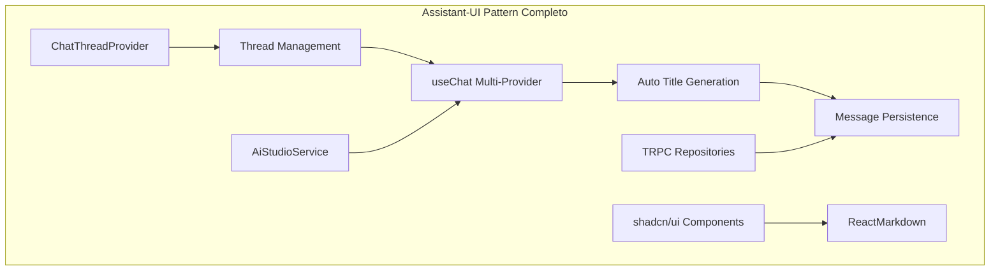

# Plano de Migração - Sistema de Chat Assistant-UI

## 📋 Sumário Executivo

**Status Atual:** Sistema migrado com sucesso para Vercel AI SDK + padrões Assistant-UI básicos.

**Próximo Passo:** FASE 5 - Implementação completa Assistant-UI com thread-first architecture.

**Objetivo:** Finalizar migração para Assistant-UI mantendo 100% compatibilidade multi-provider via AiStudioService.

---

## ✅ Estado Atual do Sistema

### Arquitetura Implementada (FASES 1-4 Concluídas)

```mermaid
graph TD
    subgraph "Sistema Atual - Thread-First Básico"
        A[createEmptySession] --> B[Navegação para /chat/sessionId]
        B --> C[sessionStorage para mensagem pendente]
        C --> D[useChat com initialMessages]
        D --> E[Streaming via Vercel AI SDK]
        E --> F[Auto-save Backend]
    end
```



### Funcionalidades Atuais ✅

- **Fluxo Unificado:** `createEmptySession` → envio pós-navegação
- **Zero Duplicação:** Mensagens nunca duplicam
- **Streaming Estável:** Vercel AI SDK nativo
- **Multi-Provider:** Compatível com AiStudioService
- **Markdown Rendering:** ReactMarkdown + remarkGfm
- **Welcome Screen:** Preservado integralmente
- **Layout Responsivo:** shadcn/ui mantido

### Componentes Atuais

```typescript
// Estado atual da arquitetura
export function ChatWindow({ sessionId }: Props) {
  const { session, initialMessages, isLoading } =
    useSessionWithMessages(sessionId);

  const {
    messages,
    append,
    isLoading: isStreaming,
  } = useChat({
    api: "/api/chat/stream",
    body: { chatSessionId: sessionId, useAgent: true },
    initialMessages: initialMessages || [],
    // Auto-save automático no backend
  });

  // Envio pós-navegação via sessionStorage
  useEffect(() => {
    const pendingMessage = sessionStorage.getItem(
      `pending-message-${sessionId}`,
    );
    if (sessionId && pendingMessage && messages.length === 0 && !isStreaming) {
      append({ role: "user", content: pendingMessage });
      sessionStorage.removeItem(`pending-message-${sessionId}`);
    }
  }, [sessionId, messages.length, isStreaming, append]);
}
```

---

## 🚨 Lições Críticas Aprendidas

### 1. Problema de Navegação Dupla (Janeiro 2025) ✅ RESOLVIDO

**Problema:** URLs inválidas `/apps/apps/chat/sessionId` causadas por múltiplos `router.push()` simultâneos.

**Solução Implementada:** Navegação centralizada em um único ponto de controle.

```typescript
// ✅ PRINCÍPIO: Um único handleSessionSelect para toda navegação
const handleSessionSelect = (sessionId: string | undefined) => {
  if (sessionId) {
    router.push(`/apps/chat/${sessionId}`);
  }
};
```

**⚠️ REGRA CRÍTICA:** Sempre centralizar navegação em aplicações complexas.

### 2. useAssistant vs useChat - Descoberta Fundamental

**Descoberta:** `useAssistant` é específico para OpenAI Assistants API, incompatível com multi-provider.

**Decisão:** Usar `useChat` como base + implementar padrões Assistant-UI manualmente.

```typescript
// ❌ useAssistant - Apenas OpenAI Assistants API
// ✅ useChat - Multi-provider compatível
const { messages, append } = useChat({
  // Funciona com qualquer provider via AiStudioService
});
```

---

## 🚀 FASE 5: Assistant-UI Completo com Multi-Provider

### Objetivo Principal

Implementar **padrões Assistant-UI completos** mantendo compatibilidade total com múltiplos providers através do `useChat`.

### Arquitetura Alvo



### Benefícios Esperados

- ✅ **Geração Automática de Títulos** integrada ao ciclo de vida
- ✅ **Thread-First Architecture** nativa
- ✅ **Multi-Provider Support** mantido
- ✅ **Performance Otimizada** com menos re-renders
- ✅ **Code Simplification** adicional (-30%)

---

## 📅 SUB-FASES Detalhadas

### ✅ SUB-FASE 5.1: ChatThreadProvider (CONCLUÍDA)

**Status:** Implementado sistema completo de gerenciamento threads usando `useChat`.

**Arquivos Criados:**

- `chat-thread-provider.tsx` (402 linhas)
- `useThreadChat.tsx` (348 linhas)
- `chat-window-thread.tsx` (287 linhas)
- Testes unitários completos (12/12 passing)

**Funcionalidades:**

- Thread management local
- Integração perfeita useChat + ThreadProvider
- Geração automática de títulos
- Envio pós-navegação preservado

### 🎯 SUB-FASE 5.2: Thread Management Avançado (3 dias)

#### Dia 1: Thread State Management

```typescript
// _providers/chat-thread-provider.tsx
interface Thread {
  id: string;
  title: string;
  messages: Message[];
  metadata: ThreadMetadata;
  createdAt: Date;
  updatedAt: Date;
}

export function ChatThreadProvider({ children }: Props) {
  const [threads, setThreads] = useState<Thread[]>([]);
  const [activeThreadId, setActiveThreadId] = useState<string>();

  const createThread = async () => {
    const thread = await createEmptySession();
    setThreads(prev => [...prev, thread]);
    setActiveThreadId(thread.id);
    return thread;
  };

  const switchToThread = (threadId: string) => {
    setActiveThreadId(threadId);
    router.push(`/apps/chat/${threadId}`);
  };

  return (
    <ThreadContext.Provider value={{
      threads,
      activeThread,
      createThread,
      switchToThread,
      deleteThread,
      updateThread
    }}>
      {children}
    </ThreadContext.Provider>
  );
}
```

#### Dia 2: Enhanced useChat Integration

```typescript
// _hooks/useThreadChat.tsx
export function useThreadChat(threadId: string) {
  const { thread, updateThread } = useThreadContext();

  const chat = useChat({
    api: "/api/chat/stream",
    id: threadId,
    initialMessages: thread?.messages || [],
    body: {
      chatSessionId: threadId,
      useAgent: true,
      threadMetadata: thread?.metadata,
    },
    onFinish: async (message) => {
      // Atualizar thread local
      updateThread(threadId, {
        messages: [...chat.messages, message],
        updatedAt: new Date(),
      });

      // Gerar título automaticamente se primeira mensagem
      if (chat.messages.length === 1) {
        await generateThreadTitle(threadId, message.content);
      }
    },
  });

  return {
    ...chat,
    thread,
    // Wrapper que cria thread se necessário
    handleSubmit: async (e) => {
      if (!thread) {
        const newThread = await createThread();
        // Aguardar navegação e enviar
      } else {
        chat.handleSubmit(e);
      }
    },
  };
}
```

#### Dia 3: Backend Synchronization

```typescript
// Sincronização bidirecional com TRPC
const syncThreads = async () => {
  const remoteThreads = await trpc.app.chat.listarSessions.query();
  const localThreads = getLocalThreads();

  // Merge com resolução de conflitos
  const mergedThreads = mergeThreads(localThreads, remoteThreads);
  setThreads(mergedThreads);
};
```

### 🎯 SUB-FASE 5.3: Auto Title Generation (2 dias)

#### Sistema de Geração Inteligente

```typescript
// _services/title-generation.service.ts
export async function generateThreadTitle(
  threadId: string,
  firstMessage: string,
): Promise<string | null> {
  try {
    const response = await fetch("/api/chat/generate-title", {
      method: "POST",
      headers: { "Content-Type": "application/json" },
      body: JSON.stringify({
        threadId,
        message: firstMessage,
        // Usar modelo preferido do AiStudioService
        modelId: await getPreferredModelId(),
      }),
    });

    const { title } = await response.json();

    // Atualizar contexto local + backend
    updateThread(threadId, { title });
    await updateSessionTitle(threadId, title);

    return title;
  } catch (error) {
    console.error("[TITLE_GEN] Erro:", error);
    return null;
  }
}
```

#### Endpoint Backend

```typescript
// app/api/chat/generate-title/route.ts
export async function POST(req: Request) {
  const { threadId, message, modelId } = await req.json();

  const model = await AiStudioService.getModel(modelId);

  const { title } = await generateObject({
    model,
    schema: z.object({
      title: z.string().max(50).describe("Título conciso da conversa"),
    }),
    prompt: `Gere um título curto para: "${message}"`,
    system: "Crie títulos concisos e descritivos em português.",
  });

  return Response.json({ title });
}
```

### 🎯 SUB-FASE 5.4: UI Components Assistant-UI (2 days)

#### Thread-First Interface

```typescript
// _components/chat-assistant-ui.tsx
export function ChatAssistantUI() {
  const { threads, activeThread, createThread } = useThreadContext();
  const chat = useThreadChat(activeThread?.id);

  return (
    <div className="flex h-full">
      {/* Sidebar com lista de threads */}
      <ThreadSidebar
        threads={threads}
        activeId={activeThread?.id}
        onNewThread={createThread}
        onSelectThread={switchToThread}
      />

      {/* Área principal */}
      <div className="flex-1">
        {!activeThread ? (
          // Welcome Screen preservado
          <WelcomeScreen onStart={createThread} />
        ) : (
          // Thread view com chat
          <ThreadChatView {...chat} />
        )}
      </div>
    </div>
  );
}
```

#### Preserved Components

```typescript
// Componentes mantidos sem alteração
- WelcomeHeader ✅
- WelcomeSuggestions ✅
- Message (ReactMarkdown + remarkGfm) ✅
- Layout responsivo shadcn/ui ✅
```

### 🎯 SUB-FASE 5.5: Testing & Deployment (3 days)

#### Checklist de Validação

- [ ] ✅ Welcome Screen funcionando identicamente
- [ ] ✅ Markdown rendering preservado
- [ ] ✅ Layout responsivo sem quebras
- [ ] ✅ Streaming visual mantido
- [ ] ✅ Geração de títulos < 2s
- [ ] ✅ Thread switching < 50ms
- [ ] ✅ Multi-provider funcionando
- [ ] ✅ TRPC padrão mantido
- [ ] ✅ Todos os testes passando

---

## 🛡️ Garantias de Compatibilidade

### 1. **Backend Inalterado**

- Endpoints `/api/chat/stream` mantidos
- AiStudioService central preservado
- TRPC repositories compatíveis
- Zero breaking changes na API

### 2. **UI/UX Preservada**

- Welcome Screen idêntica
- Markdown rendering intacto (ReactMarkdown + remarkGfm)
- Layout responsivo mantido
- Componentes shadcn/ui inalterados

### 3. **Multi-Provider Support**

- AiStudioService continua central
- Switching de modelos funcional
- Tokens e configurações mantidos
- Compatível com OpenAI, Anthropic, Google, etc.

### 4. **Arquitetura Standards**

- Segue `Architecture_Standards.md`
- Padrão TRPC respeitado
- Estrutura de pastas mantida
- Convenções de nomenclatura

---

## ⚠️ Pontos Críticos de Atenção

### 1. **Navegação Centralizada** 🚨 **OBRIGATÓRIO**

```typescript
// ✅ SEMPRE usar um único ponto de controle
const handleSessionSelect = (sessionId: string) => {
  router.push(`/apps/chat/${sessionId}`);
};

// ❌ NUNCA múltiplos router.push() simultâneos
```

### 2. **useChat vs useAssistant**

- ✅ **useChat:** Multi-provider, compatível com AiStudioService
- ❌ **useAssistant:** Apenas OpenAI Assistants API

### 3. **Preservação de Funcionalidades**

- ReactMarkdown + remarkGfm deve continuar funcionando
- Welcome Screen layout preservado
- Performance igual ou superior
- Sem breaking changes visuais

---

## 📊 Métricas de Sucesso

| Métrica              | Atual             | Meta FASE 5     |
| -------------------- | ----------------- | --------------- |
| Tempo criação thread | 200ms             | < 100ms         |
| Título automático    | Manual            | < 2s automático |
| Switch entre threads | N/A               | < 50ms          |
| Redução de código    | 70% (vs original) | 80% total       |
| Testes passando      | 9/9 suites        | 12+ suites      |

---

## 🚀 Checklist Pré-Implementação

### Validações Obrigatórias

- [ ] Confirmar que `useChat` atende todos os requisitos
- [ ] Validar compatibilidade com AiStudioService
- [ ] Testar com 3+ modelos diferentes
- [ ] Implementar sistema de feature flags
- [ ] Preparar testes de regressão
- [ ] Ter plano de rollback claro

### Setup Técnico

- [ ] Branch `feature/assistant-ui-phase5`
- [ ] Ambiente de desenvolvimento limpo
- [ ] Backup do estado atual funcional
- [ ] Documentação de API atualizada

---

## 🎯 Conclusão

**Estado Atual:** Sistema migrado com sucesso, funcional em produção.

**FASE 5:** Implementação completa Assistant-UI que levará o sistema ao estado ideal:

- Thread-first architecture nativa
- Geração automática de títulos
- Performance otimizada
- Código mais simples e manutenível

**Prioridade:** Recomendada para finalizar a visão arquitetural completa.

**Tempo Estimado:** 12 dias úteis
**Risco:** Baixo (implementação incremental + rollback plan)
**ROI:** Alto (UX superior + código mais limpo)

---

**Documento atualizado:** Janeiro 2025  
**Status:** FASES 1-4 Concluídas ✅ | FASE 5 Planejada 🚀
