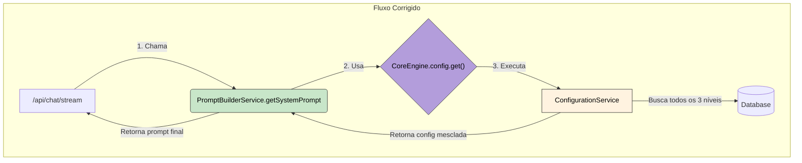

# Plano de Implementação v5 (Definitivo): Integração das Instruções de Usuário no Chat

**Data:** 2025-07-02  
**Autor:** KodixAgent  
**Status:** 📝 **Plano Final e Pronto para Execução**
**Documentos de Referência (Análise Completa Realizada):**

- `@core-engine-v1-config-plan.md` (CRÍTICO)
- `@lessons-learned.md` (Arquitetura e AI Studio) (CRÍTICO)
- `@subapp-architecture.md` (CRÍTICO)
- `@chat-architecture.md` e `@ai-studio-architecture.md`
- `@kodix-logs-policy.md` e `@logs-registry.md`
- `@trpc-patterns.md`

---

## 0. Resumo Estratégico

Este plano detalha a refatoração para integrar as instruções de Nível 3 (Usuário) no `systemPrompt` do Chat. A execução está condicionada à finalização de uma dependência crítica no `CoreEngine`, que será nosso primeiro passo. Esta interdependência foi agora formalizada nos documentos de arquitetura (`@core-engine-architecture.md` e `@chat-architecture.md`) para garantir clareza em todo o projeto. O plano segue rigorosamente as lições aprendidas e os padrões arquiteturais para garantir uma implementação segura e sem regressões.

---

### **Fase de Desbloqueio: Finalização do `CoreEngine.ConfigurationService`**

_Objetivo: Completar a **Fase 4** do plano `@core-engine-v1-config-plan.md` para tornar o `ConfigurationService` totalmente funcional. Esta fase é um **pré-requisito bloqueador**._

1.  **[ ] Corrigir Resolução de Módulos (Lição #12):**

    - **Ação:** Garantir que o `appRepository` possa ser importado de `@kdx/db` no `configuration.service.ts` sem erros de build.
    - **Critério de Sucesso:** A importação `import { appRepository } from "@kdx/db";` deve ser resolvida corretamente.

2.  **[ ] Ativar Lógica de Banco de Dados:**

    - **Ação:** Em `packages/core-engine/src/configuration/configuration.service.ts`, implementar a lógica que chama `appRepository.findAppTeamConfigs` e `appRepository.findUserAppTeamConfigs` para buscar as configurações de Nível 2 e 3.

3.  **[ ] Atualizar Testes do `ConfigurationService` (Lição #14):**

    - **Ação:** Refatorar os testes em `packages/core-engine/src/configuration/__tests__/configuration.service.test.ts`.
    - **Critério de Sucesso:** Os testes devem mockar as chamadas ao `appRepository` (não o DB diretamente) e validar a mesclagem correta dos 3 níveis de configuração.

4.  **[ ] Validação do Pacote Core:**
    - **Ação:** Executar `pnpm build --filter=@kdx/core-engine` e `pnpm test --filter=@kdx/core-engine`.
    - **Critério de Sucesso:** O pacote compila e todos os testes passam.

---

## 1. Princípios Inegociáveis (Extraídos dos Documentos)

- **Comunicação via Service Layer:** A interação entre domínios (`PromptBuilderService` -> `CoreEngine`) será feita exclusivamente via Services, conforme `@subapp-architecture.md`.
- **Validação Incremental:** Após cada fase, `pnpm typecheck` e `pnpm build` serão executados nos pacotes afetados (`--filter`), seguindo a hierarquia de dependências, conforme Lição #6.
- **Fluxo de Servidor Robusto:** A validação final usará o fluxo completo `stop -> start -> check-logs -> check-status`, conforme Lição #9.
- **Zero `ts-nocheck`:** Qualquer erro de tipo será investigado e corrigido na raiz, conforme Lição #5.

---

## 2. Arquitetura da Solução

O `PromptBuilderService` atuará como um orquestrador simples, delegando a complexidade para o `CoreEngine`, que é a fonte da verdade.

---

## 3. Plano de Implementação Detalhado

### Fase 1: Implementação do Orquestrador `PromptBuilderService`

_Objetivo: Criar um serviço isolado e testável que orquestre a busca de configurações, seguindo os padrões arquiteturais._

1.  **[ ] Criar Arquivo de Serviço:** Criar `packages/api/src/internal/services/prompt-builder.service.ts`.
2.  **[ ] Implementar Lógica Central:** Implementar o método estático `getSystemPrompt` que chama `await CoreEngine.config.get(...)` e formata a resposta (concatena as instruções).
3.  **[ ] Adicionar Teste Unitário Detalhado:**

    - **Ação:** Criar `prompt-builder.service.test.ts`.
    - **Escopo:** Mockar `CoreEngine.config.get()` e testar os cenários: (1) 3 níveis de instruções, (2) instruções de usuário desabilitadas, (3) apenas instruções de plataforma.
    - **Mock Conforme Lição #14:** O mock deve replicar a estrutura exata do retorno do `ConfigurationService`.

4.  **[ ] Validar o Pacote Isolado:** Executar `pnpm build --filter=@kdx/api` e `pnpm test --filter=@kdx/api`.

### Fase 2: Refatoração Cirúrgica e Remoção de Legado

_Objetivo: Substituir o fluxo antigo pelo novo e limpar o código de forma segura._

1.  **[ ] Atualizar Endpoint do Chat:** Modificar `apps/kdx/src/app/api/chat/stream/route.ts` para usar o novo `PromptBuilderService.getSystemPrompt`.
2.  **[ ] Limpar Código Legado:**
    - Deletar o método `getSystemPromptForChat` de `packages/api/src/internal/services/ai-studio.service.ts`.
    - Remover o endpoint tRPC `getSystemPromptForChat` de `packages/api/src/trpc/routers/app/ai-studio/_router.ts`.
    - Remover os testes legados associados.
3.  **[ ] Validar Integração Cross-Package:** Executar `pnpm typecheck` na raiz do projeto para garantir que a refatoração não quebrou nenhum tipo.

### Fase 3: Validação Completa e à Prova de Falhas

_Objetivo: Garantir que a implementação funciona no mundo real e não introduziu regressões._

1.  **[ ] Adicionar Log de Debug (Conforme Política):**
    - **Ação:** Adicionar um `console.log` com prefixo `[DEBUG_PROMPT_FIX]` no endpoint `/api/chat/stream`.
    - **Registro:** Registrar o log em `docs/debug/logs-registry.md` com status "Ativo".
2.  **[ ] Teste Funcional Manual Detalhado:**
    - **Cenário 1:** Instruções de usuário ativadas -> Devem aparecer no log.
    - **Cenário 2:** Instruções de usuário desativadas -> Não devem aparecer.
    - **Cenário 3:** Sem instruções de usuário -> Não devem aparecer.
3.  **[ ] Validação do Servidor (Robusta):** Executar a sequência `sh ./scripts/stop-dev.sh && sh ./scripts/start-dev-bg.sh && sleep 5 && sh ./scripts/check-log-errors.sh && sh ./scripts/check-dev-status.sh` (Referência: Lição #9).
4.  **[ ] Cleanup Final:** Após a validação, remover o `console.log` e atualizar o `logs-registry.md` para "Removido".

### Fase 4: Documentação

_Objetivo: Manter a documentação da arquitetura como uma fonte única de verdade._

1.  **[ ] Atualizar Diagramas e Descrições:** Modificar `docs/subapps/chat/chat-architecture.md` e `docs/subapps/ai-studio/ai-studio-architecture.md` para refletir o uso do `PromptBuilderService` e a delegação para o `CoreEngine`.
2.  **[ ] Atualizar Este Plano:** Marcar o status como `✅ Executado` e adicionar um resumo dos resultados.

---

## 4. Métricas de Sucesso

- A Fase de Desbloqueio foi concluída e o `ConfigurationService` está totalmente funcional.
- O método e o endpoint `getSystemPromptForChat` foram completamente removidos.
- O `PromptBuilderService` existe e consome o `CoreEngine.config`.
- O teste funcional manual confirma que as instruções do usuário são incluídas/excluídas corretamente.
- A suíte de testes (`pnpm test:chat`, `pnpm test --filter=@kdx/api`, `pnpm test --filter=@kdx/core-engine`) passa com 100% de sucesso.
- Nenhum log de debug temporário é deixado no código após a conclusão.
