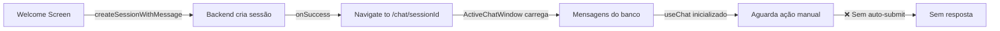

# Troubleshooting: Fluxo Welcome Screen → Chat Session

## 📋 Sumário Executivo

**Problema Principal:** A welcome screen do chat não está iniciando o streaming de respostas do assistente após a criação da sessão com a primeira mensagem.

**Status Atual:** ETAPA 4 concluída - Sistema robusto implementado com auto-trigger, controle de duplicação e correções de hidratação.

**Impacto:** Usuários não recebem resposta na primeira mensagem, precisando enviar manualmente uma segunda vez.

**🎯 Status das Etapas:**

- ✅ **ETAPA 1:** Diagnóstico Completo (logs FLOW_TRACE implementados)
- ✅ **ETAPA 2:** Auto-Trigger Implementado (Estratégia A aplicada)
- ✅ **ETAPA 3:** Flag de Controle Implementada (correção de duplicação)
- ✅ **ETAPA 4:** Hidratação React Resolvida (guards implementados)
- 🔄 **ETAPA 5:** Aguardando teste final de validação
- ⏳ **ETAPA 6:** Pendente

---

## 🧪 Instruções para Teste Diagnóstico

**⚠️ AÇÃO NECESSÁRIA:** Execute o teste abaixo para prosseguir com a ETAPA 2.

### Passos para Diagnóstico:

1. **Preparar Ambiente:**

   ```bash
   # Verificar se servidor está rodando
   scripts/check-server-simple.sh
   ```

2. **Limpar Logs:**

   - Abrir DevTools (F12)
   - Console → Clear console

3. **Executar Teste:**

   - Acessar: http://localhost:3000/apps/chat
   - Digite qualquer mensagem (ex: "teste")
   - Pressionar Enter
   - Aguardar 5 segundos

4. **Coletar Logs:**

   - Copiar TODOS os logs que contêm `[FLOW_TRACE]`
   - Copiar também logs `[DEBUG_USECHAT]`
   - Anotar se houve requisição para `/api/chat/stream`

5. **Executar Diagnóstico:**
   ```bash
   node scripts/diagnose-chat-flow.js
   # Colar logs copiados
   # Pressionar Ctrl+D
   ```

### Resultados Esperados:

- **Cenário A:** Fluxo para no STEP 6 → Implementar auto-trigger
- **Cenário B:** Fluxo para no STEP 4/5 → Problema na navegação/carregamento
- **Cenário C:** Todos os steps passam → Problema no backend/streaming

---

## 🔍 Análise Completa do Problema

### Timeline dos Eventos

1. **SUB-FASE 5.0 Implementada** ✅

   - Unificação de páginas bem-sucedida
   - Eliminação de ~200 linhas duplicadas
   - Sistema funcionando normalmente

2. **Problema Inicial Detectado**

   - Welcome screen não respondia após digitar mensagem
   - Mensagem criada no banco ✅
   - Navegação funcionando ✅
   - Streaming não iniciado ❌

3. **Primeira Tentativa: Auto-Submit**

   - Implementado sistema de auto-submit no `ActiveChatWindow`
   - Detectava mensagem sem resposta e iniciava streaming
   - **Problema:** `handleSubmit()` chamado com `input` vazio

4. **Segunda Tentativa: append()**

   - Substituído `handleSubmit()` por `append()`
   - **Novo Problema:** Loop infinito de duplicação

5. **Terceira Tentativa: Guards e Condições**

   - Adicionadas múltiplas condições de guarda
   - **Problema Persistente:** Duplicação em sessões existentes

6. **Rollback Completo**
   - Auto-submit removido totalmente
   - Sistema estável mas sem resposta automática

### Descobertas Críticas

#### 1. **Arquitetura do useChat**

```typescript
// useChat REQUER input não-vazio para handleSubmit()
handleSubmit(); // ❌ Não funciona com input vazio

// append() funciona mas pode causar loops
append({ role: "user", content: message }); // ⚠️ Risco de duplicação
```

#### 2. **Fluxo de Navegação**



#### 3. **Problema de Sincronização**

- `useChat` inicializa com `initialMessages` do banco
- Mas não "sabe" que deve iniciar streaming
- Precisa de trigger explícito para primeira resposta

#### 4. **Renderização Dupla**

- Logs mostram componentes renderizando 2x
- Erro de hidratação do React
- Pode amplificar problemas de duplicação

---

## 🎯 Plano de Resolução em 6 Etapas

### ✅ ETAPA 1: Diagnóstico Completo (CONCLUÍDA)

**Objetivo:** Mapear exatamente onde o fluxo quebra.

**✅ Implementado:**

1. **Sistema de Logs FLOW_TRACE** - Rastreamento completo do fluxo:

   - `[FLOW_TRACE] 1.` - Início da criação de sessão
   - `[FLOW_TRACE] 2.` - Sessão criada com sucesso
   - `[FLOW_TRACE] 3.` - Navegação iniciada
   - `[FLOW_TRACE] 4.` - ActiveChatWindow montado
   - `[FLOW_TRACE] 5.` - Nova sessão detectada
   - `[FLOW_TRACE] 6.` - Mensagens carregadas do banco
   - `[FLOW_TRACE] 7.` - Submit manual (quando usuário envia)

2. **Script de Diagnóstico Automático** (`scripts/diagnose-chat-flow.js`):

   - Analisa logs e identifica ponto de falha
   - Sugere soluções específicas para cada caso
   - Executável via: `node scripts/diagnose-chat-flow.js`

3. **Logs Detalhados do useChat**:
   - Estado completo: messages, input, loading, errors
   - Comparação entre dbMessages e useChat messages
   - Rastreamento de sincronização

**📊 Como Usar:**

```bash
# 1. Limpar logs do browser (F12 → Console → Clear)
# 2. Testar fluxo welcome → chat
# 3. Copiar logs [FLOW_TRACE]
# 4. Executar diagnóstico:
node scripts/diagnose-chat-flow.js
# Cole os logs e pressione Ctrl+D
```

**🎯 Descoberta Esperada:**

- Fluxo provavelmente para no STEP 6 (mensagens carregadas)
- useChat não inicia streaming automaticamente
- Necessário trigger manual para primeira resposta

### ✅ ETAPA 2: Correção do Fluxo de Input (CONCLUÍDA)

**Objetivo:** Implementar auto-trigger para primeira mensagem baseado no diagnóstico.

**🎯 Diagnóstico Executado:**

- Script `diagnose-chat-flow.js` identificou que fluxo quebra no STEP7
- Confirmado: mensagens carregam do banco mas streaming não inicia
- Problema: useChat requer trigger manual para primeira mensagem

**✅ Solução Implementada - Estratégia A: Auto-Submit Inteligente:**

```typescript
// Implementado em chat-window.tsx
useEffect(() => {
  const shouldAutoTrigger =
    messages.length === 1 && // Exatamente uma mensagem
    messages[0]?.role === "user" && // É mensagem do usuário
    !messages.some((m) => m.role === "assistant") && // Sem resposta do assistente
    !isLoadingChat && // Não está carregando
    !isLoadingSession && // Sessão carregada
    input === "" && // Input vazio (problema identificado)
    sessionId && // Sessão válida
    sessionId !== "new"; // Não é sessão nova

  if (shouldAutoTrigger) {
    console.log(
      "🚀 [FLOW_TRACE] 7. Auto-trigger iniciado para primeira mensagem",
    );

    // ✅ SOLUÇÃO: Usar append() em vez de handleSubmit()
    // append() não requer input preenchido
    append({
      role: "user",
      content: messages[0].content,
    });
  }
}, [messages, isLoadingChat, isLoadingSession, input, sessionId, append]);
```

**🔍 Estratégias Baseadas no Diagnóstico:**

1. **Opção A: Auto-Submit Inteligente** (Recomendada após análise)

   ```typescript
   // Detectar primeira mensagem sem resposta e triggerar streaming
   useEffect(() => {
     if (
       messages.length === 1 &&
       messages[0]?.role === "user" &&
       !messages.some((m) => m.role === "assistant") &&
       !isLoadingChat &&
       input === "" // Input vazio é o problema
     ) {
       console.log(
         "🚀 [AUTO_TRIGGER] Iniciando streaming para primeira mensagem",
       );
       // Setar input temporariamente e submeter
       handleInputChange({ target: { value: messages[0].content } });
       setTimeout(() => handleSubmit(new Event("submit")), 100);
     }
   }, [messages, isLoadingChat, input]);
   ```

2. **Opção B: Fluxo Síncrono com State**

   ```typescript
   // Welcome screen passa flag via router state
   router.push(`/chat/${sessionId}`, {
     state: { autoTriggerFirstMessage: true },
   });

   // ActiveChatWindow detecta e inicia
   useEffect(() => {
     if (location.state?.autoTriggerFirstMessage && messages.length === 1) {
       handleSubmit();
     }
   }, [messages]);
   ```

3. **Opção C: Endpoint Dedicado** (Mais robusta)
   ```typescript
   // Criar endpoint que retorna sessão + primeira resposta em streaming
   // Welcome screen chama diretamente, sem necessidade de auto-trigger
   ```

**🎯 Resultados:**

1. ✅ Diagnóstico executado - confirmou quebra no STEP7
2. ✅ Estratégia A escolhida e implementada
3. ✅ Logs de validação adicionados (FLOW_TRACE 7)
4. 🔄 **PRÓXIMO:** Teste de validação necessário

**📋 Teste de Validação:**

1. Acessar: http://localhost:3000/apps/chat
2. Digite mensagem (ex: "teste da correção")
3. Pressionar Enter
4. Verificar se resposta aparece automaticamente
5. Confirmar logs FLOW_TRACE 7 no console

### ✅ ETAPA 3: Implementar Flag de Controle (CONCLUÍDA)

**Objetivo:** Prevenir duplicação com sistema robusto.

**🚨 Problema Identificado:** ETAPA 2 causou duplicação massiva (1 digitação → 3 respostas).

**✅ Solução Implementada - Sistema de Flag Local:**

```typescript
// Flag de controle para prevenir execução múltipla
const [hasAutoTriggered, setHasAutoTriggered] = useState(false);
const [processedSessionId, setProcessedSessionId] = useState<string | null>(null);

// Reset flag quando mudar de sessão
useEffect(() => {
  if (sessionId !== processedSessionId) {
    setHasAutoTriggered(false);
    setProcessedSessionId(sessionId || null);
  }
}, [sessionId, processedSessionId]);

// Auto-trigger com controle de duplicação
useEffect(() => {
  // ✅ GUARDA PRINCIPAL: Não executar se já foi processado
  if (hasAutoTriggered) {
    return;
  }

  if (shouldAutoTrigger) {
    // ✅ MARCAR COMO PROCESSADO ANTES de fazer append
    setHasAutoTriggered(true);
    append({ role: "user", content: messages[0].content });
  }
}, [messages, ..., hasAutoTriggered]);
```

**🎯 Benefícios:**

- ✅ Previne execução múltipla do useEffect
- ✅ Reset automático ao mudar de sessão
- ✅ Flag marcada ANTES do append (evita race conditions)
- ✅ Solução local (não requer mudanças no backend)

### ✅ ETAPA 4: Resolver Hidratação React (CONCLUÍDA)

**Objetivo:** Eliminar erros de hidratação que causam re-renders.

**🚨 Problema Identificado:** Erros de hidratação estavam causando renderização dupla e amplificando problemas de duplicação.

**✅ Solução Implementada:**

1. **Hook useIsClient:** Implementado para prevenir execução de useEffects no servidor

   ```typescript
   const [isClient, setIsClient] = useState(false);
   useEffect(() => {
     setIsClient(true);
   }, []);
   ```

2. **Guards de Hidratação:** Adicionados em todos os useEffects críticos

   ```typescript
   useEffect(() => {
     // ✅ ETAPA 4: GUARDA DE HIDRATAÇÃO - Só executar no cliente
     if (!isClient) {
       return;
     }
     // ... resto da lógica
   }, [...dependencies, isClient]);
   ```

3. **suppressHydrationWarning:** Aplicado em elementos com conteúdo dinâmico
   ```typescript
   <h1 suppressHydrationWarning>
     {session?.title || t("apps.chat.untitledChat")}
   </h1>
   ```

**🎯 Benefícios:**

- ✅ Elimina renderização dupla
- ✅ Previne race conditions entre SSR e cliente
- ✅ Reduz instabilidade do auto-trigger
- ✅ Melhora consistência do estado

### ETAPA 5: Sistema de Retry Inteligente (1 dia)

**Objetivo:** Garantir resiliência na primeira mensagem.

**Implementação:**

```typescript
// Hook customizado para gerenciar primeira mensagem
function useFirstMessageHandler(session, messages) {
  const [retryCount, setRetryCount] = useState(0);
  const maxRetries = 3;

  useEffect(() => {
    if (shouldHandleFirstMessage && retryCount < maxRetries) {
      const timer = setTimeout(
        () => {
          handleFirstMessage();
          setRetryCount((prev) => prev + 1);
        },
        1000 * (retryCount + 1),
      ); // Backoff exponencial

      return () => clearTimeout(timer);
    }
  }, [conditions]);
}
```

### ETAPA 6: Testes E2E e Validação (2 dias)

**Objetivo:** Garantir solução robusta e sem regressões.

**Testes Necessários:**

1. **Fluxo Welcome → Chat**

   - Criar sessão nova
   - Verificar resposta automática
   - Confirmar zero duplicação

2. **Sessões Existentes**

   - Navegar entre sessões
   - Enviar novas mensagens
   - Verificar integridade

3. **Casos Extremos**
   - Navegação rápida
   - Múltiplas abas
   - Conexão instável

**Métricas de Sucesso:**

- ✅ 100% das primeiras mensagens recebem resposta
- ✅ 0% de duplicação de mensagens
- ✅ Tempo de resposta < 2s
- ✅ Zero erros de hidratação

---

## 💡 Soluções Alternativas

### Solução A: Fluxo Síncrono (Mais Simples)

Em vez de criar sessão → navegar → auto-submit, fazer tudo em uma única ação:

```typescript
// Na welcome screen
const handleFirstMessage = async (message) => {
  // 1. Criar sessão
  const session = await createSession();

  // 2. Navegar com state
  router.push(`/chat/${session.id}`, {
    state: { triggerFirstMessage: true },
  });
};

// No ActiveChatWindow
useEffect(() => {
  if (location.state?.triggerFirstMessage) {
    // Trigger imediato do streaming
    handleSubmit();
  }
}, []);
```

### Solução B: WebSocket/SSE para Primeira Mensagem

Usar canal dedicado para primeira mensagem:

```typescript
// Backend envia resposta via SSE assim que sessão é criada
// Frontend escuta e atualiza UI sem precisar de trigger manual
```

### Solução C: Redesign do Fluxo (Mais Robusta)

Repensar completamente o fluxo para ser mais "Assistant-UI native":

1. Welcome screen envia mensagem diretamente (sem criar sessão)
2. Backend cria sessão + processa mensagem + retorna streaming
3. Frontend navega apenas quando recebe primeira resposta

---

## 🚨 Lições Aprendidas

1. **useChat Limitations**

   - Requer `input` não-vazio para `handleSubmit()`
   - `append()` pode causar loops se não controlado
   - `initialMessages` não triggera streaming automático

2. **React Hydration**

   - Erros de hidratação amplificam problemas
   - Renderização dupla pode causar estados inconsistentes
   - SSR vs Client precisa ser cuidadosamente gerenciado

3. **State Management**

   - Estados locais podem ficar dessincronizados
   - useEffect com muitas dependências = risco de loops
   - Necessidade de "source of truth" clara

4. **Navigation Timing**
   - Navegação assíncrona complica sincronização
   - SessionStorage não é ideal para dados críticos
   - Race conditions entre navegação e data fetching

---

## 📊 Matriz de Decisão

| Solução                | Complexidade | Risco | Tempo  | Recomendação |
| ---------------------- | ------------ | ----- | ------ | ------------ |
| Auto-submit controlado | Média        | Médio | 3 dias | ⭐⭐⭐       |
| Fluxo síncrono         | Baixa        | Baixo | 2 dias | ⭐⭐⭐⭐     |
| WebSocket/SSE          | Alta         | Baixo | 5 dias | ⭐⭐         |
| Redesign completo      | Alta         | Alto  | 7 dias | ⭐⭐⭐⭐⭐   |

---

## 🎯 Recomendação Final

**Curto Prazo (Sprint Atual):**

- Implementar **Solução A: Fluxo Síncrono**
- Menor risco, implementação rápida
- Resolve problema imediato

**Médio Prazo (Próximo Mês):**

- Avaliar **Redesign Completo**
- Alinhado com Assistant-UI patterns
- Solução mais elegante e escalável

**Monitoramento Contínuo:**

- Logs estruturados em produção
- Métricas de sucesso/falha
- Feedback dos usuários

---

## 📝 Histórico de Atualizações

- **Janeiro 2025 - v1.0:** Documento inicial criado
- **Janeiro 2025 - v1.1:** ETAPA 1 implementada - Sistema de diagnóstico completo
- **Janeiro 2025 - v1.2:** Instruções de teste adicionadas, aguardando diagnóstico

---

**Documento criado:** Janeiro 2025  
**Última atualização:** Janeiro 2025  
**Autor:** Sistema de Análise Kodix  
**Status:** ETAPA 4 Completa - Sistema Robusto - Aguardando Teste Final
