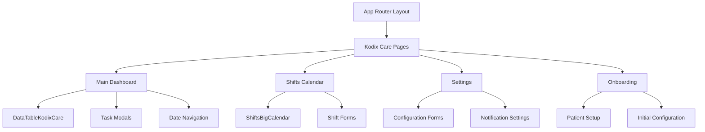
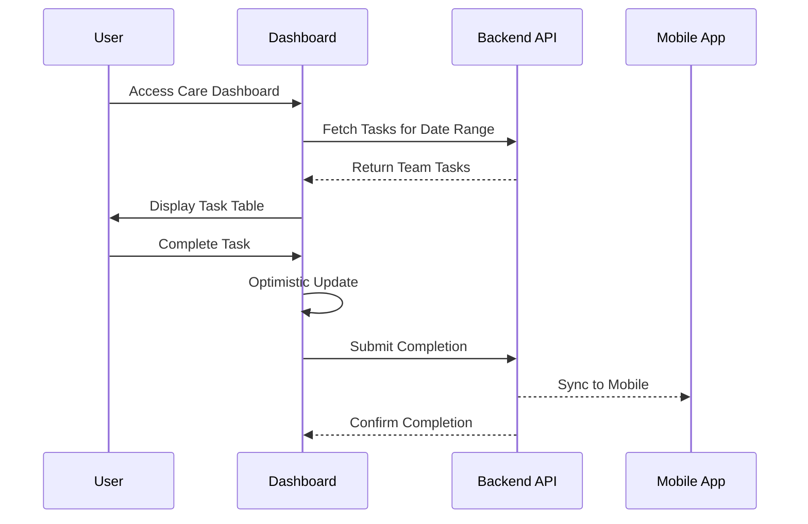

# Kodix Care Web - Frontend Documentation

<!-- AI-METADATA:
category: architecture
complexity: intermediate
updated: 2025-07-13
claude-ready: true
priority: high
token-optimized: true
audience: developers
ai-context-weight: important
-->

<!-- AI-CONTEXT-BOUNDARY: start -->

> **Status**: ✅ Production Ready & Actively Maintained  
> **Last Updated**: July 2025  
> **Related Documents**: [Component Reference](./components.md) | [State Management](./state-management.md)

## 🔍 1. Overview

<!-- AI-COMPRESS: strategy="summary" max-tokens="150" -->
**Quick Summary**: Kodix Care Web frontend is built with Next.js 14, React components, Zustand state management, and TanStack Query. Features include interactive calendars, data tables, and real-time task management with healthcare-specific UI patterns.
<!-- /AI-COMPRESS -->

The Kodix Care Web frontend provides a comprehensive healthcare management interface designed for **desktop-first usage** while maintaining mobile responsiveness. Built with modern React patterns and healthcare-specific UI components.

### Core Design Philosophy

1. **Healthcare Workflow Optimization**: UI designed around clinical care workflows
2. **Desktop-First Design**: Optimized for healthcare staff using desktop workstations
3. **Real-time Synchronization**: Immediate UI updates with mobile app synchronization
4. **Progressive Task Management**: Visual task unlocking and workflow guidance
5. **Accessibility**: Healthcare-compliant accessibility standards

## 🏗️ 2. Architecture Principles

### Component Architecture



### State Management Architecture

```typescript
// Zustand store structure
interface CareTaskStore {
  // Date filtering state
  input: {
    dateStart: Date;
    dateEnd: Date;
  };
  
  // UI state management
  editDetailsOpen: boolean;
  currentlyEditing: string | undefined;
  unlockMoreTasksCredenzaWithDateOpen: Date | false;
  
  // Actions
  setInput: (input: Partial<CareTaskStore['input']>) => void;
  setEditDetailsOpen: (open: boolean) => void;
  setCurrentlyEditing: (taskId: string | undefined) => void;
  setUnlockMoreTasksCredenzaWithDateOpen: (date: Date | false) => void;
}
```

### Technology Stack Integration

| Technology | Purpose | Integration Pattern |
|------------|---------|-------------------|
| **Next.js 14** | App Router framework | Route groups for organization |
| **React 18** | Component library | Hooks and context patterns |
| **TypeScript** | Type safety | Comprehensive type coverage |
| **Zustand** | Client state | Lightweight global state |
| **TanStack Query** | Server state | Cache and synchronization |
| **TanStack Table** | Data tables | Advanced filtering/sorting |
| **React Big Calendar** | Calendar interface | Drag-and-drop scheduling |
| **React Hook Form** | Form management | Zod schema validation |
| **Tailwind CSS** | Styling | Component-based design |
| **shadcn/ui** | Component library | Healthcare-optimized components |

## 🎨 3. UI Architecture & User Flow

### Route Structure

```
/apps/kodixCare/
├── onboarding/          # Initial patient setup
│   └── page.tsx
├── (post-install)/      # Main application routes
│   ├── page.tsx         # Task management dashboard
│   ├── shifts/
│   │   └── page.tsx     # Calendar-based shift management
│   └── settings/
│       └── page.tsx     # User preferences and configuration
└── layout.tsx           # Shared layout with sidebar
```

### User Flow Patterns



### Component Hierarchy

```typescript
// Main layout structure
export default function KodixCareLayout({
  children
}: {
  children: React.ReactNode
}) {
  return (
    <div className="flex h-screen bg-gray-50">
      <KodixCareSideBar />
      <main className="flex-1 overflow-auto">
        <div className="container mx-auto p-6">
          {children}
        </div>
      </main>
    </div>
  );
}
```

## 🚀 4. Quick Setup Workflow

### Development Setup

```bash
# Prerequisites
cd apps/kdx
npm install

# Environment setup
cp .env.example .env.local
# Configure database and auth settings

# Run development server
npm run dev

# Access Kodix Care
open http://localhost:3000/apps/kodixCare
```

### Component Development Pattern

```typescript
// Standard component pattern
export function CareTaskComponent() {
  // 1. Hooks and state
  const [localState, setLocalState] = useState();
  const store = useCareTaskStore();
  
  // 2. Data fetching
  const { data: tasks, isLoading } = api.kodixCare.careTask.getCareTasks.useQuery({
    dateStart: store.input.dateStart,
    dateEnd: store.input.dateEnd
  });
  
  // 3. Mutations
  const createMutation = api.kodixCare.careTask.createCareTask.useMutation({
    onSuccess: () => toast.success('Task created successfully')
  });
  
  // 4. Event handlers
  const handleCreateTask = useCallback((data: CreateTaskData) => {
    createMutation.mutate(data);
  }, [createMutation]);
  
  // 5. Render with loading states
  if (isLoading) return <CareTaskSkeleton />;
  
  return (
    <div className="space-y-4">
      {/* Component JSX */}
    </div>
  );
}
```

## 🔧 5. Advanced Features

### Progressive Task Unlocking UI

```typescript
// Task unlocking credenza component
export function UnlockMoreTasksCredenza() {
  const store = useCareTaskStore();
  const selectedDate = store.unlockMoreTasksCredenzaWithDateOpen;
  
  const unlockMutation = api.kodixCare.careTask.unlockMoreTasks.useMutation({
    onSuccess: () => {
      toast.success('Tasks unlocked successfully');
      store.setUnlockMoreTasksCredenzaWithDateOpen(false);
    }
  });
  
  return (
    <Credenza open={!!selectedDate} onOpenChange={() => store.setUnlockMoreTasksCredenzaWithDateOpen(false)}>
      <CredenzaContent>
        <CredenzaHeader>
          <CredenzaTitle>Unlock More Tasks</CredenzaTitle>
          <CredenzaDescription>
            Unlock tasks up to {selectedDate && format(selectedDate, 'PPP')}
          </CredenzaDescription>
        </CredenzaHeader>
        
        <CredenzaBody>
          <p>This will allow completion of tasks up to the selected date.</p>
          <p className="text-sm text-muted-foreground">
            This action cannot be undone.
          </p>
        </CredenzaBody>
        
        <CredenzaFooter>
          <Button
            onClick={() => selectedDate && unlockMutation.mutate({ selectedTimestamp: selectedDate })}
            disabled={unlockMutation.isPending}
          >
            {unlockMutation.isPending ? 'Unlocking...' : 'Unlock Tasks'}
          </Button>
        </CredenzaFooter>
      </CredenzaContent>
    </Credenza>
  );
}
```

### Interactive Calendar Integration

```typescript
// React Big Calendar with drag-and-drop
export function ShiftsBigCalendar() {
  const { data: shifts = [] } = api.kodixCare.getAllCareShifts.useQuery();
  const { data: caregivers = [] } = api.kodixCare.getAllCaregivers.useQuery();
  
  const createShiftMutation = api.kodixCare.createCareShift.useMutation();
  const editShiftMutation = api.kodixCare.editCareShift.useMutation();
  
  // Convert shifts to calendar events
  const events = useMemo(() => 
    shifts.map(shift => ({
      id: shift.id,
      title: `${shift.caregiver.name} - ${shift.notes || 'Shift'}`,
      start: shift.startAt,
      end: shift.endAt,
      resource: shift
    })), [shifts]
  );
  
  const handleSelectSlot = useCallback(({ start, end }: { start: Date; end: Date }) => {
    // Open caregiver selection modal
    setNewShiftSlot({ start, end });
    setShowCreateModal(true);
  }, []);
  
  const handleEventDrop = useCallback(({ event, start, end }: {
    event: CalendarEvent;
    start: Date;
    end: Date;
  }) => {
    editShiftMutation.mutate({
      id: event.id,
      startAt: start,
      endAt: end
    });
  }, [editShiftMutation]);
  
  return (
    <div className="h-[600px]">
      <DragAndDropCalendar
        localizer={localizer}
        events={events}
        startAccessor="start"
        endAccessor="end"
        onSelectSlot={handleSelectSlot}
        onEventDrop={handleEventDrop}
        selectable
        resizable
        defaultView="week"
        views={['month', 'week', 'day']}
        step={30}
        timeslots={2}
        eventPropGetter={(event) => ({
          style: {
            backgroundColor: getCaregiverColor(event.resource.caregiverId),
            borderColor: getCaregiverColor(event.resource.caregiverId)
          }
        })}
      />
    </div>
  );
}
```

### Advanced Data Table

```typescript
// TanStack Table with healthcare-specific features
export function DataTableKodixCare() {
  const store = useCareTaskStore();
  const { data: tasks = [], isLoading } = api.kodixCare.careTask.getCareTasks.useQuery({
    dateStart: store.input.dateStart,
    dateEnd: store.input.dateEnd
  });
  
  const columns = useMemo<ColumnDef<CareTask>[]>(() => [
    {
      id: 'select',
      header: ({ table }) => (
        <Checkbox
          checked={table.getIsAllPageRowsSelected()}
          onCheckedChange={(value) => table.toggleAllPageRowsSelected(!!value)}
        />
      ),
      cell: ({ row }) => (
        <Checkbox
          checked={row.getIsSelected()}
          onCheckedChange={(value) => row.toggleSelected(!!value)}
        />
      ),
      enableSorting: false,
      enableHiding: false,
    },
    {
      accessorKey: 'title',
      header: ({ column }) => (
        <DataTableColumnHeader column={column} title="Task" />
      ),
      cell: ({ row }) => {
        const task = row.original;
        return (
          <div className="flex items-center space-x-2">
            {task.type === 'CRITICAL' && (
              <AlertTriangle className="h-4 w-4 text-red-500" />
            )}
            <span className={cn(
              task.doneAt && "line-through text-muted-foreground"
            )}>
              {task.title}
            </span>
          </div>
        );
      }
    },
    {
      accessorKey: 'date',
      header: ({ column }) => (
        <DataTableColumnHeader column={column} title="Date" />
      ),
      cell: ({ row }) => format(row.getValue('date'), 'PPP'),
      sortingFn: 'datetime'
    },
    {
      accessorKey: 'doneAt',
      header: 'Status',
      cell: ({ row }) => {
        const doneAt = row.getValue('doneAt') as Date | null;
        return (
          <Badge variant={doneAt ? 'default' : 'secondary'}>
            {doneAt ? 'Completed' : 'Pending'}
          </Badge>
        );
      }
    },
    {
      id: 'actions',
      header: 'Actions',
      cell: ({ row }) => <CareTaskActions task={row.original} />
    }
  ], []);
  
  const table = useReactTable({
    data: tasks,
    columns,
    getCoreRowModel: getCoreRowModel(),
    getSortedRowModel: getSortedRowModel(),
    getFilteredRowModel: getFilteredRowModel(),
    getPaginationRowModel: getPaginationRowModel(),
    onRowSelectionChange: setRowSelection,
    state: {
      sorting,
      columnFilters,
      columnVisibility,
      rowSelection,
    },
  });
  
  return (
    <div className="space-y-4">
      <DataTableToolbar table={table} />
      <div className="rounded-md border">
        <Table>
          <TableHeader>
            {table.getHeaderGroups().map((headerGroup) => (
              <TableRow key={headerGroup.id}>
                {headerGroup.headers.map((header) => (
                  <TableHead key={header.id}>
                    {header.isPlaceholder
                      ? null
                      : flexRender(header.column.columnDef.header, header.getContext())
                    }
                  </TableHead>
                ))}
              </TableRow>
            ))}
          </TableHeader>
          <TableBody>
            {table.getRowModel().rows?.length ? (
              table.getRowModel().rows.map((row) => (
                <TableRow
                  key={row.id}
                  data-state={row.getIsSelected() && "selected"}
                >
                  {row.getVisibleCells().map((cell) => (
                    <TableCell key={cell.id}>
                      {flexRender(cell.column.columnDef.cell, cell.getContext())}
                    </TableCell>
                  ))}
                </TableRow>
              ))
            ) : (
              <TableRow>
                <TableCell colSpan={columns.length} className="h-24 text-center">
                  No tasks found.
                </TableCell>
              </TableRow>
            )}
          </TableBody>
        </Table>
      </div>
      <DataTablePagination table={table} />
    </div>
  );
}
```

## 🎯 6. UI Patterns & Best Practices

### Healthcare-Specific UI Patterns

```typescript
// Critical task indicator pattern
export function CriticalTaskBadge({ task }: { task: CareTask }) {
  if (task.type !== 'CRITICAL') return null;
  
  const isOverdue = !task.doneAt && isPast(task.date);
  
  return (
    <Badge 
      variant={isOverdue ? 'destructive' : 'secondary'}
      className="flex items-center gap-1"
    >
      <AlertTriangle className="h-3 w-3" />
      {isOverdue ? 'OVERDUE' : 'CRITICAL'}
    </Badge>
  );
}

// Task completion pattern with audit trail
export function TaskCompletionButton({ task }: { task: CareTask }) {
  const completeMutation = api.kodixCare.careTask.completeCareTask.useMutation({
    onSuccess: () => {
      toast.success(`Task "${task.title}" marked as completed`);
    }
  });
  
  if (task.doneAt) {
    return (
      <div className="flex items-center gap-2 text-sm text-muted-foreground">
        <CheckCircle className="h-4 w-4 text-green-500" />
        Completed {formatDistanceToNow(task.doneAt, { addSuffix: true })}
      </div>
    );
  }
  
  return (
    <Button
      size="sm"
      variant="outline"
      onClick={() => completeMutation.mutate({ id: task.id })}
      disabled={completeMutation.isPending}
    >
      {completeMutation.isPending ? (
        <Loader2 className="h-4 w-4 animate-spin" />
      ) : (
        <Check className="h-4 w-4" />
      )}
      Complete
    </Button>
  );
}
```

### Form Patterns

```typescript
// Healthcare form pattern with validation
export function CreateCareTaskForm() {
  const form = useForm<CreateCareTaskInput>({
    resolver: zodResolver(CreateCareTaskSchema),
    defaultValues: {
      title: '',
      description: '',
      details: '',
      type: 'NORMAL',
      date: new Date()
    }
  });
  
  const createMutation = api.kodixCare.careTask.createCareTask.useMutation({
    onSuccess: () => {
      toast.success('Care task created successfully');
      form.reset();
    },
    onError: (error) => {
      toast.error(`Failed to create task: ${error.message}`);
    }
  });
  
  return (
    <Form {...form}>
      <form onSubmit={form.handleSubmit(createMutation.mutate)} className="space-y-4">
        <FormField
          control={form.control}
          name="title"
          render={({ field }) => (
            <FormItem>
              <FormLabel>Task Title *</FormLabel>
              <FormControl>
                <Input {...field} placeholder="Enter task title" />
              </FormControl>
              <FormMessage />
            </FormItem>
          )}
        />
        
        <FormField
          control={form.control}
          name="type"
          render={({ field }) => (
            <FormItem>
              <FormLabel>Priority Level</FormLabel>
              <Select onValueChange={field.onChange} defaultValue={field.value}>
                <FormControl>
                  <SelectTrigger>
                    <SelectValue placeholder="Select priority" />
                  </SelectTrigger>
                </FormControl>
                <SelectContent>
                  <SelectItem value="NORMAL">Normal</SelectItem>
                  <SelectItem value="CRITICAL">
                    <div className="flex items-center gap-2">
                      <AlertTriangle className="h-4 w-4 text-red-500" />
                      Critical
                    </div>
                  </SelectItem>
                </SelectContent>
              </Select>
              <FormMessage />
            </FormItem>
          )}
        />
        
        <FormField
          control={form.control}
          name="date"
          render={({ field }) => (
            <FormItem className="flex flex-col">
              <FormLabel>Task Date *</FormLabel>
              <Popover>
                <PopoverTrigger asChild>
                  <FormControl>
                    <Button
                      variant="outline"
                      className={cn(
                        "w-full pl-3 text-left font-normal",
                        !field.value && "text-muted-foreground"
                      )}
                    >
                      {field.value ? (
                        format(field.value, "PPP")
                      ) : (
                        <span>Pick a date</span>
                      )}
                      <CalendarIcon className="ml-auto h-4 w-4 opacity-50" />
                    </Button>
                  </FormControl>
                </PopoverTrigger>
                <PopoverContent className="w-auto p-0" align="start">
                  <Calendar
                    mode="single"
                    selected={field.value}
                    onSelect={field.onChange}
                    disabled={(date) => date < new Date("1900-01-01")}
                    initialFocus
                  />
                </PopoverContent>
              </Popover>
              <FormMessage />
            </FormItem>
          )}
        />
        
        <Button type="submit" disabled={createMutation.isPending} className="w-full">
          {createMutation.isPending ? (
            <>
              <Loader2 className="mr-2 h-4 w-4 animate-spin" />
              Creating...
            </>
          ) : (
            'Create Task'
          )}
        </Button>
      </form>
    </Form>
  );
}
```

## 🔗 7. Integration with Backend

### API Integration Patterns

```typescript
// Optimistic updates for better UX
export function useOptimisticTaskCompletion() {
  const utils = api.useUtils();
  
  return api.kodixCare.careTask.completeCareTask.useMutation({
    onMutate: async (variables) => {
      // Cancel outgoing refetches
      await utils.kodixCare.careTask.getCareTasks.cancel();
      
      // Snapshot previous value
      const previous = utils.kodixCare.careTask.getCareTasks.getData();
      
      // Optimistically update
      utils.kodixCare.careTask.getCareTasks.setData(undefined, (old) =>
        old?.map((task) =>
          task.id === variables.id
            ? { ...task, doneAt: new Date(), doneByUserId: getCurrentUserId() }
            : task
        )
      );
      
      return { previous };
    },
    onError: (err, variables, context) => {
      // Rollback on error
      if (context?.previous) {
        utils.kodixCare.careTask.getCareTasks.setData(undefined, context.previous);
      }
    },
    onSettled: () => {
      // Always refetch after error or success
      utils.kodixCare.careTask.getCareTasks.invalidate();
    }
  });
}
```

### Error Boundary Pattern

```typescript
// Healthcare-specific error boundary
export function CareErrorBoundary({ children }: { children: React.ReactNode }) {
  return (
    <ErrorBoundary
      FallbackComponent={CareErrorFallback}
      onError={(error, errorInfo) => {
        // Log healthcare errors for compliance
        logger.error('Care application error', {
          error: error.message,
          stack: error.stack,
          componentStack: errorInfo.componentStack,
          timestamp: new Date(),
          userAgent: navigator.userAgent
        });
      }}
    >
      {children}
    </ErrorBoundary>
  );
}

function CareErrorFallback({ error, resetErrorBoundary }: FallbackProps) {
  return (
    <div className="flex min-h-[400px] flex-col items-center justify-center space-y-4">
      <AlertTriangle className="h-12 w-12 text-red-500" />
      <div className="text-center">
        <h2 className="text-lg font-semibold">Care System Error</h2>
        <p className="text-sm text-muted-foreground">
          An error occurred in the care management system.
        </p>
        <p className="text-xs text-muted-foreground mt-2">
          Error: {error.message}
        </p>
      </div>
      <div className="flex gap-2">
        <Button onClick={resetErrorBoundary} variant="outline">
          Try Again
        </Button>
        <Button onClick={() => window.location.reload()}>
          Reload Page
        </Button>
      </div>
    </div>
  );
}
```

## ⚡ 8. Performance Optimization

### React Query Optimization

```typescript
// Efficient data fetching patterns
export const careTaskQueryOptions = {
  staleTime: 5 * 60 * 1000, // 5 minutes
  cacheTime: 10 * 60 * 1000, // 10 minutes
  refetchOnWindowFocus: true, // Important for healthcare
  refetchOnReconnect: true
};

// Prefetch patterns for smooth navigation
export function prefetchCareData() {
  const utils = api.useUtils();
  
  useEffect(() => {
    // Prefetch shifts when on main page
    utils.kodixCare.getAllCareShifts.prefetch();
    
    // Prefetch caregivers for shift management
    utils.kodixCare.getAllCaregivers.prefetch();
  }, [utils]);
}
```

### Component Optimization

```typescript
// Memoized components for performance
export const CareTaskCard = memo(({ task }: { task: CareTask }) => {
  return (
    <Card className={cn(
      "p-4 transition-colors",
      task.doneAt && "bg-green-50",
      task.type === 'CRITICAL' && !task.doneAt && "border-red-200"
    )}>
      <div className="flex items-center justify-between">
        <div>
          <h3 className="font-medium">{task.title}</h3>
          <p className="text-sm text-muted-foreground">{task.description}</p>
        </div>
        <TaskCompletionButton task={task} />
      </div>
    </Card>
  );
});

// Virtualized lists for large datasets
export function VirtualizedTaskList({ tasks }: { tasks: CareTask[] }) {
  return (
    <FixedSizeList
      height={600}
      itemCount={tasks.length}
      itemSize={120}
      itemData={tasks}
    >
      {({ index, style, data }) => (
        <div style={style}>
          <CareTaskCard task={data[index]} />
        </div>
      )}
    </FixedSizeList>
  );
}
```

## 🧪 9. Testing Strategy

### Component Testing

```typescript
// Test utilities for care components
export function renderWithCareProviders(
  ui: React.ReactElement,
  options: RenderOptions = {}
) {
  const queryClient = new QueryClient({
    defaultOptions: {
      queries: { retry: false },
      mutations: { retry: false }
    }
  });
  
  function Wrapper({ children }: { children: React.ReactNode }) {
    return (
      <QueryClientProvider client={queryClient}>
        <TRPCProvider client={trpc} queryClient={queryClient}>
          {children}
        </TRPCProvider>
      </QueryClientProvider>
    );
  }
  
  return render(ui, { wrapper: Wrapper, ...options });
}

// Example component test
describe('CareTaskCard', () => {
  it('renders critical task with warning indicator', () => {
    const criticalTask: CareTask = {
      id: '1',
      title: 'Critical Medication',
      type: 'CRITICAL',
      doneAt: null,
      date: new Date()
    };
    
    renderWithCareProviders(<CareTaskCard task={criticalTask} />);
    
    expect(screen.getByText('Critical Medication')).toBeInTheDocument();
    expect(screen.getByTestId('critical-indicator')).toBeInTheDocument();
    expect(screen.getByRole('button', { name: /complete/i })).toBeInTheDocument();
  });
});
```

### Integration Testing

```typescript
// Integration test for task completion flow
describe('Task Completion Flow', () => {
  it('completes task and updates UI', async () => {
    const user = userEvent.setup();
    
    // Mock API response
    mockTRPC.kodixCare.careTask.getCareTasks.mockReturnValue([
      { id: '1', title: 'Test Task', doneAt: null }
    ]);
    
    renderWithCareProviders(<DataTableKodixCare />);
    
    // Wait for tasks to load
    await waitFor(() => {
      expect(screen.getByText('Test Task')).toBeInTheDocument();
    });
    
    // Complete the task
    const completeButton = screen.getByRole('button', { name: /complete/i });
    await user.click(completeButton);
    
    // Verify optimistic update
    await waitFor(() => {
      expect(screen.getByText('Completed')).toBeInTheDocument();
    });
  });
});
```

## 🛡️ 10. Development & Maintenance

### Development Workflow

```bash
# Start development with hot reload
npm run dev

# Run component tests
npm run test:components

# Run integration tests
npm run test:integration

# Type checking
npm run type-check

# Lint and format
npm run lint
npm run format
```

### Code Quality Standards

```typescript
// ESLint configuration for healthcare code
module.exports = {
  extends: ['@kdx/eslint-config'],
  rules: {
    // Healthcare-specific rules
    'no-console': 'error', // No console logs in production
    'prefer-const': 'error', // Immutability preference
    '@typescript-eslint/no-any': 'error', // No any types
    'react-hooks/exhaustive-deps': 'error' // Proper hook dependencies
  }
};
```

### Accessibility Standards

```typescript
// Accessibility patterns for healthcare UI
export function AccessibleTaskButton({ task, onComplete }: {
  task: CareTask;
  onComplete: () => void;
}) {
  return (
    <Button
      onClick={onComplete}
      aria-label={`Complete task: ${task.title}`}
      aria-describedby={`task-${task.id}-description`}
      className="focus:ring-2 focus:ring-blue-500"
    >
      <span className="sr-only">Complete task</span>
      <Check className="h-4 w-4" />
    </Button>
  );
}
```

### Maintenance Guidelines

1. **Weekly**: Update dependencies and security patches
2. **Monthly**: Performance audit and optimization review
3. **Quarterly**: Accessibility compliance audit
4. **As Needed**: Feature updates and bug fixes

<!-- AI-CONTEXT-BOUNDARY: end -->

---

**Framework**: Next.js 14 with App Router  
**UI Library**: React 18 with TypeScript  
**Last Updated**: 2025-07-13