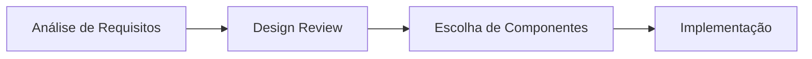

<!-- AI-METADATA:
<!-- AI-CONTEXT-PRIORITY: always-include="false" summary-threshold="medium" -->category: reference
complexity: intermediate
updated: 2025-07-12
claude-ready: true
phase: 4
priority: medium
token-optimized: true
audience: all
ai-context-weight: important
last-ai-review: 2025-07-12
-->

# 🎨 Documentação de Componentes - Índice

Bem-vindo à documentação completa dos componentes do ecossistema Kodix. Esta seção contém toda a informação necessária para utilizar, estender e criar componentes no sistema.

## 📖 Documentação Disponível

### 📦 **[Documentação Completa de Componentes](./README.md)**

Visão abrangente de todos os componentes organizados por categorias:

- **UI Library** - Componentes base do sistema (`packages/ui/src/`)
- **App Components** - Componentes específicos da web app (`apps/kdx/src/`)
- **Mobile Components** - Componentes React Native (`apps/care-expo/src/`)

### 🧩 **[Exemplos Práticos](./component-examples.md)**

Exemplos de código prático para implementação:

- Componentes básicos (Button, Form, Card, Dialog)
- Componentes de layout (Sidebar, Tabs)
- Componentes de feedback (Toast, Alert, Tooltip)
- Padrões avançados (Data Tables, Multi-step Forms)
- Exemplos mobile (React Native)

### 🔧 **[Guia Shadcn Sidebar](./guia-shadcn-sidebar.md)**

Implementação específica do componente Sidebar:

- Setup e configuração
- Customizações avançadas
- Integração com navegação

## 🚀 Quick Start

### Para usar um componente básico:

<!-- AI-CODE-BLOCK: typescript-example -->
<!-- AI-CODE-OPTIMIZATION: language="typescript" context="kodix-patterns" -->
```typescript
// AI-CONTEXT: TypeScript implementation following Kodix patterns
import { Button } from "@kdx/ui/button";

<Button variant="default" size="lg">
  Meu Botão
</Button>
```
<!-- /AI-CODE-OPTIMIZATION -->
<!-- /AI-CODE-BLOCK -->

### Para criar um formulário:

<!-- AI-CODE-BLOCK: typescript-example -->
<!-- AI-CODE-OPTIMIZATION: language="typescript" context="kodix-patterns" -->
```typescript
// AI-CONTEXT: TypeScript implementation following Kodix patterns
import { Button } from "@kdx/ui/button";
import {
  Form,
  FormControl,
  FormField,
  FormItem,
  FormLabel,
} from "@kdx/ui/form";
import { Input } from "@kdx/ui/input";

// Ver exemplos completos em component-examples.md
```
<!-- /AI-CODE-OPTIMIZATION -->
<!-- /AI-CODE-BLOCK -->

### Para implementar uma sidebar:

<!-- AI-CODE-BLOCK: typescript-example -->
<!-- AI-CODE-OPTIMIZATION: language="typescript" context="kodix-patterns" -->
```typescript
// AI-CONTEXT: TypeScript implementation following Kodix patterns
import { Sidebar, SidebarContent, SidebarProvider } from "@kdx/ui/sidebar";

// Ver guia completo em guia-shadcn-sidebar.md
```
<!-- /AI-CODE-OPTIMIZATION -->
<!-- /AI-CODE-BLOCK -->

## 📊 Estatísticas dos Componentes

### **UI Library (packages/ui/src/)**

- **🎨 Interface Básica**: 8 componentes (Button, Input, Label, etc.)
- **📐 Layout**: 4 componentes (Card, Separator, Sidebar, etc.)
- **🧭 Navegação**: 5 componentes (Dropdown, Command, Tabs, etc.)
- **💬 Feedback**: 8 componentes (Dialog, Toast, Alert, etc.)
- **📊 Dados**: 6 componentes (Table, Badge, Avatar, etc.)
- **⏰ Tempo**: 3 componentes (Calendar, DatePicker, TimePicker)
- **📝 Formulário**: 1 sistema completo (Form + validação)
- **🎯 Especializados**: 4 componentes (KBD, Toggle, Typography, etc.)
- **✨ Animação**: 3 bibliotecas (Magic UI, Aceternity, Origin UI)
- **🪝 Hooks**: 3 hooks customizados
- **💾 Estado**: Stores Zustand

**Total**: ~45 componentes base

### **App Components (apps/kdx/src/)**

- **🌐 Globais**: 5 componentes principais
- **🎯 Header**: 5 componentes de cabeçalho
- **📱 Apps**: 15+ seções de aplicativos específicos
- **🔐 Auth**: 4 componentes de autenticação
- **👥 Team**: 6 componentes de gerenciamento
- **👤 Account**: 4 componentes de conta

**Total**: ~39 componentes específicos

### **Mobile Components (apps/care-expo/src/)**

- **📱 Base**: 9 componentes móveis
- **🏠 Home**: 2 componentes específicos

**Total**: ~11 componentes móveis

## 🏗️ Arquitetura dos Componentes

### **Estrutura Hierárquica**

```
📦 Kodix Components
├── 🎨 UI Library (Base)
│   ├── Primitivos (Radix UI)
│   ├── Estilização (Tailwind)
│   └── Comportamento (React Hooks)
├── 🌐 Web App Components
│   ├── Layout Global
│   ├── Features Específicas
│   └── Business Logic
└── 📱 Mobile Components
    ├── Native Behavior
    ├── Platform Specific
    └── Shared Logic
```

### **Padrões de Design**

- **🧩 Composição**: Compound components
- **🔄 Polimorfismo**: `asChild` pattern
- **♿ Acessibilidade**: WCAG 2.1 compliance
- **📱 Responsividade**: Mobile-first design
- **🎨 Customização**: Variant-based styling
- **⚡ Performance**: Lazy loading + memoization

## 🚀 🛠️ Ferramentas e Setup

### **Stack Tecnológico**

- **React 19** - Framework base
- **TypeScript** - Type safety
- **Radix UI** - Componentes acessíveis
- **Tailwind CSS** - Styling system
- **Class Variance Authority** - Variant management
- **React Hook Form** - Form handling
- **Zod** - Schema validation
- **Framer Motion** - Animações
- **Lucide React** - Ícones

### **Ferramentas de Desenvolvimento**

- **Turbo** - Monorepo orchestration
- **ESLint + Prettier** - Code quality
- **Storybook** - Component documentation
- **Jest + Playwright** - Testing
- **PostHog** - Analytics integration

## 🎯 Casos de Uso Comuns

### **🔧 Desenvolvimento de Features**

1. **Nova Funcionalidade**: Use componentes da UI Library
2. **Layout Customizado**: Combine componentes de layout
3. **Formulário Complexo**: Use Form + validação Zod
4. **Dashboard**: Combine Cards + Charts + Tables

### **🎨 Customização Visual**

1. **Tema Personalizado**: Modifique CSS variables
2. **Novos Variants**: Estenda buttonVariants, etc.
3. **Componente Específico**: Crie wrapper components
4. **Animações**: Use Framer Motion + Magic UI

### **📱 Mobile Development**

1. **Telas Nativas**: Use componentes do care-expo
2. **Navegação**: SafeAreaView + navigation
3. **Formulários**: Form components adaptados
4. **Performance**: Loading states + optimistic UI

## 📚 Recursos Adicionais

### **Documentação Externa**

- [Radix UI Documentation](https://radix-ui.com/)
- [Tailwind CSS Docs](https://tailwindcss.com/docs)
- <!-- AI-LINK: type="related" importance="medium" -->
<!-- AI-CONTEXT-REF: importance="medium" type="guide" -->
[React Hook Form Guide](https://react-hook-form.com/)
<!-- /AI-CONTEXT-REF -->
<!-- /AI-LINK -->
- [Shadcn/ui Components](https://ui.shadcn.com/)

### **Design Resources**

- **Figma Design System**: [Link interno]
- **Color Palette**: Ver `globals.css`
- **Typography Scale**: Ver `typography.tsx`
- **Spacing System**: Ver Tailwind config

### **Comunidade e Suporte**

- **Internal Docs**: Esta documentação
- **Team Knowledge Base**: [Link interno]
- **Component Request**: Via issues/PRs
- **Best Practices**: Ver exemplos práticos

## 🔄 Fluxo de Desenvolvimento

### **1. Planejamento**



### **2. Implementação**

1. **Verificar** componentes existentes
2. **Reutilizar** quando possível
3. **Estender** se necessário
4. **Criar** apenas se único

### **3. Testing**

1. **Unit Tests** - Componentes isolados
2. **Integration Tests** - Fluxos completos
3. **Visual Tests** - Storybook
4. **E2E Tests** - User journeys

### **4. Deployment**

1. **Review** de código
2. **Testing** em staging
3. **Documentation** atualizada
4. **Release** para produção

## 🎖️ Melhores Práticas

### **✅ Do's**

- Use TypeScript para type safety
- Siga padrões de acessibilidade
- Mantenha componentes pequenos e focados
- Use composition over inheritance
- Implemente loading e error states
- Documente props e exemplos

### **❌ Don'ts**

- Não crie componentes monolíticos
- Não ignore acessibilidade
- Não hardcode valores de estilo
- Não esqueça de responsive design
- Não negligencie performance
- Não pule testes

## 🚀 Próximos Passos

### **Para Novos Desenvolvedores**

1. **Leia** a documentação completa
2. **Explore** os exemplos práticos
3. **Implemente** um componente simples
4. **Teste** diferentes variantes
5. **Contribua** com melhorias

### **Para Veteranos**

1. **Review** novos componentes
2. **Otimize** componentes existentes
3. **Documente** padrões descobertos
4. **Mentore** novos membros
5. **Innove** com novas soluções

---

## 📞 Contato e Suporte

Para dúvidas, sugestões ou contribuições relacionadas aos componentes:

- **Team Frontend**: [@frontend-team]
- **Component Reviews**: [@design-system-team]
- **Issues/Bugs**: Abra uma issue no repositório
- **Feature Requests**: Discussão em equipe

---

_Esta documentação é mantida pela equipe de frontend e atualizada regularmente conforme novos componentes são adicionados ao sistema._
