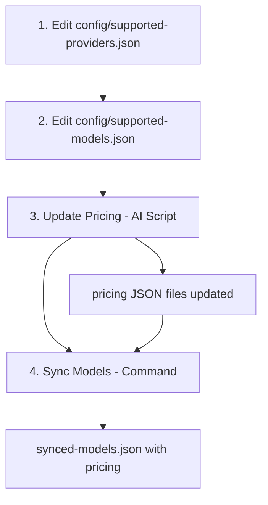

# AI Model Sync Guide

Synchronizes AI models from multiple providers (OpenAI, Google, Anthropic, xAI) with unified pricing management.

---

## 🚀 Quick Start - 4 Steps

### 1. Update Providers

```bash
# Edit: config/supported-providers.json
{
  "providers": [
    {"name": "OpenAI", "base_url": "https://api.openai.com", "sync_name": "openai"},
    {"name": "Google", "base_url": "https://generativelanguage.googleapis.com", "sync_name": "google"},
    {"name": "Anthropic", "base_url": "https://api.anthropic.com", "sync_name": "anthropic"},
    {"name": "XAI", "base_url": "https://api.x.ai/v1", "sync_name": "xai"}
  ]
}
```

### 2. Update Models

```bash
# Edit: config/supported-models.json
[
  {"modelId": "gpt-4o", "provider": "openai"},
  {"modelId": "gpt-4o-mini", "provider": "openai"},
  {"modelId": "claude-3-5-sonnet-20241022", "provider": "anthropic"},
  {"modelId": "claude-opus-4-20250514", "provider": "anthropic"},
  {"modelId": "gemini-1.5-pro", "provider": "google"},
  {"modelId": "gemini-2.5-flash", "provider": "google"},
  {"modelId": "grok-4-0709", "provider": "xai"}
]
```

### 3. Update Pricing (FIRST!)

⚠️ **Important**: Do this BEFORE model sync - the model sync uses pricing data!

```bash
# Follow the AI pricing script:
# See: sync/providers/pricing-ai-script.md
```

**What this does**:
- Updates `sync/providers/[provider]/[provider]-pricing.json` files
- Ensures all models have current pricing from official sources

**Why first**: The model sync script reads pricing from these JSON files to apply to the unified model data.

### 4. Sync Models

```bash
pnpm run --filter @kdx/api models-sync
```

**What this does**:
- Fetches latest models from provider APIs
- Applies pricing from the JSON files updated in step 3
- Creates unified `synced-models.json` with complete model + pricing data

## ✅ Expected Results

After completing all steps:

- ✅ `synced-models.json` created with unified model data + pricing
- ✅ Provider model files updated with technical specs
- ✅ All supported models have pricing applied

---

## 🛠️ Detailed Setup

### Environment Variables Required

```bash
# .env file in repository root
OPENAI_API_KEY="sk-proj-..."          # Optional
GOOGLE_API_KEY="AIza..."              # Optional  
ANTHROPIC_API_KEY="sk-ant-api03-..."  # Optional
XAI_API_KEY="xai-..."                 # Optional
```

### Two Types of Syncing

#### 1. Model Sync (Technical Data)
Syncs model specifications and technical details from provider APIs:

```bash
pnpm run --filter @kdx/api models-sync
```

**What it does**:
- Fetches latest models from each provider's API
- Updates `[provider]-models.json` with technical specifications
- Updates `[provider]-models-summary.json` with model IDs
- Generates unified `synced-models.json` with pricing applied
- Only syncs models listed in `config/supported-models.json`

#### 2. Pricing Sync (Business Data)
Updates pricing information based on official provider pricing pages:

```bash
# Follow the AI script instructions:
# See: sync/providers/pricing-ai-script.md
```

**What it does**:
- Updates `[provider]-pricing.json` files based on official pricing
- Ensures all models have current pricing information

---

## 📁 Understanding the System

### File Structure

```info
ai-model-sync-adapter/
├── How-To-Sync.md              # 📖 This guide - complete documentation
├── config/
│   ├── supported-providers.json # 👤 Manual: Provider configuration
│   └── supported-models.json    # 👤 Manual: Curated model list
├── synced-models.json           # 🤖 Auto: Generated unified model data
└── sync/
    ├── models-sync-provider.dev.ts  # Model sync script
    ├── types.ts                     # TypeScript interfaces
    └── providers/
        ├── pricing-ai-script.md     # 👤 Manual: AI pricing update guide
        ├── ADD-NEW-PROVIDER-GUIDE.md # 👤 Manual: Adding new providers
        ├── openai/
        │   ├── openai-adapter.ts        # Provider adapter
        │   ├── openai-pricing.md        # 👤 Manual: Pricing documentation
        │   ├── openai-pricing.json      # 👤 Manual: Pricing configuration
        │   ├── openai-models.json       # 🤖 Auto: Technical specs
        │   └── openai-models-summary.json # 🤖 Auto: Model IDs only
        ├── google/
        │   ├── google-adapter.ts         # Provider adapter
        │   ├── google-pricing.md         # 👤 Manual: Pricing documentation
        │   ├── google-pricing.json       # 👤 Manual: Pricing configuration
        │   ├── google-models.json        # 🤖 Auto: Technical specs
        │   └── google-models-summary.json # 🤖 Auto: Model IDs only
        ├── anthropic/
        │   ├── anthropic-adapter.ts      # Provider adapter
        │   ├── anthropic-pricing.md      # 👤 Manual: Pricing documentation
        │   ├── anthropic-pricing.json    # 👤 Manual: Pricing configuration
        │   ├── anthropic-models.json     # 🤖 Auto: Technical specs
        │   └── anthropic-models-summary.json # 🤖 Auto: Model IDs only
        └── xai/
            ├── xai-adapter.ts           # Provider adapter
            ├── xai-pricing.md           # 👤 Manual: Pricing documentation
            ├── xai-pricing.json         # 👤 Manual: Pricing configuration
            ├── xai-models.json          # 🤖 Auto: Technical specs
            └── xai-models-summary.json  # 🤖 Auto: Model IDs only
```

**Legend:**
- 👤 **Manual**: Files you edit manually
- 🤖 **Auto**: Files generated by sync scripts

### Configuration Files You Must Edit

#### `config/supported-providers.json`
**Purpose**: Defines which AI providers to sync from.
**You must**: Add/remove providers manually.

```json
{
  "providers": [
    {
      "name": "OpenAI",
      "base_url": "https://api.openai.com",
      "sync_name": "openai"
    },
    {
      "name": "Google", 
      "base_url": "https://generativelanguage.googleapis.com",
      "sync_name": "google"
    }
  ]
}
```

#### `config/supported-models.json`
**Purpose**: Curated list of models to include in the platform.
**You must**: Add new models manually when they become available.

```json
[
  {"modelId": "gpt-4o", "provider": "openai"},
  {"modelId": "gpt-4o-mini", "provider": "openai"},
  {"modelId": "claude-3-5-sonnet-20241022", "provider": "anthropic"},
  {"modelId": "gemini-1.5-pro", "provider": "google"}
]
```

⚠️ **Important**: Only models in this list will be synced and available in the platform.

### Generated Files

#### `synced-models.json`
**Purpose**: Unified model data with pricing applied.
**Generated by**: `pnpm run --filter @kdx/api models-sync`

Contains complete model information:
- Technical specifications from provider APIs
- Pricing from `[provider]-pricing.json` files
- Only includes models from `config/supported-models.json`

---

## 🔧 Pricing System

### Provider-Specific Pricing Files
Each provider has a manually configured pricing file:

```json
[
  {
    "modelId": "exact-model-id-from-api",
    "pricing": {
      "input": "2.50",
      "output": "10.00", 
      "unit": "per_million_tokens"
    }
  }
]
```

**Important**: 
- Model IDs must match exactly what the provider API returns
- Prices must be strings (e.g., "2.50" not 2.50)
- Unit must always be "per_million_tokens"

### Pricing Update Process
Use the AI script in `sync/providers/pricing-ai-script.md`:

1. Reads provider pricing documentation
2. Visits official pricing pages  
3. Updates pricing JSON files

**Fallback**: If no pricing is found, defaults to $1.00 input / $3.00 output per million tokens.

---

## 🚨 Troubleshooting

| Problem               | Solution                                           |
| --------------------- | -------------------------------------------------- |
| Script fails          | Check API keys in root `.env`                      |
| Missing models        | Verify provider in `config/supported-providers.json`     |
| No pricing            | Run pricing update first (`sync/providers/pricing-ai-script.md`) |
| Pricing outdated      | Re-run pricing update script                      |
| Model has no pricing  | Check model exists in provider's pricing JSON     |

### Model sync fails
- Check API keys in root `.env` file
- Verify provider URLs in `config/supported-providers.json`
- Check network connectivity
- Ensure provider has credits/quota available

### Missing models
- Ensure model is listed in `config/supported-models.json`
- Check if API key has correct permissions
- Verify model is available in provider's API
- Check console output for errors

### Missing pricing
- Ensure model has pricing in `sync/providers/[provider]/[provider]-pricing.json`
- Run pricing update using `sync/providers/pricing-ai-script.md`
- Check that model ID matches exactly between pricing file and API

### Pricing discrepancies
- Use AI script to update pricing from official sources
- Verify model IDs match exactly
- Check individual provider pricing files for current rates

---

## 🔄 Sync Order Matters!



**Key**: Pricing update (step 3) must happen before model sync (step 4) because the model sync reads pricing from the JSON files.

---

## 📋 Validation Checklist

After Step 3 (Pricing):
- [ ] Each provider's pricing JSON has current models
- [ ] All pricing files are updated with current official rates

After Step 4 (Models):
- [ ] `synced-models.json` exists with pricing for all supported models
- [ ] Provider model files contain technical specs
- [ ] All provider pricing files are up to date with official rates
- [ ] All models from `config/supported-models.json` appear in unified data
- [ ] Pricing appears correctly in AI Studio UI
- [ ] Model sync completed without errors

---

## 🚀 Advanced Usage

### Adding a New Provider
1. Follow `sync/providers/ADD-NEW-PROVIDER-GUIDE.md`
2. Add to `config/supported-providers.json`
3. Create provider folder with adapter and pricing files
4. Test sync process

### Adding New Models
1. Add model ID to `config/supported-models.json`
2. Update provider's pricing file if needed
3. Run model sync to fetch technical specs
4. Verify model appears in `synced-models.json`

### Custom Pricing Overrides
Edit `synced-models.json` manually after sync (will be overwritten on next sync):

```json
{
  "modelId": "custom-model",
  "name": "Custom Model", 
  "provider": "openai",
  "pricing": {
    "input": "5.00",
    "output": "15.00",
    "unit": "per_million_tokens"
  }
}
```

---

**Location**: `packages/api/src/internal/services/ai-model-sync-adapter/`  
**Architecture Summary**: Configuration → Manual files control what gets synced | Model Data → Automated fetch from provider APIs | Pricing → Manual configuration with AI-assisted updates | Output → Unified JSON files for platform consumption