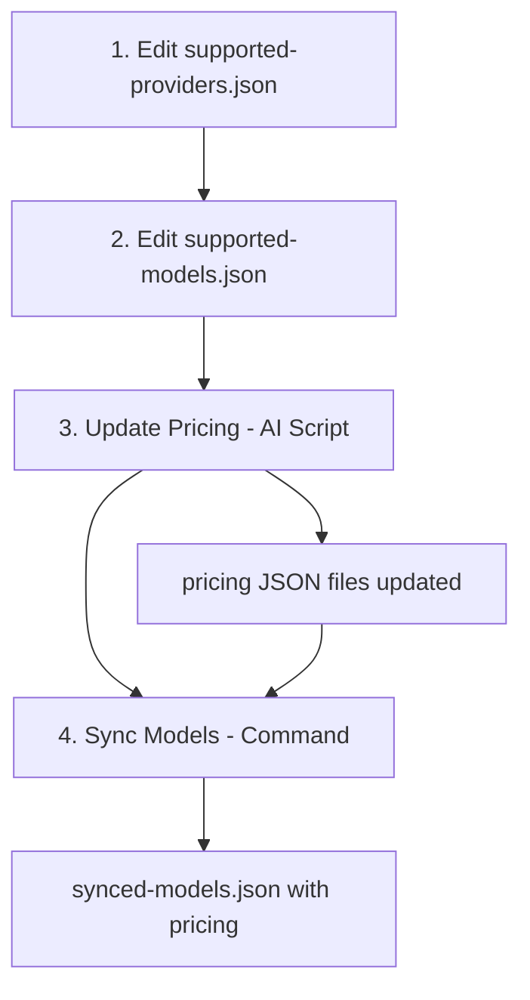

# ⚡ Fast Sync Guide

Quick reference for syncing AI models and pricing data from OpenAI, Google, Anthropic, and xAI.

## 4-Step Process

### 1. Update Providers

```bash
# Edit: supported-providers.json
{
  "providers": [
    {"name": "OpenAI", "base_url": "https://api.openai.com", "sync_name": "openai"},
    {"name": "Google", "base_url": "https://generativelanguage.googleapis.com", "sync_name": "google"},
    {"name": "Anthropic", "base_url": "https://api.anthropic.com", "sync_name": "anthropic"},
    {"name": "XAI", "base_url": "https://api.x.ai/v1", "sync_name": "xai"}
  ]
}
```

### 2. Update Models

```bash
# Edit: supported-models.json
[
  {"modelId": "gpt-4o"},
  {"modelId": "gpt-4o-mini"},
  {"modelId": "claude-3-5-sonnet-20241022"},
  {"modelId": "claude-opus-4-20250514"},
  {"modelId": "gemini-1.5-pro"},
  {"modelId": "gemini-2.5-flash"},
  {"modelId": "grok-4-0709"}
]
```

### 3. Update Pricing (FIRST!)

⚠️ **Important**: Do this BEFORE model sync - the model sync uses pricing data!

```bash
# Follow the AI pricing script:
# See: update/pricing-ai-script.md
```

**What this does**:
- Updates `providers/[provider]/[provider]-pricing.json` files
- Creates `synced-price.json` status report
- Ensures all models have current pricing from official sources

**Why first**: The model sync script reads pricing from these JSON files to apply to the unified model data.

### 4. Sync Models

```bash
pnpm run --filter @kdx/api models-sync
```

**What this does**:
- Fetches latest models from provider APIs
- Applies pricing from the JSON files updated in step 3
- Creates unified `synced-models.json` with complete model + pricing data

## ✅ Expected Results

After completing all steps:

- ✅ `synced-price.json` created with pricing sync status
- ✅ `synced-models.json` created with unified model data + pricing
- ✅ Provider model files updated with technical specs
- ✅ All supported models have pricing applied

## 🚨 Quick Troubleshooting

| Problem               | Solution                                           |
| --------------------- | -------------------------------------------------- |
| Script fails          | Check API keys in root `.env`                      |
| Missing models        | Verify provider in `supported-providers.json`     |
| No pricing            | Run pricing update first (`update/pricing-ai-script.md`) |
| Pricing outdated      | Re-run pricing update script                      |
| Model has no pricing  | Check model exists in provider's pricing JSON     |

## 📋 Validation Checklist

After Step 3 (Pricing):
- [ ] `synced-price.json` exists with recent sync date
- [ ] All providers show "success" status
- [ ] Each provider's pricing JSON has current models

After Step 4 (Models):
- [ ] `synced-models.json` exists
- [ ] Has pricing for all supported models  
- [ ] Provider model files have technical specs (no pricing)
- [ ] No errors in console output

## 🔄 Sync Order Matters!



**Key**: Pricing update (step 3) must happen before model sync (step 4) because the model sync reads pricing from the JSON files.

---

**Location**: `packages/api/src/internal/services/ai-sync-adapters/`  
**Full docs**: See `README.md` for complete documentation  
**Pricing script**: See `update/pricing-ai-script.md` for step 3 details