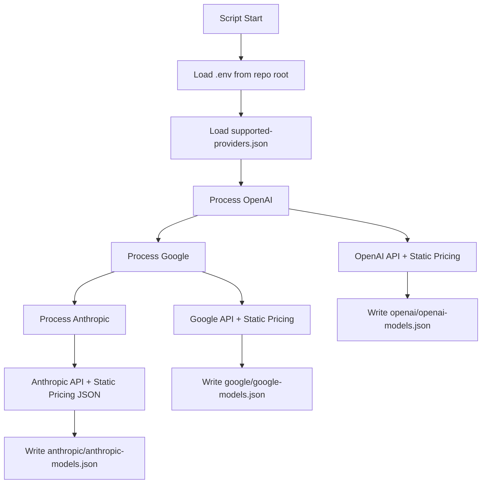

# Models Sync Provider Guide

Documentation for `models-sync-provider.dev.ts` - A development utility for fetching AI model data from multiple providers and generating separate JSON files for each provider.

## 📋 Overview

The `models-sync-provider.dev.ts` script is a **development-only utility** that fetches real model metadata from AI provider APIs and generates separate JSON files for each provider. This eliminates the need for database model syncing during development and provides accurate, up-to-date model information for testing.

## 🚀 Quick Start

```bash
# From repository root
pnpm run --filter @kdx/api sync-models

# Or from packages/api directory
npm run sync-models

# Or manually
npx tsx src/internal/services/ai-sync-adapters/update/models-sync-provider.dev.ts
```

## 🎯 Purpose & Benefits

### Why This Script Exists

- **Development Speed**: No need to set up full database model sync during development
- **Real Data**: Uses actual provider APIs instead of mock/static data
- **Up-to-date**: Always fetches latest models and pricing from providers
- **Testing**: Provides comprehensive model data for UI and integration testing

### Key Benefits

- ✅ **Development-only safety** - Prevents accidental production use
- ✅ **Multi-provider support** - OpenAI, Google, Anthropic
- ✅ **Graceful error handling** - Continues if one provider fails
- ✅ **Rich metadata** - Pricing, context windows, modalities, training cutoffs
- ✅ **Safe re-runs** - Atomic file writes, no partial states

## 📊 Output Structure

### Generated Files

The script generates separate JSON files for each provider in their respective subfolders:
- `anthropic/anthropic-models.json`
- `google/google-models.json` 
- `openai/openai-models.json`

### File Structure

Each provider file follows this structure:

```json
{
  "generatedAt": "2025-07-14T15:54:11.692Z",
  "provider": "openai",
  "totalModels": 31,
  "models": [
    {
      "modelId": "gpt-4o",
      "name": "Gpt 4o",
      "displayName": "Gpt 4o", 
      "provider": "openai",
      "version": "",
      "pricing": {
        "unit": "per_million_tokens",
        "input": "5.00",
        "output": "15.00"
      },
      "maxTokens": 128000,
      "contextWindow": 128000,
      "status": "active",
      "description": "",
      "modalities": ["text", "vision"],
      "trainingDataCutoff": "2023-10",
      "modelFamily": "gpt-4o",
      "releaseDate": "2024-05-13",
      "modelType": "multimodal",
      "inputFormat": ["text", "image", "vision"],
      "outputFormat": ["text", "json", "structured", "streaming"],
      "responseFormat": ["text", "json", "json_object", "structured_output"],
      "toolsSupported": ["function_calling", "tools", "code_interpreter", "vision", "image_analysis"]
    }
  ]
}
```

### Model Data Fields

| Field | Type | Description | Example |
|-------|------|-------------|---------|
| `modelId` | string | Provider's official model identifier | `"gpt-4o"` |
| `name` | string | Human-readable model name | `"Gpt 4o"` |
| `displayName` | string | UI display name | `"GPT-4o"` |
| `provider` | string | Provider name | `"openai"` |
| `pricing` | object | Cost per million tokens | `{"input": "5.00", "output": "15.00"}` |
| `maxTokens` | number | Maximum output tokens | `128000` |
| `contextWindow` | number | Context window size | `128000` |
| `modalities` | array | Supported input types | `["text", "vision"]` |
| `trainingDataCutoff` | string | Training data cutoff date | `"2023-10"` |
| `modelFamily` | string | Model family/series | `"gpt-4o"` |
| `releaseDate` | string | Model release date | `"2024-05-13"` |
| `modelType` | string | Type of model | `"multimodal"` |
| `inputFormat` | array | Supported input formats | `["text", "image", "vision"]` |
| `outputFormat` | array | Supported output formats | `["text", "json", "streaming"]` |
| `responseFormat` | array | Supported response formats | `["text", "json", "json_object"]` |
| `toolsSupported` | array | Supported tools/capabilities | `["function_calling", "vision"]` |

## 🔧 Implementation Details

### Architecture

```typescript
class SourceModelsSyncService {
  constructor() {
    // 1. Load supported-providers.json configuration
    // 2. Validate development environment only
    // 3. Set up output file path
  }

  async run() {
    // 1. Process each provider sequentially
    // 2. Aggregate models with error isolation
    // 3. Generate provider-specific output files
  }

  private async fetchModelsForProvider(providerName) {
    // Route to appropriate adapter based on provider name
  }
}
```

### Provider Data Flow



### Data Sources by Provider

| Provider | Models API | Pricing Source | Notes |
|----------|------------|----------------|-------|
| **OpenAI** | `/v1/models` | `openai-pricing.json` | API pricing not reliable |
| **Google** | Gemini API | `google-pricing.json` | API pricing limited |
| **Anthropic** | `/v1/models` | `anthropic-pricing.json` | API doesn't include pricing |

### Intelligent Data Enhancement

The script adds metadata not provided by APIs:

```typescript
// Modality inference
private inferModalitiesFromModel(modelId: string, provider: string): string[] {
  if (provider === "openai" && modelId.includes("gpt-4o")) {
    return ["text", "vision"];
  }
  if (provider === "openai" && modelId.includes("o1")) {
    return ["text", "reasoning"];
  }
  // ... more provider-specific logic
}

// Training cutoff estimation  
private inferTrainingCutoff(modelId: string, provider: string): string {
  if (provider === "anthropic" && modelId.includes("claude-3-5")) {
    return "2024-04";
  }
  // ... more inference logic
}
```

## 🔐 Environment & Security

### Required Environment Variables

```bash
# .env file in repository root
OPENAI_API_KEY="sk-proj-..."          # Optional
GOOGLE_API_KEY="AIza..."              # Optional  
ANTHROPIC_API_KEY="sk-ant-api03-..."  # Optional
```

### Environment Loading

```typescript
// Load environment variables FIRST, before any other imports
import { config } from "dotenv";
import { dirname, join } from "path";
import { fileURLToPath } from "url";

// Calculate repo root from script location
const __filename = fileURLToPath(import.meta.url);
const __dirname = dirname(__filename);
const repoRoot = join(__dirname, "../../../../../../");
const envPath = join(repoRoot, ".env");

// Load .env file
const result = config({ path: envPath });
if (result.error) {
  console.error("❌ Failed to load .env:", result.error);
  process.exit(1);
}
```

### Security Features

- ✅ **Development-only execution** - Production environment check
- ✅ **API keys from environment** - Never hardcoded
- ✅ **No key logging** - API keys never written to output
- ✅ **Read-only operations** - Only fetches data, never modifies APIs
- ✅ **Graceful failure** - Missing keys don't crash the script

## 🛠️ Error Handling & Recovery

### Provider Isolation

```typescript
for (const provider of this.supportedProviders) {
  try {
    const models = await this.fetchModelsForProvider(provider.name);
    if (models.length > 0) {
      // Generate provider-specific output
      const output: ProviderModelsOutput = {
        generatedAt: new Date().toISOString(),
        provider: provider.name,
        totalModels: models.length,
        models: models,
      };
      
      // Create provider subfolder and write files
      const providerDir = join(__dirname, "..", provider.name);
      mkdirSync(providerDir, { recursive: true });
      
      const outputPath = join(providerDir, `${provider.name}-models.json`);
      writeFileSync(outputPath, JSON.stringify(output, null, 2), "utf-8");
    }
  } catch (error) {
    console.warn(`⚠️  Skipped ${provider.name} due to error:`, error.message);
    continue; // Continue with next provider
  }
}
```

### Common Error Scenarios

| Error | Cause | Script Behavior | Solution |
|-------|-------|-----------------|----------|
| Missing API key | Key not in .env | Skip provider, continue | Add key to .env file |
| API rate limiting | Too many requests | Skip provider, continue | Wait and retry |
| Network failure | Connection issues | Skip provider, continue | Check connectivity |
| Invalid API key | Wrong/expired key | Skip provider, continue | Update API key |
| Provider API down | Service outage | Skip provider, continue | Wait for service recovery |

### Output Examples

**Successful run:**
```bash
🚀 Starting source models sync...
📊 Found 3 supported providers

🔄 Processing provider: openai
✅ Successfully wrote 31 models to openai/openai-models.json
✅ Successfully wrote 31 model summaries to openai/openai-models-summary.json

🔄 Processing provider: google
⚠️  Skipped google due to error: Google API error: 400 Bad Request

🔄 Processing provider: anthropic  
✅ Successfully wrote 8 models to anthropic/anthropic-models.json
✅ Successfully wrote 8 model summaries to anthropic/anthropic-models-summary.json

✅ Successfully processed 39 total models
📈 Providers processed: openai, anthropic

🎉 Source models sync completed successfully!
```

## 🧪 Development Workflow

### Regular Model Updates

```bash
# Update model data when needed
cd packages/api
npm run sync-models

# Verify output
ls -la src/internal/services/ai-sync-adapters/*/models.json
ls -la src/internal/services/ai-sync-adapters/*/*-models-summary.json
```

### Integration with Development

```typescript
// Using the generated data in development
import openaiModels from './ai-sync-adapters/openai/openai-models.json';
import anthropicModels from './ai-sync-adapters/anthropic/anthropic-models.json';
import googleModels from './ai-sync-adapters/google/google-models.json';

// Get all models from a provider
const openaiModelList = openaiModels.models;

// Get pricing for a specific model
const gpt4Pricing = openaiModels.models.find(m => m.modelId === 'gpt-4')?.pricing;

// Combine models from multiple providers
const allModels = [
  ...openaiModels.models,
  ...anthropicModels.models,
  ...googleModels.models
];
```

### Adding New Providers

1. **Create adapter**: `new-provider/new-provider-adapter.ts`
2. **Update configuration**: Add to `supported-providers.json`
3. **Add API handling**: Update `fetchModelsForProvider()` switch
4. **Environment setup**: Add API key handling
5. **Test**: Run script and verify output creates `new-provider/new-provider-models.json`

## 🔍 Debugging & Troubleshooting

### Debug Mode

Add debug logging to the script:

```typescript
// Temporary debug output
console.log("🔍 Debug - Environment check:");
console.log(`  API Keys available: ${Object.keys(process.env).filter(k => k.includes('API_KEY'))}`);
console.log(`  Provider count: ${this.supportedProviders.length}`);
console.log(`  Output path: ${__dirname}`);
```

### Common Issues & Solutions

**No models fetched (empty output)**
```bash
# Check API keys are loaded
node -e "require('dotenv').config({path: '.env'}); console.log(!!process.env.OPENAI_API_KEY)"

# Verify provider configuration
cat src/internal/services/ai-sync-adapters/supported-providers.json

# Verify output files
ls -la src/internal/services/ai-sync-adapters/*/*-models.json
```

**Environment loading failed**
```bash
# Check .env file exists and is readable
ls -la .env
head -5 .env
```

**TypeScript compilation errors**
```bash
# Use tsx directly instead of compiling
npx tsx --version
npx tsx src/internal/services/ai-sync-adapters/update/sync-source-models.dev.ts
```

### Validation Checklist

- [ ] Script runs without errors
- [ ] At least one provider successfully fetched models
- [ ] Output files `*/models.json` exist and are valid JSON
- [ ] Summary files `*/*-models-summary.json` exist with one line per model
- [ ] Model count > 0 in each provider file
- [ ] Pricing data is present for fetched models
- [ ] Provider names in files match expected values (openai, google, anthropic)

## 📈 Performance & Optimization

### Execution Time

- **Typical runtime**: 5-15 seconds depending on provider response times
- **Rate limiting**: Built-in provider isolation prevents cascading failures
- **Memory usage**: Minimal - processes models in batches

### Optimization Opportunities

1. **Parallel fetching**: Could run providers concurrently (currently sequential)
2. **Caching**: Could cache responses for development sessions
3. **Incremental updates**: Could detect and update only changed models
4. **Validation**: Could add JSON schema validation for output

## 📝 Maintenance

### Regular Updates

- **Monthly**: Verify new models are detected correctly
- **Quarterly**: Update training cutoff inference logic
- **As needed**: Add new providers or update existing adapters

### Code Health

- **Environment handling**: Keep dotenv loading at top of file
- **Error isolation**: Maintain provider error boundaries
- **Data consistency**: Ensure all providers return normalized data structure
- **Type safety**: Maintain TypeScript interfaces for all data structures

---

**Script Location**: `packages/api/src/internal/services/ai-sync-adapters/update/models-sync-provider.dev.ts`  
**Last Updated**: 2025-07-14  
**Dependencies**: dotenv, fs, path, fileURLToPath  
**Node Version**: Requires ES modules support